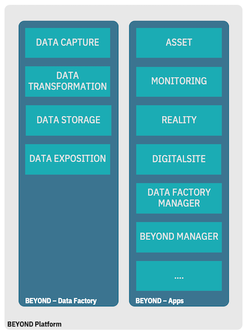
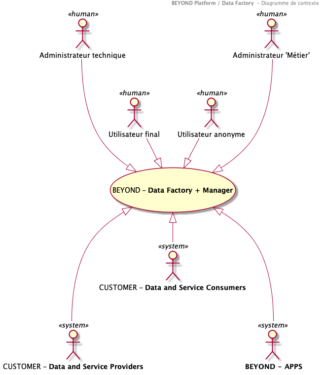

# Diagramme de contexte du système

## Périmètre

L'écosystème **BEYOND** est une plateforme de données et de services dans le monde de la construction. A ce titre, elle peut être segmentée en 2 grands modules :

- **BEYOND Data Factory** : Ce module permet l'acquisition, le stockage, la transformation, et l'exposition des données à des tiers
- **BEYOND Apps** : Ce module permet d'exposer des services applicatifs basés sur les données de la Data Factory.

Le module **BEYOND Data Factory** est l'objet de ce dossier d'architecture.
Toutefois, il faut noter qu'une application **BEYOND Data Factory Manager** permet de gérer la **BEYOND Data Factory**. Cette application, comme tous les services applicatifs de la plateforme reposera sur les principes architecturaux de **BEYOND Apps**. Néanmoins, pour des raisons de lisibilité et afin de traiter le sujet "Data Factory" dans son ensemble, elle sera aussi decrite dans ce document.

>Le module **BEYOND Data Factory** et l'application de gestion **BEYOND Data Factory Manager** seront dénommés **SYSTEME** dans le reste du document.

## Introduction

Le diagramme de contexte du système est une représentation de l'architecture de la solution à son plus haut niveau.

Il permet de représenter

- Les frontières du **SYSTEME**,
- Son rôle et ses responsabilités
- Les interactions auxquelles il est soumis
  - Par les utilisateurs (Fonctions dans l'application)
  - Par les systèmes externes.

>A ce stade, le diagramme de contexte du SYSTEME ne détaille pas la nature (technologique, fonctionnelle) de ces interactions qui seront décrites par les cas d'utilisation et la vision générale de l'architecture.

## **BEYOND Data Factory** / **BEYOND Data Factory Manager** a.k.a. le SYSTEME

### Rôles et responsabilités

Le **SYSTEME** est une plateforme visant à :

- **CAPTURER** la donnée auprès de tiers externes.
- **STOCKER** la donnée sous un mode permettant la traçabilité et l'auditabilité des mouvements.
- **TRANSFORMER** la donnée pour la normaliser, l'enrichir, la rendre 'opérable'.
- **EXPOSER** la donnée pour la rendre accessible aux utilisateurs (BEYOND Apps, ou consommateurs externes).

Aussi les responsabilités du **SYSTEME** sont de :

- Fournir des canaux d'acquisition de données versatiles (Synchrone, Asynchrone).
- Contrôler que la donnée fournie est saine (anti-virus).
- Assurer l'intégrité de la donnée transmise en s'assurant que le fichier reçu est conforme à celui émis.
- Valider l'éligibilité (technique et fonctionnelle) d'une donnée entrante.
- Permettre le stockage de la donnée en l'association à un "tenant", un propriétaire.
- Identifier de manière unique la donnée reçue.
- Permettre l'annotation d'une donnée.
- Appliquer des algorithmes de transformation à la donnée.
- Assurer la traçabilité des mouvements des données (Écriture, Consultation).
- Fournir une capacité de recherche de la donnée.
- Exposer la donnée à des tiers.

### Frontières

### Interactions

Le **SYSTEME** interagit avec les utilisateurs suivants :

**Fonction d'administration** :

- **Administrateur technique** : en charge du paramétrage technique de la solution. Il est en charge de suivre les éléments de journalisation et notamment les alertes afin d'y remédier.

- **Administrateur 'Métier'** : en charge du suivi des métriques "métier" remontées par le SYSTEME. Il est en charge de suivre les éléments de journalisation "Métier" et notamment les alertes afin d'y remédier. Il est aussi en charge du paramétrage permettant de contextualiser le fonctionnement de la plateforme. Par exemple, il définit les profils de permissions pouvant être associés aux utilisateurs de la plateforme.

**Utilisateurs standard** :

- **Utilisateurs finaux** : Utilisateur authentifie de la plateforme. Le **SYSTEME** repose sur des profils d'utilisateurs permettant de composer les permissions atomiques disponibles. Une permission permet d'ajouter une fonction élémentaire.

- **Utilisateurs anonymes** : Avant tout action d'authentification un utilisateur peut utiliser une URL BEYOND, à minima une page d'atterrissage doit être positionnée. Par ailleurs, des parcours utilisateurs d'incitation seront disponibles à terme sur la plateforme en mode anonyme.
Le **SYSTEME** interagit avec les systèmes suivants

...
