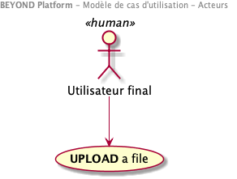

# Diagrammes de cas d'utilisation

> Les cas d'utilisation de la solution sont présentés ici.
> Ce document doit être aligné (ou remplacé) par les éléments des équipes fonctionnelles (EPIC/Stories JIRA).
> Son ambition est de pouvoir permettre d'assurer la maîtrise de la couverture fonctionnelle de la plate-forme.
> Les éléments devant être décrits pour un cas d'utilisation :
>
> - ACTEURS
> - PRE-CONDITIONS
> - DECLENCHEUR
> - DESCRIPTION
> - POST-CONDITIONS
> - ALTERNATIVES

## Acteurs

Les différents acteurs peuvent être répartis selon 2 catégories :

-   **Acteurs "solutions" :** services, systèmes ou applications
-   **Acteurs humains :** utilisateurs finaux de la plateforme

Les acteurs "humains" sont catégorisés en différentes populations, chacune avec des rôles et des droits spécifiques sur la plateforme.

>Remarque :
>La notion d'acteur permet de décrire l'intervenant "Métier" dans son utilisation  du **SYSTEME**. 
On parle de **profil** 'utilisateur' pouvant agréger un ensemble de **permissions** atomiques. Certaines permissions peuvent alors être partagées par différents profils.
>Voir [Sécurité](./0401.ComponentsModel.md)

### Acteurs Humains

### Acteurs "solutions"

### Niveau "PRODUIT"

#### Administrateur technique (HUMAIN)

**Rôle** : Assure le paramétrage du SYSTEME pour les paramètres non accessibles des "Tenants". 
**Responsabilités** :

- **Configure** les paramètres du systèmes (Par exemple eligibilité des fichiers entrants)
- **Consulte** les journaux techniques de la plateforme

### Niveau "TENANT"

#### Administrateur 'Métier' (HUMAIN)

**Rôle** : Assure le paramétrage du SYSTEME pour personnaliser l'espace dédié au "Tenants". 
**Responsabilités** :

#### Utilisateur anonyme (HUMAIN)

**Rôle** : Utilisateur non authentifié accedant le **SYSTEME**

**Responsabilités** : N/A

#### BEYOND - APPS / BEYOND Manager

**Rôle** : BEYOND Manager est une application offrant l'ensemble des services transverses de la plateforme aux BEYOND Apps

**Responsabilités** :

- Service d'authentification des utilisateurs
- Service d'identification de haut niveaudes utilisateurs
- Service de tracabilité : Collecte des évènements de la plateforme

#### BEYOND - APPS

**Rôle** : Les BEYOND Apps sont les premières consommatrices des données du **SYSTEME**. Par exemple, **BEYOND Reality** est une consommatrice des données 3D exposé par le **SYSTEME**

**Responsabilités** :

#### CUSTOMER - Data and Service Providers

**Rôle** : Fournisseurs de données externes au **SYSTEME**

**Responsabilités** :

#### CUSTOMER - Data and Service Consumers

**Rôle** :Consommateurs de données externes au **SYSTEME**

**Responsabilités** :

---
# Use Case Diagrams

> The content filled here has been put only for illustration and to prpose a structure for the work product.
> It has to be contextualized to the project.
> All diagrams have been done relying on the modeling tool PLANTUML

## Actors

The different actors can be split into 2 categories:

-   **System actors:** Services or applications
-   **Human actors:** End users of the platform  

The human actors can be categorized in 3 populations, each one embracing different permissions

-   The **anonymous** users of the platform (not allowed in this use cases)
-   The **administration team** of the platform
-   The **Business** in charge of the definition of the Business rules

| Actors                 | Type   |
| ---------------------- | ------ |
| **EXTERNAL ACTOR #1**  | HUMAN  |
| **EXTERNAL ACTOR #2**  | HUMAN  |
| **EXTERNAL SYSTEM #1** | SYSTEM |
| **EXTERNAL SYSTEM #2** | SYSTEM |

### EXTERNAL ACTOR #1 (HUMAN)

**Role:** Shall configure the **SYSTEM**, especially in term of process orchestration among  engines .....

**Responsibilities:**

-   **Do** this ....
-   **Do** that ....

### EXTERNAL ACTOR #2 (HUMAN)

**Role:** Shall.....

**Responsibilities:**

-   **Do** this ....
-   **Do** that ....

### EXTERNAL SYSTEM #1 (SYSTEM)

**Role:** Shall.....

**Responsibilities:**

-   **Do** this ....
-   **Do** that ....

### EXTERNAL SYSTEM #2 (SYSTEM)

**Role:** Shall.....

**Responsibilities:**

-   **Do** this ....
-   **Do** that ....
-   

_Remark : Technical roles are not considered here (Platform/System Administration…)_

## UC - CONFIGURE Component

### ACTOR

-   EXTERNAL ACTOR #1

### PRE-CONDITIONS

-   The ACTOR has triggered the service
-   The VALUES passed are compliant with the schema of engines....

### TRIGGER

API Call

### DESCRIPTION

-   **STEP 01** The compliance of the VALUES provided in the payload are assessed with the service JSON Schema. Compliance is reached.

-   **STEP 02** XXXXXXX

### POST-CONDITIONS

Overall Eligibility is returned to the ACTOR

### ALTERNATIVES

_Alternative #1_: This is a variation #1

-   **STEP 01.A**:  

-   **STEP 02.A**:  
-   **STEP 03.A**:  

### Wireframe

> The following screen is intended only for helping the understanding of the use case and orientation for implementation

 \|

* * *

Architecture Dossier - Markdown Template - March 2018

< [System Context](./0100.SystemContext.md) \| [Table of content](./0001.TableOfContent.md) \| [Requirements](./0300.Requirements.md) >
