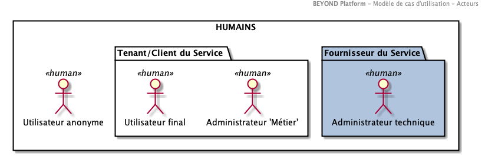
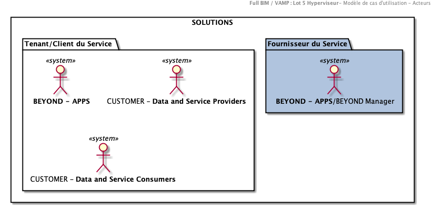

# Diagrammes de cas d'utilisation

## Acteurs

Les différents acteurs peuvent être répartis selon 2 catégories :

- **Acteurs "solutions" :** services, systèmes ou applications
- **Acteurs humains :** utilisateurs finaux de la plateforme

Les acteurs "humains" sont catégorisés en différentes populations, chacune avec des rôles et des droits spécifiques sur la plateforme.

>Remarque :
>La notion d'acteur permet de décrire l'intervenant "Métier" dans son utilisation  du **SYSTEME**.

On parle de **profil** 'utilisateur' pouvant agréger un ensemble de **permissions** atomiques. Certaines permissions peuvent alors être partagées par différents profils.

### Acteurs Humains

#### Administrateur technique (HUMAIN) - Niveau "Produit"

**Rôle** : Assure le paramétrage du SYSTEME pour les paramètres non accessibles des "Tenants".
**Responsabilités** :

- **Configure** les paramètres du systèmes (Par exemple eligibilité des fichiers entrants)
- **Consulte** les journaux techniques de la plateforme

#### Administrateur 'Métier' (HUMAIN) - Niveau "Tenant"

**Rôle** : Assure le paramétrage du SYSTEME pour personnaliser l'espace dédié au "Tenants".
**Responsabilités** :

#### Utilisateur anonyme (HUMAIN)- Niveau "Tenant"

**Rôle** : Utilisateur non authentifié accédant le **SYSTEME**

**Responsabilités** : N/A

#### Utilisateur final (HUMAIN)- Niveau "Tenant"

**Rôle** : Utilisateur  authentifié accédant le **SYSTEME**

**Responsabilités** : N/A

### Acteurs "solutions"

#### BEYOND - APPS / BEYOND Manager

**Rôle** : BEYOND Manager est une application offrant l'ensemble des services transverses de la plateforme aux BEYOND Apps

**Responsabilités** :

- Service d'authentification des utilisateurs
- Service d'identification de haut niveaudes utilisateurs
- Service de tracabilité : Collecte des évènements de la plateforme

#### BEYOND - APPS

**Rôle** : Les BEYOND Apps sont les premières consommatrices des données du **SYSTEME**. Par exemple, **BEYOND Reality** est une consommatrice des données 3D exposés par le **SYSTEME**

**Responsabilités** :

#### CUSTOMER - Data and Service Providers

**Rôle** : Fournisseurs de données externes au **SYSTEME**

**Responsabilités** :

#### CUSTOMER - Data and Service Consumers

**Rôle** :Consommateurs de données externes au **SYSTEME**

**Responsabilités** :
