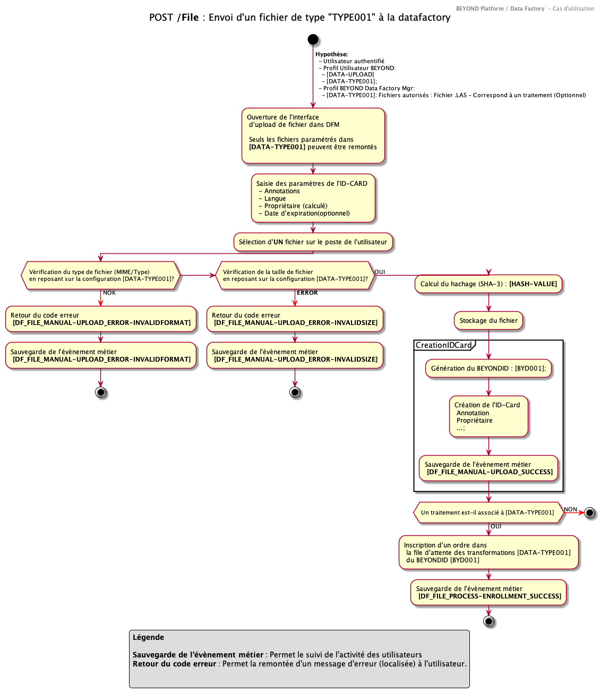

## En tant qu'utilisateur final (authentifié) autorisé, je peux remonter un fichier brut en vue de son traitement par le SYSTEME

### Introduction

Ce cas d'utilisation permet la remontée an toute sécurité d'un fichier dans l'écosystème afin de l'inscrire dans sa file de traitement.

Le processus suivant est envisagé :

1. Validation des droits de l'utilisateurs
2. Récupération des caractéristiques de la remontée du fichier
3. Sélection du fichier depuis un poste local
4. Contrôle du type de fichier
5. Contrôle de la taille du fichier
6. Vérification de l'existence du fichier dans le corpus BEYOND
7. Remontée du fichier
8. Indexation du fichier dans BEYOND (annotation, champs additionnels)
9. Inscription du fichier dans la file d'attente de traitement correspondante

>Remarques
>Ce cas d'utilisation envisage une remontée manuelle par un utilisateur depuis une interface graphique. Une alternative de remontée automatisé en traitement M2M est aussi disponible (cf. cas d'utilisation correspondant)
> Des cas d’utilisation supplémentaire son définit pour l'implémentation du traitement)

### Acteurs

Un utilisateur final authentifié auprès de de **BEYOND MANAGER**

### Préconditions

1 - L'utilisateur final dispose du profil "Utilisateur" suivant tel que défini dans **BEYOND Apps - BEYOND Manager** , par l'administrateur 'Métier' (Niveau BEYOND MANAGER):

- **[DATA-UPLOAD]**: Profil permettant d'afficher la fonction de remontée de fichiers manuel depuis le **SYSTEME**
- **[DATA-TYPE001]** : Profil permettant la remontée de fichier de type 001. (la configuration du type de fichier s'opérant dans l'application DataFactoryManager - paramétrage local)

L'administrateur 'Métier' (Niveau **SYSTEME**) a configuré localement le type **[DATA-TYPE001]** afin

- de définir le type de fichier (par ex : .las)
- de définir une taille maximale (par ex : 1Go)
- un traitement associé (optionnel) parmi les types de traitement disponibles (Par exemple : "CESIUM-Transformation")
  
**Remarque** la cohérence des valeurs est une responsabilité des administrateurs.

### Déclencheur

L'utilisateur accède à BEYOND, s'authentifie puis accès a la page de remontée de fichier du **SYSTEME** (Data Factory Manager)

### Description

### Alternatives

- Cas d'utilisation : Remontée de fichiers M2M
