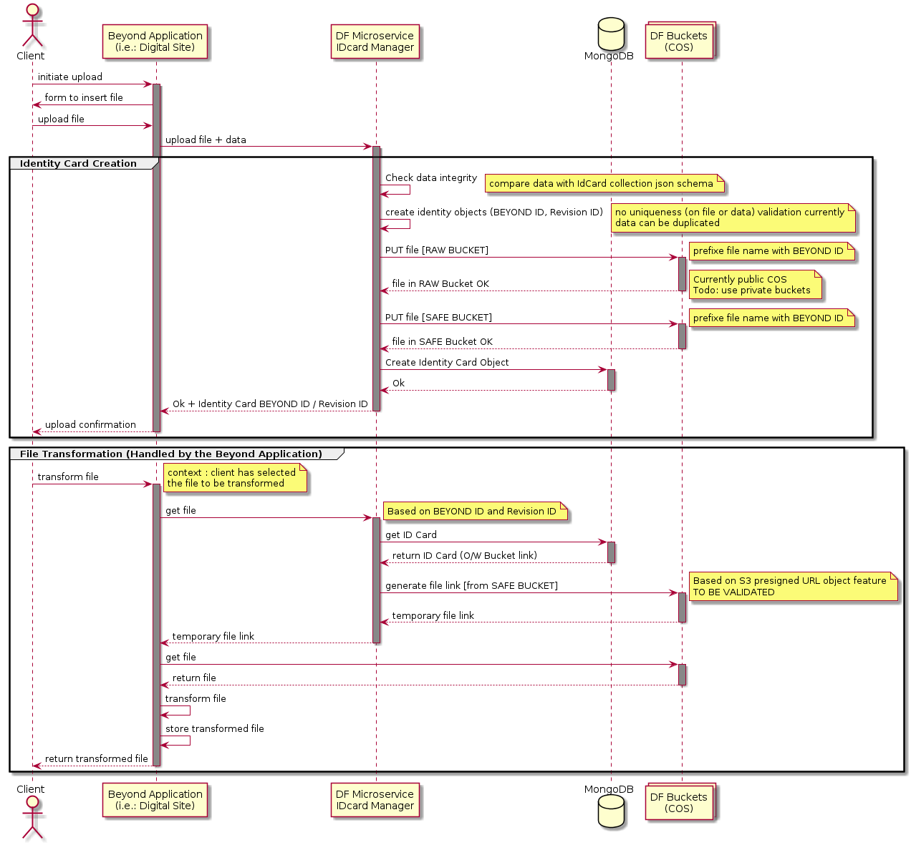
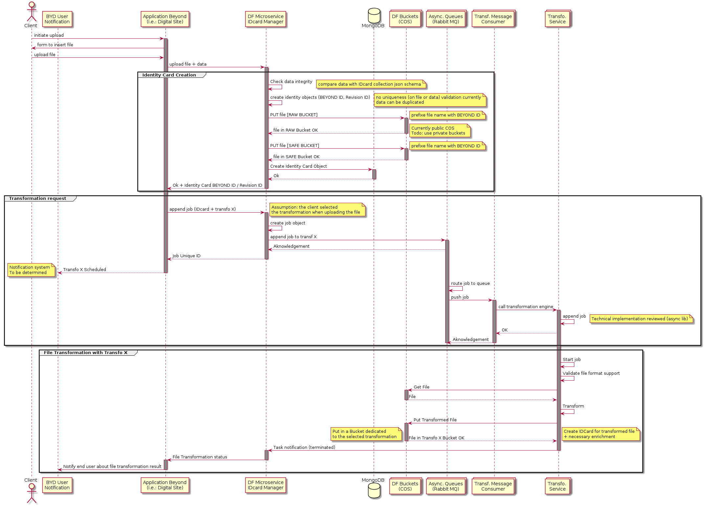

# Exigences fonctionnelles

## Introduction

Les exigences fonctionnelles définissent :

- les processus qu'opèrent le SYSTEME (ce "qu'il fait")
- les éléments qu'il génère (ce "qu'il produit")

Ces éléments d'exigences du **SYSTEME** seront décrits dans les cas d'utilisation de la plateforme dont l'ensemble fournira la couverture fonctionnelle à atteindre.

## Préambule : cycle de vie des ouvrages

On peut identifier comme suit les principales étapes du cycle de vie d'un ouvrage, les outils informatiques (génériques) et les données associées à celui-ci :

| **Phase** | **Outil** | **Données** | **Acteurs / Utilisateurs** |
| --- | --- | --- | --- |
| Conception | CAO | BIM & documentation (fiches techniques, matériaux) | Concepteurs |
| Construction | Suivi de chantier | Observations (relevé de défauts) | Chef de chantier |
| Fin de construction | Suivi de chantier | DOE, incluant le ‘BIM as Built’ (issu de l'outil de CAO) et la documentation finalisée (notices, fiches techniques, matériaux, coordonnées des entreprises maîtres d’oeuvre) | Chef de chantier |
| Maintenance | GMAO | Tâches de maintenance | Techniciens de maintenance |

## Beyond Platform

La plateforme a pour objectif :

- d’offrir différentes vues sur un ensemble d’attributs liés aux ouvrages et à leur statut au cours du temps (via l’application Beyond Reality),
- de donner accès à différents outils permettant de gérer certaines étapes du cycle de vie des ouvrages.

D’un point de vue outils métier, Sixense couvre la partie de suivi de chantier avec Digital Site et la gestion d'asset (liée à la GMAO)  avec Beyond Asset.
D’autres outils complémentaires viendront s’intégrer progressivement dans la plateforme (Beyond Monitoring, Beyond Soil,…).

## Data Factory

Pour répondre aux objectifs de la plateforme BEYOND, la data factory doit permettre :

- d’intégrer des données issues des différents outils métier utilisés tout au long du cycle de vie d’un ouvrage
- de transformer les données issues d’un outil métier pour les intégrer dans un autre outil métier
- de permettre la corrélation entre les données issues des différentes sources

> Pour mémoire:
Chaque ajout d'une donnée dans la Data Factory, donne lieu à la création d'un identifiant unique (UUID au niveau de l'ID Card). L'application ayant poussé la donnée dans la Data Factory doit conserver cet identifiant pour toute mise à jour de la donnée dans la Data Factory.

### Echange de données entre outils métier

Le passage d’information d’un outil d’une phase à un outil de la phase suivante pourra s’effectuer au moyen de transformation de données.
Certaines de ces transformations pourront s’appuyer sur des standards du marché : IFC, BCF, Cobie…
D’autres seront spécifiques aux outils utilisés.
Par exemple :

- les données de BIM au format IFC sont à adapter pour être injectées dans Digital Site, suivant une transformation définie par Digital Site
- les observations réalisées dans Digital Site pourraient être à adapter suivant le format BCF (à titre d'exemple ; d'autres formats pourront être étudiés) pour être transmis aux concepteurs mettant à jour le BIM. Une transformation Digital Site -> BCF est dans ce cas à définir / développer
- les données de nomenclature issues d’un BIM as Built dans un format spéficique (Cobie par exemple) pourraient être à adapter pour être injectées dans Beyond Asset, suivant une transformation définie par Beyond Asset

Dans ces 2 cas, les données sources sont importées dans la Data Factory puis transformées pour être intégrées dans l’outil cible.

Ces transformations peuvent être prises en charge directement par l'outil métier (après avoir remonter les données dans la DataFactory) :

- L'outil métier récupère les données (brutes) depuis la DataFactory et effectue la transformation de données utiles dans son contexte d'usage.
- l'outil métier délègue à la DataFactory l'application de transformation sur les données brutes pour obtenir un jeu de données utile dans son contexte d'usage.

_Exemple de stockage des données depuis une application Beyond dans la DataFactory, puis transformation par l'application Beyond :_

_Exemple de stockage des données depuis une application Beyond dans la DataFactory, puis demande de transformation par l'application Beyond à la DataFactory :_

### Corrélation de données au sein de BEYOND Platform

Pour alimenter les vues proposées par Beyond Reality, les données pertinentes seront exportées depuis les outils métier vers la Data Factory.
La corrélation entre ces données (issues de différentes sources) pourront se faire selon différentes approches :

- corrélation manuelle
- corrélation semi automatique sur la base de critères de rapprochement

La corrélation manuelle repose sur la création d’association entre objets, réalisée explicitement par un utilisateur de la Data Factory : j’associe un chantier à un ouvrage.

La corrélation semi automatique s’appuie sur des critères de rapprochement définis au niveau du paramétrage des vues d’aggrégation : géométrie (x,y dans le cas d’ouvrages ponctuels, PR pour le linéaire…), temporalité (date de livraison, de mise en service…),  identifiants universels commun aux objets…

Cette corrélation peut s'effectuer selon deux modes :

- au chargement d'une données dans la Data Factory (à la création de l'ID Card)
- à la volée, c'est à dire au moment de restituter les éléments (à l'utilisateur)

#### Mode de corrélation #1 : au chargement de la donnée dans la Data Factory

Effectuer le rapprochement d'une donnée issue d'un outil métier avec les autres données déjà présentes dans la Data Factory implique :

- d'avoir défini des critères de rapprochement qui sont pertinents dans le contexte métier
- d'effectuer une comparaison des valeurs des critères pour la nouvelle ID Card avec les mêmes critères sur les ID Cards déjà présentes dans la Data Factory

Lorsqu'il y a une correspondance entre les valeurs des critères de la nouvelle ID Card et d'une ID Card existante, on crée une association entre ces ID Cards.

##### Avantages de l'approche #1

- Le rapprochement est effectué au plus tôt au moment de l'ajout d'une nouvelle entité (ID Cards) dans la Data Factory
- l'identification des données corrélées est simplifiée (sur la base d'associations qu'on peut typer)

##### Inconvénients de l'approche #1

- Si on met à jour les critères de rapprochement, il faut potentiellement vérifier toutes les associations de ce type pour en supprimer ou en créer

#### Mode de corrélation #2 : à la restitution de la donnée dans un outil de visualisation de la plate forme

Avec cette approche, on ajoute une donnée dans la Data Factory sans faire de rapprochement au chargement.

Les critères de rapprochement sont utilisés uniquement dans le contexte de l'application visualisation de BEYOND Platform (REALITY) au moment de la restitution des données, sur une carte ou dans toute autre interface de restitution.

##### Avantages de l'approche #2

- Le rapprochement est effectué uniquement au moment de la restitution des données, sur la base des critères pouvant évoluer dans le temps

##### Inconvénients de l'approche #2

- Suivant la complexité des critères, l'opération de corrélation (recherche des objets ayant des attributs répondant aux critères) peut être plus ou moins lourde avec une performance (temps de réponse, consommation CPU) plus ou moins acceptable

[Modèle des cas d'utilisation](./0200.UseCaseModel.md)
