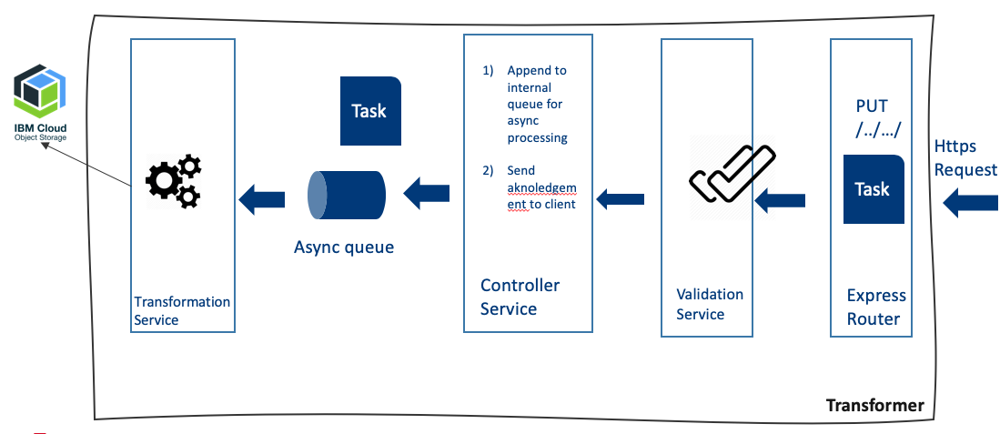

# Système de transformation

Les transformations font partie de la famille **System of Insight**. Une transformation permet de produire une donnée de type Y à partir d'une donnée de type X. 

### Anatomie d'une transformation

Une transformation est un **microservice** autonome pouvant être déclenché par : 
 
  * Un appel HTTP

Ce microservice représente un noeud de transformation de l'ensemble des transformations disponible sur la plateforme.
Un noeud de transformation peut executer un seul  

Une transformation traite une tâche d'une façon asynchrone. L'appel permets de poster une tâche dans la file d'attente interne au **noeud** de transformation. 
Les tâches sont ensuite traités dans leurs ordre d'arrivée dans le noeud de transformation (**FIFO - First In First Out**).  

Les consommateurs (**Apps Beyond**) appellent une transformation avec un ensemble d'informations décrivant: 

  * La localisation du fichier source de transformation
  * La destination ou seront placés le/les fichier(s) résultant(s)
  * Accéssoirement des paramétres spécifique à la transformation

 Plus techniquement, l'objet source d'une transformation doit au moins contenir:   

  * **srcBucket***: Le bucket contenant le fichier source
  * **srcFile***: Le chemin du fichier source
  * **destBucket***: Le bucket destination où le fichier résultat de transformation sera enregistré
  * **opts**: Optionnel, un ensemble d'options/arguments pour enrichir le process d'une transformation 
  * **weight**: Optionnel, pour de future besoins, le degré de priorité d'une transformation pour la gestion de file d'attente.

Les fichiers manipulés par un noeud de transformation sont enregistrés sur un bucket **COS**.

### Volumetrie des fichiers transformés

(...)

### Distribution des noeuds de transformation

Les noeuds de transformations sont distribués par types de transformations :

  * Un noeud = une transformation

  * Chaque noeud est taggé son type de transformation.

  * Chaque transformation posséde un répartisseur de charge (**point d'entrée vers une transformation**) permettant d'acheminer les requêtes vers les noeuds du même type. Ainsi nous intégrons aussi une gestion santé des noeuds, lorsqu'un noeud ne répond plus, il est ignoré.

  * Un répartisseur de charge global est placé au plus haut niveau pour permettre la redirection vers le point d'entrée de la transformation désiré suivant le chemin de la requete. Ainsi gérer les différentes transformation sous forme d'API.

 Cette architecture nous permet d'isoler chaque type de transformation tout en gardant une homogénéité dans l'exploitation de celles-ci. 