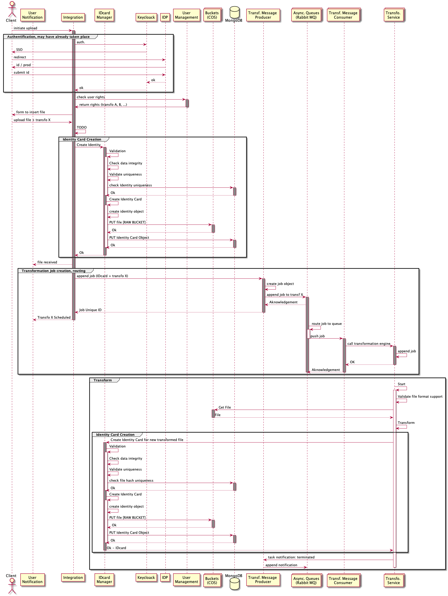

# Système de transformation

Les transformations font partie de la famille **System of Insight**. Une transformation permet de produire une donnée de type Y à partir d'une donnée de type X.

## Anatomie d'une transformation

Une transformation est un **microservice** autonome pouvant être déclenché par :

 * Un appel HTTP

Ce microservice représente un noeud de transformation de l'ensemble des transformations disponible sur la plateforme.
Un noeud de transformation peut executer un seul type de transformation.

Les trasnformations sont déclenché en mode **Fire and Forget**:

* L'appel permet de poster une tâche dans la file d'attente interne au **noeud** de transformation.
* Une tache doit être identifié dans le plateforme avant son arrivée dans le noeud de transformation.
* Les tâches sont ensuite traités dans leurs ordre d'arrivée dans le noeud de transformation (**FIFO - First In First Out**) en tâche de fond.
* Un noeud peut executer plusieurs tâches en concurrence.  

Les consommateurs (**Beyond Apps**) appellent une transformation avec un ensemble d'informations décrivant :

* La localisation du fichier source de transformation
* La destination ou seront placés le/les fichier(s) résultant(s)
* Accéssoirement des paramétres spécifique à la transformation

Plus techniquement, l'objet source d'une transformation doit au moins contenir :

* **id**: l'identifiant du job de transformation
* **srcBucket**: Le bucket contenant le fichier source
* **srcFile**: Le chemin du fichier source
* **destBucket**: Le bucket destination où le fichier résultat de transformation sera enregistré
* **opts**: Optionnel, un ensemble d'options/arguments pour enrichir le process d'une transformation
* **weight**: Optionnel, pour de future besoins, le degré de priorité d'une transformation pour la gestion de file d'attente.

Les fichiers produits par un noeud de transformation sont enregistrés sur un bucket **COS**.

### Track activity

L'avancement d'un job de transformation doit être loggé dans le **track activity (audit)** de la plateforme **BEYOND**.
Le track activity est en charge de fournir un ensemble de services permettant à des tenants de récupérer le statut d'une transformation par son identifiant.

### Distribution des noeuds de transformation

Les noeuds de transformations sont distribués par types de transformations :

* Un noeud = une transformation

* Chaque noeud est taggé son type de transformation.

* Chaque type de transformation posséde un répartisseur de charge (**point d'entrée vers une transformation**) permettant d'acheminer les requêtes vers les noeuds du même type. Ainsi nous intégrons aussi une gestion santé des noeuds, lorsqu'un noeud ne répond plus, il est ignoré.

 Cette architecture nous permet d'isoler chaque type de transformation tout en gardant une homogénéité dans l'exploitation de celles-ci.

### Integration dans BEYOND

Pour garder un couplage faible entre les tâches de transformations et le reste de la plateforme, un outils de messagerie (**RabbitMQ**) sera utilisé pour permettre aux tenants de poster des tâches de transformation.

Les tâches doivent être identifiées d'une manière unique et libellé (type de transf.) avant de les poster sur l'outil de messagerie. ceci nous permet de :

* Récupérer l'avancement d'une tâche avec le **Track activity** (en mode Pull).
* Router un job vers la bonne queue

De ce fait, La mise en place des queues de transformation se fera en suivant les principes suivant:

* Le **message producer** déverse dans un *exchanger* de la manière suivante: 
    * l'exchanger doit être de type **direct**
    * le producer est responsable de créer les "messages" (représentant les tâches) et générer un identifiant unique pour chaque message.
    * le producer envoie des messages avec une **clé de routage** correspondant au type de transformation.
* Le **message consumer** récupére depuis les *queues* de transformation de la maniére suivante:
    * le consumer s'assure de la configuration des queues de transformation et notamment leurs liaison avec l'exchanger (le routage à base d'une clé spécifique vers une queue de transformation).  
    * le consumer dispose d'un agent connecté à chaque queue. chaque agent est responsable de déliverer les messages d'une transformation vers le point d'entrée de la transformation.
    * chaque queue est durable, de cette maniére si le consumer se déconnecte les tâches non traité persistent dans la queue.
      * Si le consumer n'arrive pas à joindre une transformation, il doit mettre le job dans une **dead letter queue**.

### Injection d'un job de transformation

Le diagramme de séquence suivant décrit les interractions entre les différents composants de la plateforme **BEYOND** pour lancer un job de transformation.

