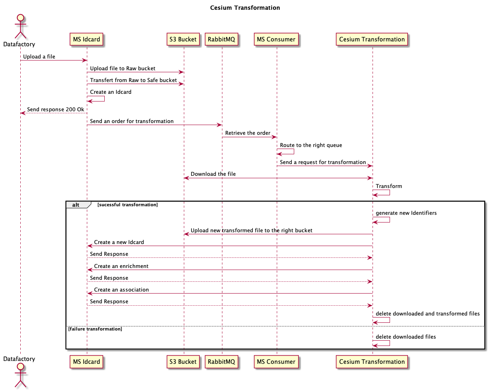

# Diagramme de séquence

## S3

### Utilisation

### Bucket Raw

Le bucket `Raw` sert juste a déposé les fichiers (non analysé) reçu par `idcard`.

### Bucket Safe

Le bucket `safe`, dit sécurisé, à terme on mettra un module qui va récupérer les fichiers du bucket `raw` pour les analyser et les mettra dans le bucket `safe`.

Tous les autes microservices téléchargent depuis le bucket `safe`.

### Bucket Cesium

Les buckets `cesium` servent principalement pour l'affichage sur la carte des éléments cesium.

## Transformation

### Transformation Cesium

### Transformation Visualisation

### Transformation JSON vers YAML

