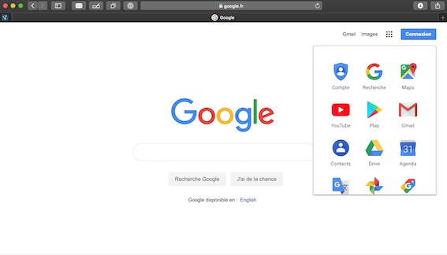
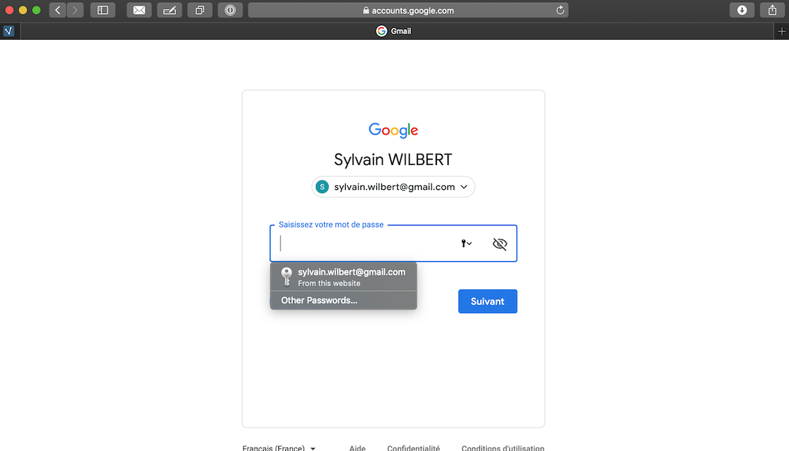
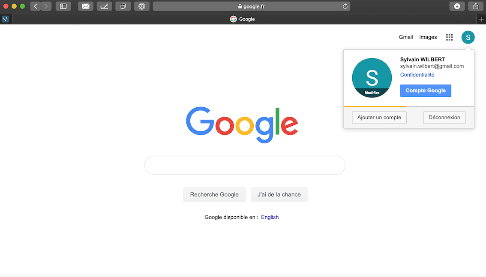
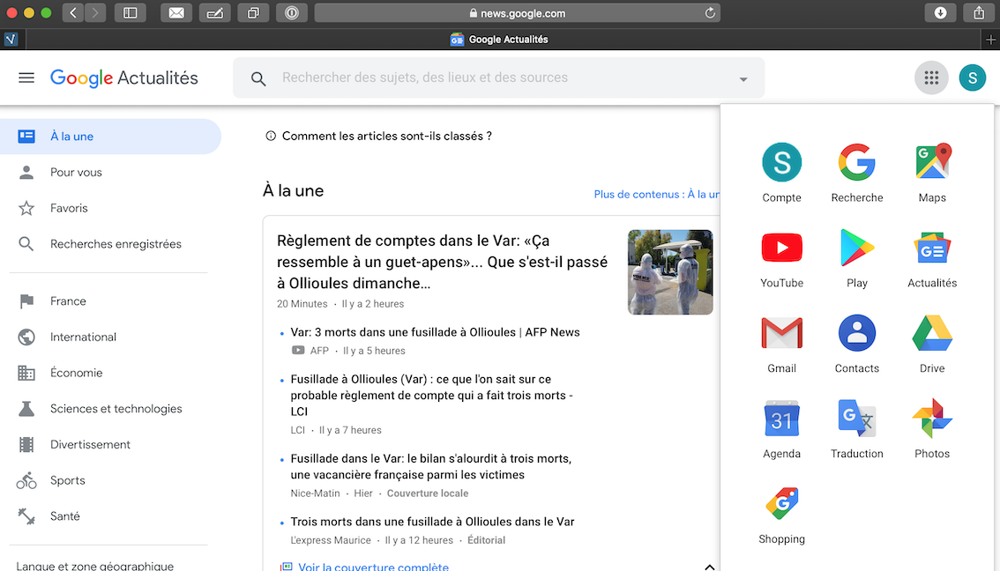
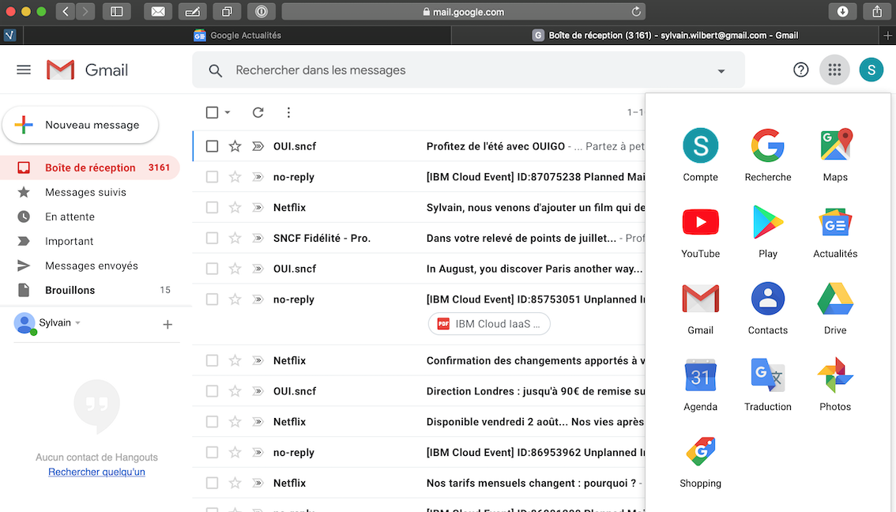
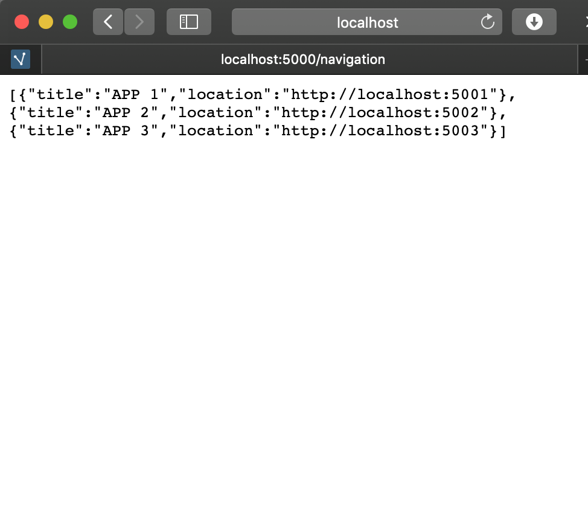
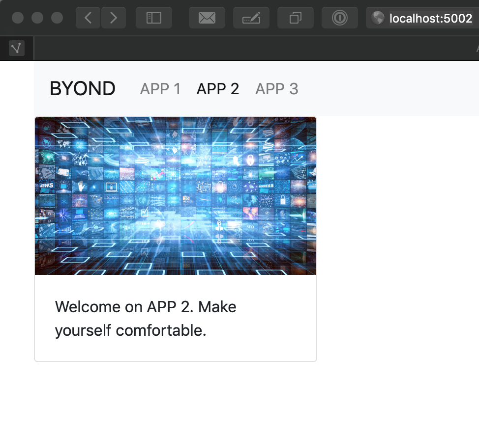
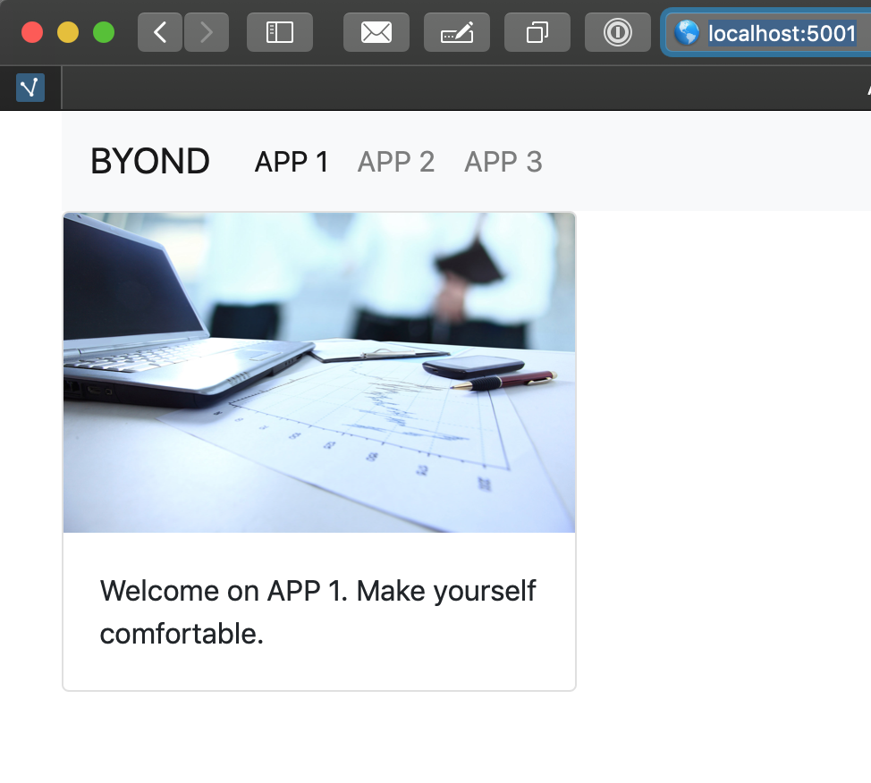
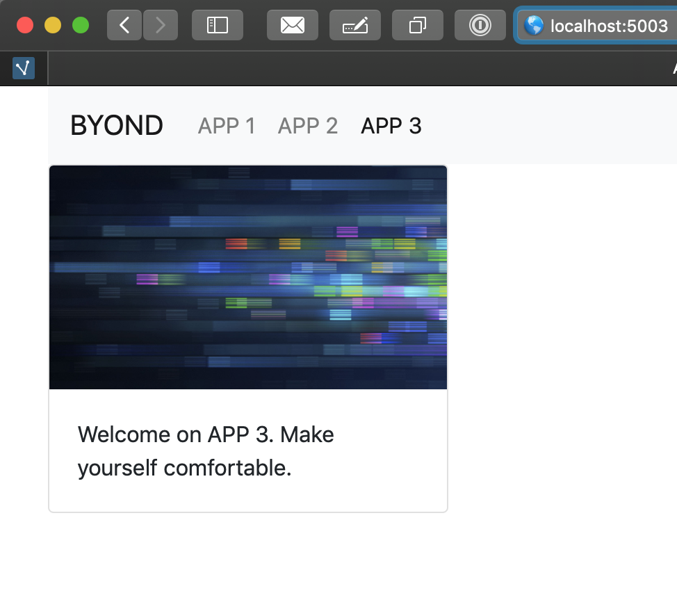

# Stratégie d’implémentation les applications web BEYOND

## Contexte

La plateforme BEYOND sera dénommé **SYSTEME** dans le reste du document

La *SYSTEME** peut se décomposer en 2 modules :

- les **BEYOND APPS** qui regroupent applications reposant sur les données et les services exposés par la plateforme
- la **BEYOND Data Factory** qui capture, stocke, transforme et expose les données de la plateforme.

Aussi, parmi ses responsabilités, le *SYSTEME** doit :

- Exposer des services applicatifs.
- Exposer des données.
- De mettre en œuvre des applications accessibles au moyen d'un navigateur Internet.

## Les BEYOND Apps

Elles regroupent toutes les applications participantes à l'écosystème mis en place par le **SYSTEME**.
Par leur nature, on peut les classifier comme suit

- **BEYOND Native application** : Application conçue, implémentée directement sur/pour la plateforme **BEYOND** et qui en respectent l'architecture et les concepts. Par leur conception, elle bénéficie de toutes les fonctionnalités exposées par le **SYSTEME**. Par exemple : BYD Reality, BYD DataFactory Manager, BYD Manager.
- **BEYOND Ready application** : Application préexistante à la conception du **SYSTEME**, qui s'interface, soit au niveau des données, soit au niveau des services avec le **SYSTEME**. Pour les plus intégrée, elles peuvent partager la même charte graphique. Par exemple : Digital Site, IMS, Hyperviseur.

La qualification des applications sera portée par une validation par la Direction Technique Sixense, notamment pour celles effectuant leur migration vers le **SYSTEME**.

## Exigences pour les **BEYOND Native applications**

1. Une **BEYOND Native application** doit reposer sur la charte graphique (UI : pour user interface).
2. Une **BEYOND Native application** doit implémenter et décliner les parcours utilisateurs défini dans le **SYSTEME**
3. Une **BEYOND Native application** doit implémenter les mécanismes d'authentification du **SYSTEME**
4. Une **BEYOND Native application** doit reposer sur le modèle d'habilitation/identification du **SYSTEME** pour les droits de haut niveau
5. Une **BEYOND Native application** doit permettre un accès par un route directe l'identifiant. Par exemple http://www.beyond.sixense.com/beyond/reality
6. Une **BEYOND Native application** doit reposer sur les principes architecturaux du **SYSTEME**. En particulier, elle doit faire la promotion du couplage faible permettant à chacune d'elle de se mettre à jour sans dépendance avec les autres.
7. Une **BEYOND Native application** peut être implémentée par les équipes SIXENSE Digital, IBM, ou un tiers externe.

## Stratégie d'implémentation

### 1 - Séquence d'authentification

- **Cas #1 :** L'utilisateur accède à la **BEYOND Native application** de manière anonyme, par exemple en appelant directement sa route. La séquence d'authentification de la plateforme BEYOND doit être implémentée. Les accréditations de l'utilisateur sont alors récupérées (cf. cas #2)
- **Cas #2 :** L'utilisateur accède à la **BEYOND Native application** suite à une navigation dans le **SYSTEME**. Il est alors authentifié. Dans ce cas, le Jeton SSO (access token) lui et transmis.

### 2 - Séquence d'identification

Les droits de haut niveau d'un utilisateur du **SYSTEME** sont gérés par l'application BEYOND Manager. Ceux-ci sont directement récupéré depuis le jeton d'authentification.
Par ailleurs, un service applicatif accessible sur une route de type */user/{byd-user-id}/profile* permet de récupérer les droits de l'utilisateur. (Par exemple dans le cas où la séquence d'authentification est initiée directement par la **BEYOND Native application**)

>Remarque : Les droits de haut niveau peuvent entre enrichis par une gestion des droits fins de l'utilisateur identifié par son **byd-user-id** pour chacune des **BEYOND Native application**

### 3 - Charte Graphique

L'ensemble des ressources graphiques, l'intégration dans la **BEYOND Native application** doit être repris depuis le **BEYOND Design System**

### 4 - Parcours utilisateurs

L'ensemble des éléments ayant trait au parcours de l'utilisateur (Modèle d'écran, Enchainement, "Design patterns"), l'intégration dans la **BEYOND Native application** doit être repris depuis le **BETOND Design System**

La navigation de haut niveau dans le **SYSTEME** doit être implémentée en se basant sur le service navigation exposé par une route de  type */navigation* : Celle-ci retourne la liste des URLS telles que définies au niveau du **SYSTEME**

>Remarque : La navigation fournie par le **SYSTEME** peut être enrichie par des éléments de navigations propres à la **BEYOND Native application**. La parfaite intégration repose sur l'application du **Design System**

## Cycle de vie

Le principe de mise à jour des **BEYOND Native application** repose sur l'application des évolutions des éléments ci-dessus.

Chaque élément porte un numéro de version aligné sur les statuts suivants :

- **releasecandidate**: La prochaine version permettant aux consommateurs d'anticiper l'intégration
- **active** La version en cours de l'élément
- **deprecated** Les 2 versions précédentes. Les nouveaux développements ne doivent pas les prendre en compte. En revanche, les applications existantes peuvent encore les utiliser.
- **retired**: Versions historiques d'un composant. Ne doivent plus être utilisées.

La stratégie d'intégration et de déploiement continue des **BEYOND Native application** doit permettre d'atteindre cet objectif.

## Prototype

### Principe :  Un exemple de plateforme applicative

Mise en place d'une notion de plateforme avec des univers différencié et autonome, implémentant :

1. Une fonction d'authentification
2. Une fonction d'identification
3. Une fonction de navigation personnalisable

Par défaut, les applications possèdent une barre de navigation contenant :

1. une **zone personnalisable** (ici un raccourci direct vers gmail/images)
2. Un **ensemble de liens** vers les applications de la plateforme
3. Un **bouton d'authentification**

La fonction d'authentification est commune.

Une fois authentifié, la plateforme permet (et applique) d'accéder aux éléments d'identification de l'utilisateur (Habilitation)

L'ensemble des univers de la plateforme repose sur les mêmes mécaniques (barre de navigation commune, charte graphique partagé) tout en préservant leurs fonctionnalités propres.

### Implémentation

Un prototype a été implémenté pour illustrer cette approche.

Un service de navigation est exposé par la plateforme BEYOND. Celle-ci est paramétrable depuis la BEYOND Manager.
Elles pointent vers les 3 univers de la plateforme.

Chaque application intègre ce service de navigation et le positionne selon les directives du design system.

