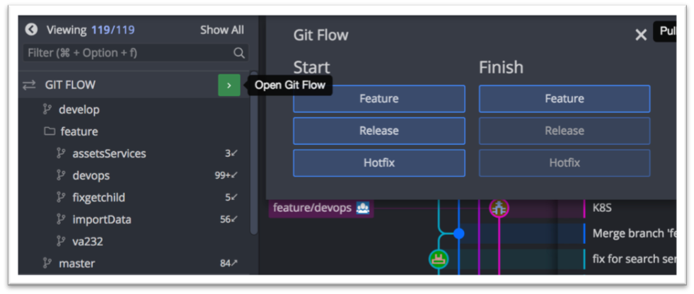
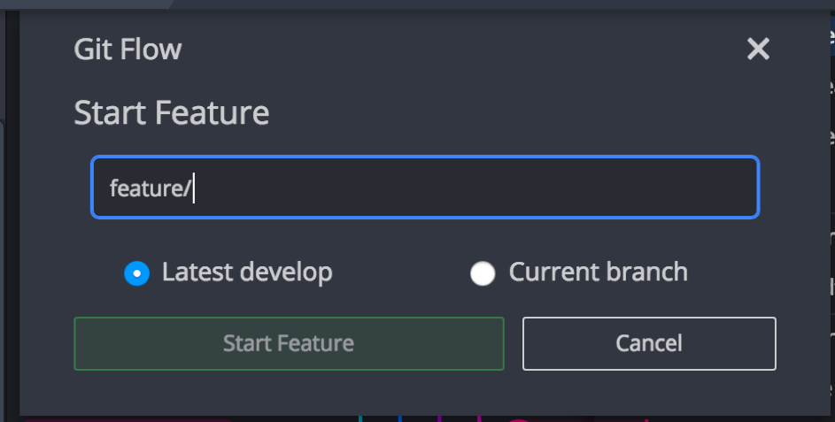
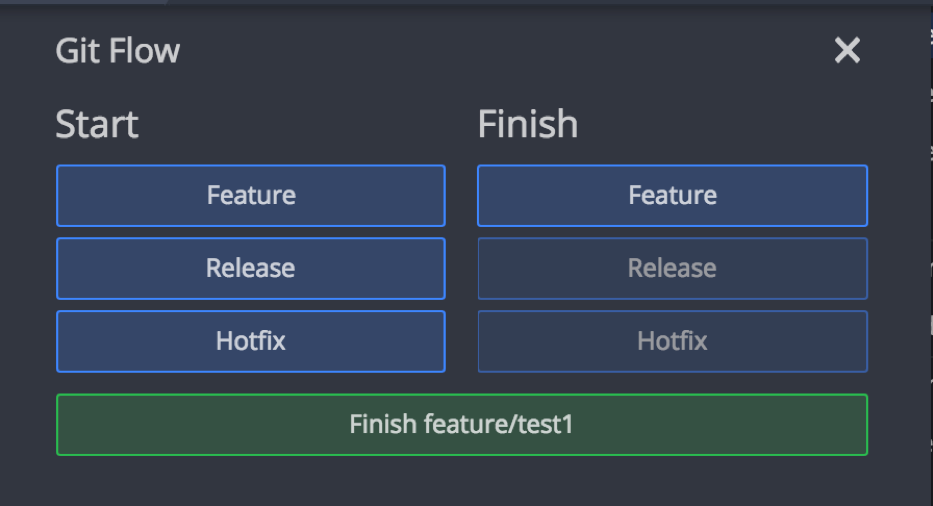
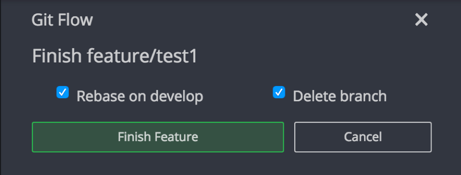

#Passage sur Gitflow

### Explication
> Gitflow sépare sur des branches isolées le code en cours de développement et le code validé et testé. 
>Pour cela, il s’appuie sur la création de plusieurs branches dont le cycle de vie est bien défini.
### Pré-requis

* Avoir le logiciel gitKraken
    *  Téléchargeable ici : https://www.gitkraken.com/download
    * `La licence gitkraken pro est disponible, voir
     avec Jacques-Henri ou Dominique pour l'obtenir`
 
 ### Depuis Gitkraken
 
 * Préférences
 * Gitflow
 * Initialize Gitflow
 
`Vous pouvez laisser les autres paramètres par défaut`

### Création d'une branche

> Une fois les préférences fermées vous aurez un nouveau menu "GITFLOW"
* Pull develop 
* Créer une nouvelle branche
    * Cliquer sur la flèche verte 
    * Start -> feature 
    

>Cela va créer une branche locale qui viendra s'ajouter au dossier "feature"  
>Vous pourrez donc travailler sur votre branche et faire vos développement en local
  
    
`Pour éviter tout soucis : AVOIR LA BRANCHE DEVELOP A JOUR AVANT CHAQUE CREATION DE BRANCHE`

* Nommage de la branche: BY-XXX [Descriptif]

### Rebase de votre branche sur develop

* Une fois votre développement terminé vous pouvez:
    * Cliquer sur le bouton vert sur la même ligne que "gitflow"
    * Cliquer sur Finish -> Feature 
    * Une fois cliqué vous pouvez:
        * `Rebase on develop` : Mets sur develop vos développements
        * `Delete branche` : Supprime la branche directement
        

> Concernant la suppression de branche, c'est à vous de voir si vous souhaitez faire la suppression
>directement après le rebase, ou si vous voulez garder votre branche. 

     