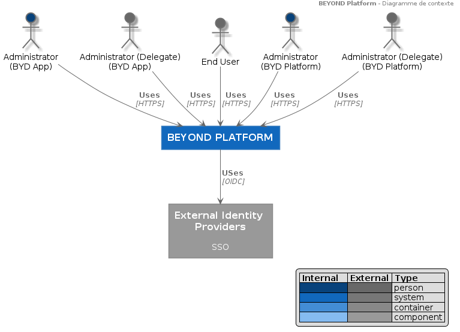

<[Glossaire](./0002.Glossary.md) \| [Table des matières](./0001.TableOfContent.md) \| [Modèle de cas d'utilisation](./0200.UseCaseModel.md) >

* * *

# Diagramme de contexte du système

La plateforme BEYOND sera dénommée **SYSTEME** dans le reste du document.

Le **SYSTEME** a pour vocation de permettre l'acquisition, l'hébergement la visualisation et l'analyse de données liées au cycle de vie d'infrastructures du domaine de la construction.

Pour ce faire, Le **SYSTEME** s'appuie sur un ensemble de solutions applicatives (BEYOND-ASSET, BEYOND-REALITY, BEYOND-DIGITALSITE, BEYOND-MONITORING...) auxquelles il fournira :

- Des services transverses de gestion des données (DATA FACTORY), des utilisateurs et des droits d'utilisation ; la liste des services est en cours de construction dans le backlog de développment du SYSTEME.
- Des composants réutilisables.

Le **SYSTEME** interagit avec les acteurs suivants :

- Des **utilisateurs anonymes** qui accèdent aux informations et services publiques du SYSTEME.
- Des **utilisateurs finaux** qui accèdent aux applications reposant sur le SYSTEME et pouvant gérer leur accès au SYSTEME.
- Des **Administrateurs d'utilisateurs** qui gèrent les l'accès au SYSTEME et aux applications reposant sur le SYSTEME.
- Des **Administrateurs techniques** qui gèrent la configuration du SYSTEME.
- Des **Administrateurs métier** qui gèrent les rôles et fonctionnalités du SYSTEME.

Le **SYSTEME** interagit avec les systèmes externes suivants :

- Des **IdP** de clients entreprises pour la délagation de l'authentification.
- (_Liste non exhaustive_)

* * *

Dossier d'Architecture - BEYOND PLATFORM - Novembre 2019

<[Glossaire](./0002.Glossary.md) \| [Table des matières](./0001.TableOfContent.md) \| [Modèle de cas d'utilisation](./0200.UseCaseModel.md) >
