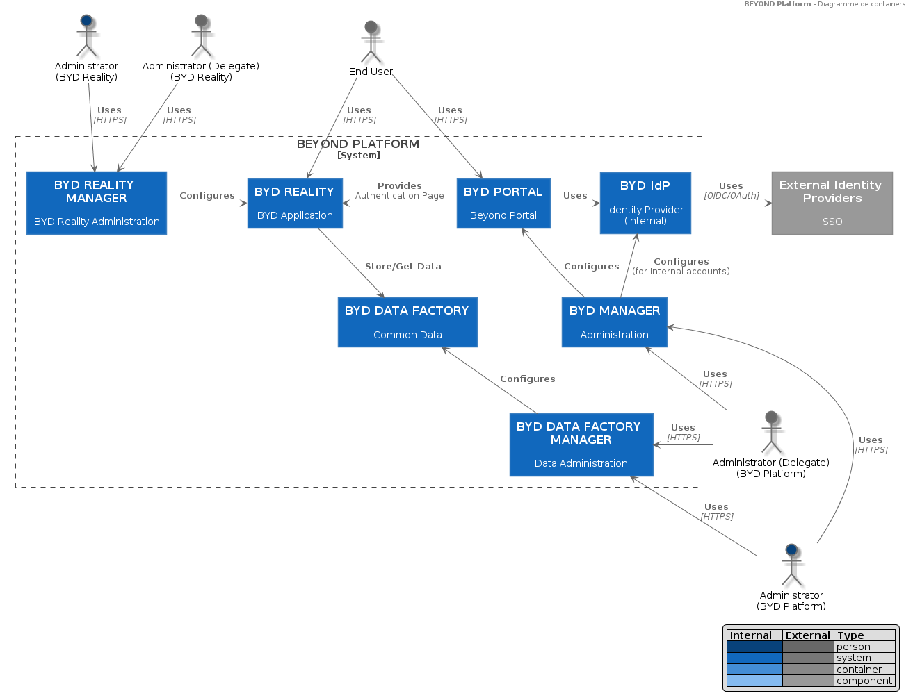
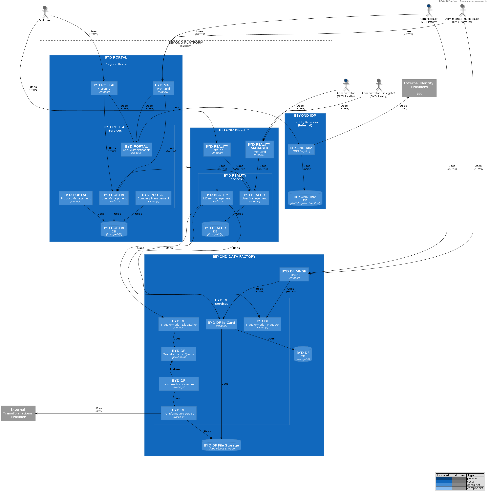
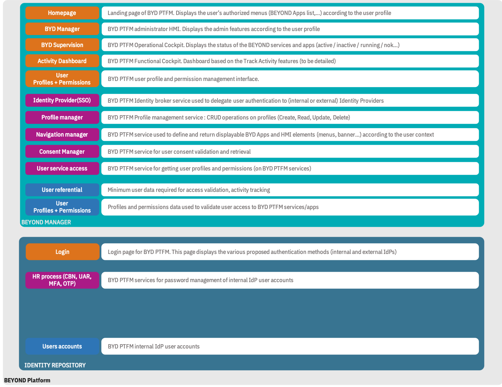
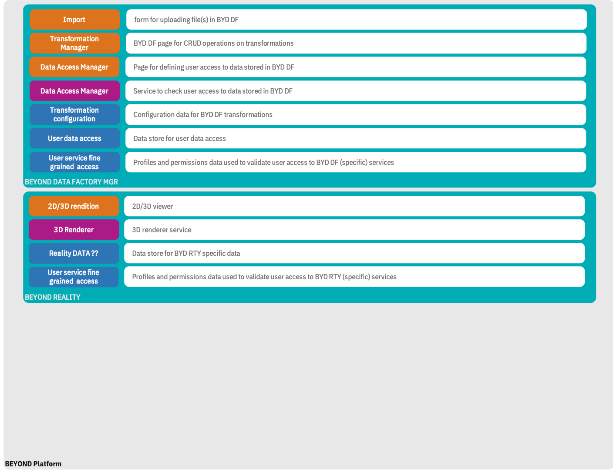
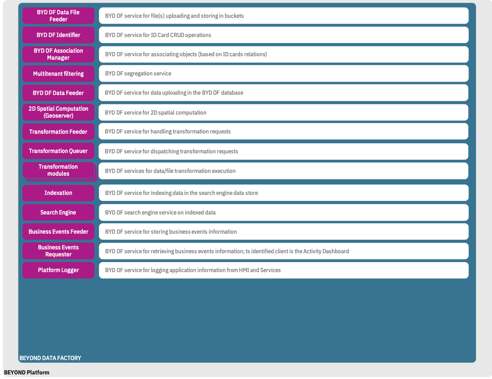
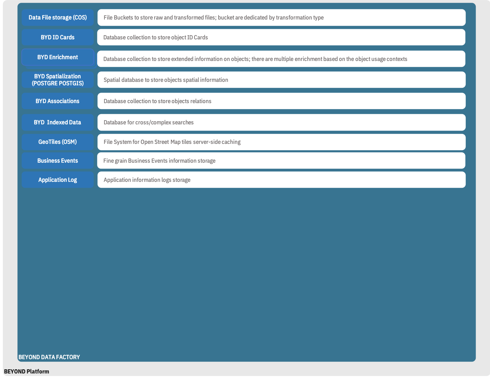

< [Exigences](./0300.Requirements.md) \| [Table des matières](./0001.TableOfContent.md) \| [Architecture : vue d'ensemble](./0500.ArchitectureOverview.md) >

* * *

# Modèle de composants

Les composants sont des éléments indépendants, interchangeables du **SYSTEME**. Ils respectent et réalisent une ou plusieurs interfaces fournies et requises, qui déterminent le comportement des composants.

Un composant du **SYSTEME** doit stocker ses données selon les concepts et principes d'architecture de la plate-forme : l'utilisation d'un identifiant unique Beyond-ID est obligatoire, la gestion des revisions importantes en terme de traçabilité.

Le **SYSTEME** peut être décomposé en sous-systèmes (BEYOND DATA FACTORY, BEYOND MANAGER, BEYOND DATA FACTORY MANAGER, IDENTITY REPOSITORY...), un ou plusieurs composants constituent un sous-système, selon le degré de granularité adopté.

Dans une approche "cloud native", les sous-systèmes sont implémentés sous forme de **microservices**.
Ces microservices exposent (par défaut) des interfaces de type services REST pour promouvoir le couplage faible.
La description de ces services respecte la spécification openAPI 2.0 (SWAGGER) ; cette description est accessible via un fichier au format YAML.

Les solutions applicatives (BEYOND-ASSET, BEYOND-REALITY, BEYOND-DIGITALSITE, BEYOND-MONITORING...) reposant sur le **SYSTEME** doivent respecter les principes ci-dessus dans le cadre de leur utilisation de services et composants du **SYSTEME** et de leur exposition de services et composants pour les autres sous-systèmes ou solutions applicatives de la plate-forme.

## Vue Statique

Le **SYSTEME** est organisé en sous-systèmes, tout en intégrant des solutions applicatives (les "Beyond App") qui fourniront des services et des composants autres éléments du **SYSTEME**.

| Sous-système | Description |
| ------- |-----------|
| Beyond Portal | Le portail est à destination des utilisateurs ; il permet d'exposer les produits (les "Beyond Apps") de la plateforme|
| Beyond Manager | Ce module d'admnistration permet la configuration de l'intégration des produits dans la plateforme ; il sert également à instancer les clients ("Compagnies") de la plateforme et à gérer les accès aux produits par les utillisateurs|
| Beyond Identity Provider (IdP) | Il s'agit du système d'authentification des utilisateurs ; il permet de gérer des comptes utilisateurs internes à la plateforme comme la délégation à des systèmes d'authentification externes utilisés par les clients de la plateforme|
|TbC | TbC |

### Packages et composants

Le **SYSTEME** peut être représenté à l'aide d'un diagramme de packages (les sous-systèmes / containers) montrant les dépendance entre les packages.

#### Packages/containers

Les packages suivants peuvent être définis :

| Package | Description |
| ------- |:-----------:|

#### Composants

Les composants suivants peuvent être définis :
_A détailler sur la base des éléments des images ci-dessus_

|**Package**|Composant|Domaine|Rôle|Responsabilitées|
|---|:---:|---|---|---|

## Vue Dynamique

### Diagrammes de processus

_A détailler_

#### Authentification (SSO)

#### Intégration de données

* * *

Dossier d'Architecture - BEYOND PLATFORM - Novembre 2019

< [Exigences](./0300.Requirements.md) \| [Table des matières](./0001.TableOfContent.md) \| [Architecture : vue d'ensemble](./0500.ArchitectureOverview.md) >
