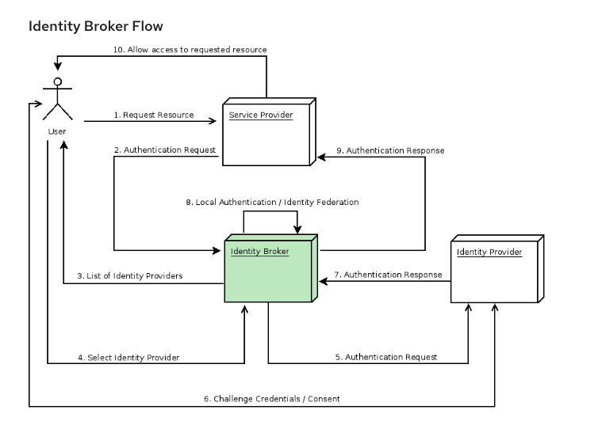
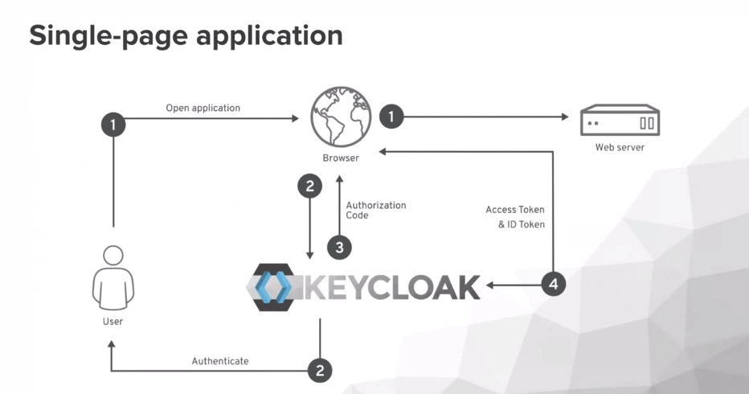
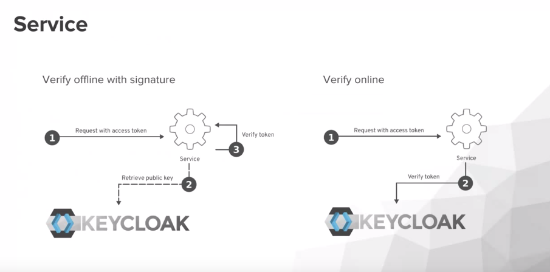

# Gestion d'authentification et compte utilisateur

La gestion de l'authentification doit être géré par un composant central pour une meilleur gestion de sécurité. 
En utilisant les jetons **JSON WEB Tokens (JWT)** les microservices BEYOND sont découplés du fournisseur d'identité et se base uniquement sur le jeton pour vérifier l'identité de l'appelant.   

## Protocol d'authentification

Beyond est une platforme basé sur une architecture de microservices REST destribué. De ce fait **OpenID Connect (OIDC) / OAuth 2.0** est le protocol standard adapté pour ce type d'architecture : 
  * Échange basé sur JSON
  * Protocol simple et légé 
  * Basé sur l'utilisation de jetons (bearer token)
  * Gestion de consentement native (GDPR)
  * S'intégre plus facilement aux architectures modernes
  * Largement utilisé

## Keycloak

**Keycloak** est une solution open source de gestiion d'identité et gestion d'accès qui offre un ensemble de fonctionnlaité permettant à la fois d'optimiser les temps de développement et renforcer la sécurité : 
* Solution de gestion d'identité et d'autorisations
  * Gestion d'utilisateurs out of the box
  * Pas besoin de gérer les credentials de l'utilisateurs
  * Supporte OIDC, SAML et LDAP
  * Permet de génerer des jetons
  * Offre la possibilité de s'intégrer avec des IDP (identity provider) externes
  * Gestion de SSO
* Offre un ensemble d'adaptateur simple pour différentes technos
* Offre un adaptateur générique
* Propose des outils pour gérer les actions répetitive et classiques:
  * Gestion de formulaire de login/logout
  * Gestion d'information utilisateur et gestion de mot de passe (réinitialisation)
  * Vérification SSO
* Gestion de role par défaut

## Integration dans Beyond

**Keycloak** jouera le rôle de **identity broker** permettant ainsi d'intégrer fournisseurs d'identité (social media ou autre) ou d'utiliser keycloak comme fournisseur d'identité. 

Le schéma suivant représente les interractions entre un utilisateur (son navigateur) et les différentes briques du système permettant de l'authentifier.

Ainsi, les Applications Web (Single Page Application) BEYOND intégreront l'authentification en intégrant les adaptateurs édequat pour gérer l'authentification de l'utilisateur:

Les services BEYOND valideront, en utilisant le jeton fournis, l'identité de l'appelant. Il existe deux façon: 

  * Online: Permet de valider auprès du serveur keycloak --> rajoute de la latence
  * Offline: chaque service est responsable de valider le token --> meilleur performance

