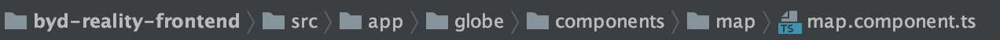

# Changement de clef Cesium

La clef Cesium est renseigné à 2 endroits distinc dans l'application REALITY.

La premiere se trouve dans la Méthode `initMap` du fichier `map.component.ts`.

 

La deuxieme se trouve dans la Methode `search` du fichier `search.service.ts`
