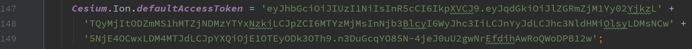
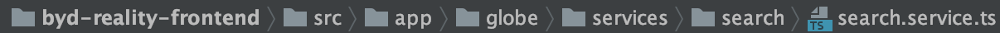
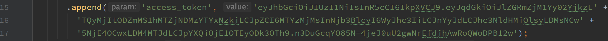

# Changement de clef Cesium

La clef Cesium est renseignée à 2 endroits distincts dans l'application REALITY.

La première se trouve dans la Méthode `initMap` du fichier `map.component.ts`.

 

 

La deuxième se trouve dans la Méthode `search` du fichier `search.service.ts`.

 

 
