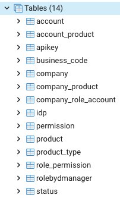

# Nettoyage des bases de données (MongoDB & PostGreSQL)

## MongoDB

### Contenu de la base

Avant d'expliquer la procédure permettant de purger la base de données, voici un rappel des différents éléments qui la compose :

 

| Collections | Détails | 
|:---|:---|
| **association** | Informations liées à l'association entre différents atomes 
| **connector** | Informations liées aux connecteurs utilisés pour les instances GED | 
| **enrichment** | Contient les enrichissements liés à un atome | 
| **enrichmentTemplate** | Contient les templates à partir desquels les enrichissements peuvent être créés
| **idcards** | Informations liées à chaque atome |

 

### Nettoyer la base

Plusieurs atomes de la plateforme sont liés à un ou plusieurs fichiers. Ces derniers sont stockés dans le COS.

Dès lors, afin d'effectuer un nettoyage "propre" de la base de données, il est conseillé de supprimer les données depuis l'interface de la plateforme. En effet, en utilisant cette méthode, l'ensemble des données présentent dans la base de données et dans le COS seront supprimées.

Une fois cette manipulation réalisée, si des données venaient à persister dans la base de données, il sera alors possible de les supprimer directement, notamment grâce à l'interface proposée par l'outil `Compass` (interface base de données MongoDB)

**ATTENTION** : En cas de manipulation directe de la base de données, et pour le bon fonctionnement de la plateforme, il est essentiel de ne pas supprimer les templates d'enrichissements suivants : `Cesium`, `Reality_ContextData`, `MODELGRAPHIC`, `Diagramme Cesium`, ainsi que tous ceux ayant un label commençant par `ExternalData` (ces derniers étant utilisés dans le cadre du menu "Ouvrir avec")

## PostGreSQL

### Contenu de la base

L'ensemble des données stockées dans la base PostGreSQL concerne l'administration (utilisateur, compagnies et produits). Voici la liste des différentes tables utilisées :

### Nettoyer la base

S'agissant de données "sensibles", il est conseillé de réaliser l'ensemble des manipulations via l'interface proposée par la plateforme.  En effet, les actions pouvant avoir des conséquences sur différentes tables, l'interface permet de gérer facilement les interdépendances.

Néanmoins si une action directe en base s'avère nécessaire, **voici quelques règles à respecter** :

- Ne pas supprimer une compagnie disposant de membres
- Ne pas supprimer un "product_type" si un produit y fait référence
- Ne pas supprimer les champs présents dans la table `status`
- En cas de suppression d'un produit, veiller à supprimer toutes les références à ce dernier dans les tables `account_product` et `company_product`
- En cas de suppression d'un compte utilisateur (table `account`), veiller à supprimer toutes les références à ce dernier dans les tables `account_product` et `company_role_account`
- Ne pas supprimer un élément de la table `role_permission` s'il existe une référence à ce dernier dans la table `company_role_account`
- Ne pas supprimer un champ de la table `business_code` s'il existe une référence à ce dernier dans la table `product`
- Si la valeur d'une clé d'api est modifiée (table `apikey`), il est nécessaire de répercuter cette modification dans les charts d'environnement
- Ne pas supprimer un champ de la table `permission` s'il existe des référence à ce dernier dans la table `role_permission`
- Pour les tables disposant d'un champ "label", ne pas éditer le champ '"code"

