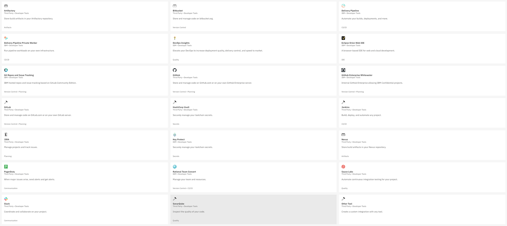
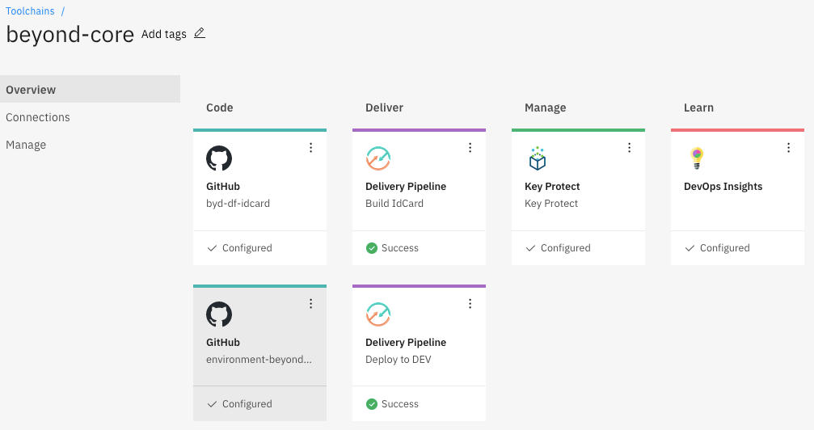
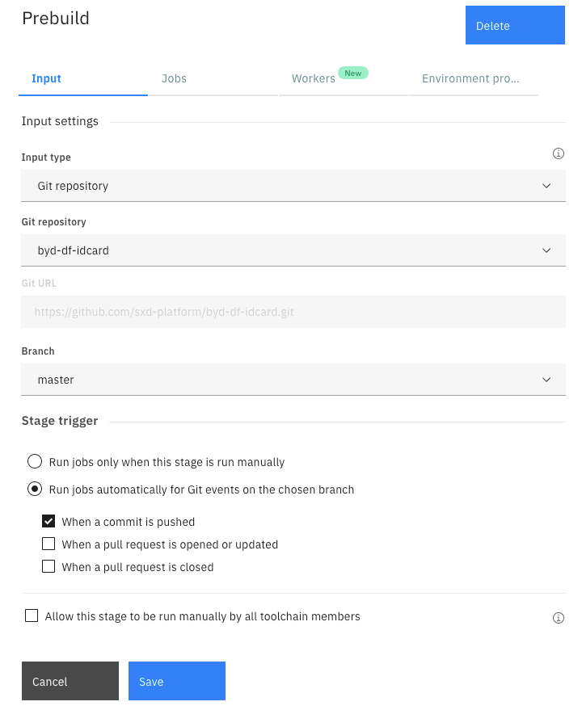
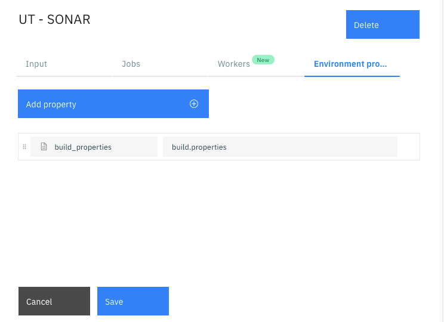
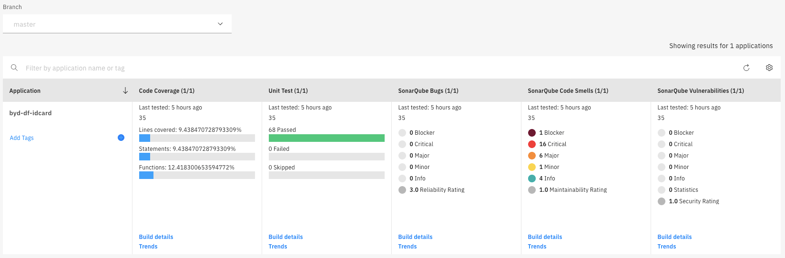
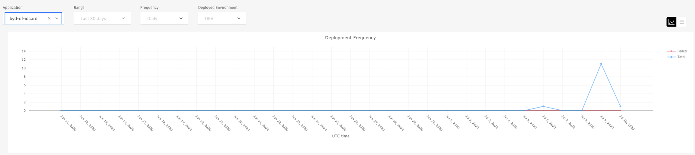
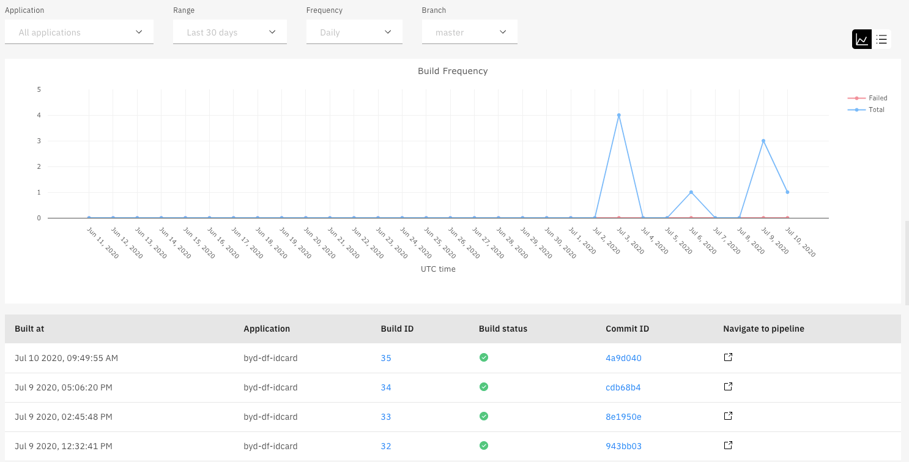

IBM Cloud - Continuous Delivery

# IBM Cloud - Continuous Delivery

Continuous Delivery est un service disponible sur IBM Cloud. Il permet de créer une toolchain pour gérer les différents aspects DevOps d’une application. Chaque toolchain contient des outils IBM Cloud, opensource et third-party.

Note: Une mise à jour des scripts de la toolchain est en cours pour Beyond Core, ce document détaille la nouvelle version.

# Tools

Les différents outils intégrables dans une toolchain sont les suivants:



Ceux utilisés par la toolchain Beyond Core sont les suivants:

- Github: Permet d’intéragir avec un repository hébergé sur Github
- Delivery Pipeline: Automatiser les builds et les déploiements.
- DevOps Insight: Visualiser les métriques CI/CD (TU, Code Coverage, Rapport Sonarqube, Vulnerability Scan, fréquences de build et deploy)
- Slack: Notification de l'état de chaque pipeline (start / stop / erreur etc…)
- Sonarqube: Interaction avec une instance Sonarque (Sonarqube n’est pas proposé en PaaS, il s’agit de lier l’instance Sonarqube pour l’utiliser dans les pipelines)
- Key Protect: Gestion des informations sensibles de la toolchain (API Key, Password, Token)
    

Quand un Delivery Pipeline est utilisé, celui-ci fait partie d’un pool de workers, partagés, dans la région de création de la pipeline. Il est possible de choisir un Private Worker et le faire s’exécuter sur l’infracture de son choix (un cluster Kubernetes par exemple).

Les Delivery Pipeline utilisés par Beyond Core sont Classic. Il est également possible de créer des pipeline basées sur Tekton.

Les pipelines Classic se basent principalement sur du script Bash autour duquel le paramètrage est facilité.

Exemple Interface Toolchain Beyond Core:



# Delivery Pipeline

## Image de Pipeline

Continuous Delivery met à disposition plusieurs version d’image pour utilisation dans ses scripts. Ces images inclue beaucoup d’outils nécessaires au build & déploiement des applications. La version utilisée est la 2.7 dont le détail est accessible [ici](https://cloud.ibm.com/docs/ContinuousDelivery/pipeline_versioned_base_images?topic=ContinuousDelivery-pipeline_versioned_base_images#version_2_7)

Il est aussi possible d’utiliser sa propre image docker.

## Stage

### Input

L’input du premier Stage est le repository Github, il faut choisir la branche et aussi le trigger du Stage:

- Manuel
- Basé sur un évenement Github
    - Commit push
    - PR ouverte ou mise à jour
    - PR fermée



### Job

Il existe 3 types de job. Chacun ayant plusieurs types:

- Build
    - Simple
    - Ant
    - Container Registry
    - Custom Docker Image
    - Gradle
    - Grunt
    - Maven
    - npm
    - Shell Script
- Deploy
    - Cloud Foundry
    - Custom Docker Image
    - Kubernetes
- Test
    - Simple
    - Custom Docker Image
    - Vulnerability Advisor
    - Cloud Foundry
    - Sauce Labs

Chaque type ayant ses propres variables, par exemple, le type Container Registry du Job Build



Avec la clé d’API, stockée sous Key Protect, la connection au registry IBM Cloud est effectuée automatiquement. On peut facilement définir la région, le namespace et le nom de l’image Docker pour les utiliser dans le script.

### Script

Tous les scripts utilisés dans les pipelines sont stockés dans un repository Github: beyond-core-toolchain. Cela permet de pouvoir modifier tous les jobs de tous les microservices en même temps.

Côté toolchain, l’appel à un script hébergé sur Github est fait en Bash, à l’aide des API Rest Github:

```sh
#!/bin/bash
source <(curl -H "Authorization: bearer ${GITHUB_TOKEN}"  -H 'Accept: application/vnd.github.v3.raw' -L "https://api.github.com/repos/sxd-platform/beyond-core-toolchain/contents/CI/00-prebuild.sh?ref=init")
```

## Archive Directory & Stage’s input

Entre deux stages, il est possible de s'échanger des données et/ou des variables.

### Archive Directory

A la fin de chaque stage, tous le répertoire courant du job sont packagés pour être ré-utilisés en tant qu’input d’un futur Stage. Il est aussi possible de spécifier un Archive Directory différent afin de ne copier que les fichiers important.

Dans le Stage suivant, il faut préciser en tant qu’input, un type à **Build Artifact**, puis spécifier le Stage et le Job à utiliser.


### Build Properties

Pour échanger des variables entre 2 Stages, il faut utiliser un fichier build.properties. Ce fichier, au format properties, doit contenir toutes les variables nécessaires.

Dans le Stage suivant, il faut rajouter une variable d’environnement de type **Properties File** ayant pour nom buid_properties et le nom de fichier build.properties.  
La toolchain va importer toutes les variables du fichier en tant que variable d’environnement.


# CI

Pour chaque microservice, il faut ajouter un tool Github qui référence le repository Github du microservice concerné.

Ensuite, il faut créer un Delivery Pipeline. Ce delivery pipeline est composé de 6 étapes. Pour chaque Stage, il faut définir l’input, les jobs et les variables d’environnements. Il est aussi possible de configurer des variables au niveau du Pipeline, par exemple pour déterminer l’image de la pipeline.


## Prebuild

Ce script sert à initialiser des variables d’environnement relatives au repository Github ainsi que créer la nouvelle version du microservice.

Comme pour Jenkins X, la création de la version se base sur le tag (ou release) Github, qui doit utiliser la sémantique SemVer, en incrémentant le Patch de 1. Si on souhaite faire un bump Minor ou Major, il faut préalablement créer un tag du repository Github. Le script tagge cette nouvelle version sur Github

## UT - Sonar

Ce script sert à lancer les TU, ainsi que le code coverage et une analyse Sonarqube. Les fichiers de résultats sont garder pour pouvoir être uploadés par la suite à DevOps Insight.

Si les TUs sont KO, le build est stoppé.

## Docker Build

Ce script sert à compiler et stocker dans le container registry IBM Cloud l’image Docker du microservice

## Vulnerability Advisor

Une fois que l’image est dans le container registry, une analyse de vulnérabilité est lancée pour détecter toute vulnérabilité au sein de l’image Docker

## Helm

Si l’image est validée, il faut ensuite mettre à jour le chart Helm avec la nouvelle version. Une fois modifié, le Chart est envoyé sur le Chartmuseum.

Puis le repository d’environnement de Dev est cloné pour ajouter cette nouvelle release du microservice concerné. Si c’est la première fois que ce microservice est à déployer, le script rajoute une section dans le fichier requirements.yaml.

Le chart du microservice est aussi packagé directement dans le répertoire charts du repository d’environnement. Le repository est ensuite mis à jour sur Github avec un push sur la branche Master.

## DevOps Insight

La dernière étape consiste à remonter les métriques sur DevOps Insight:

- Rapport TU
- Rapport Code Coverage
- Rapport Sonarqube
- Rapport Vulnerability Advisor
- Statut du build: Pass ou Fail

Le statut du build se base sur un build number et un nom de microservice. Le statut du deploy doit utiliser les mêmes informations pour que cela soit visible, ces deux informations ont donc été aussi copiés dans le repository d’environnement via un fichier version.yaml à la racine du repository.

# CD

Le deploy est fait via un repository d’environnement. Dès qu’un commit est détecté sur la branche master, la pipeline de Deploy se déclenche automatiquement.

## Deploy

Le script de Deploy utilise Helm pour déployer sur le cluster cible. L’utilisation d’un job Deploy de type Kubernetes permet de ne pas avoir à gérer la connection au cluster. Il suffit, via une API Key, de spécifier la région, le resource group et le cluster cible.

Le script upgrade donc l’install précédente de l’application, avec option --install si c’est la première installation.

Une fois que le chart est déployé, un statut du déploiement est envoyé à DevOps Insight.

# DevOps Insight






