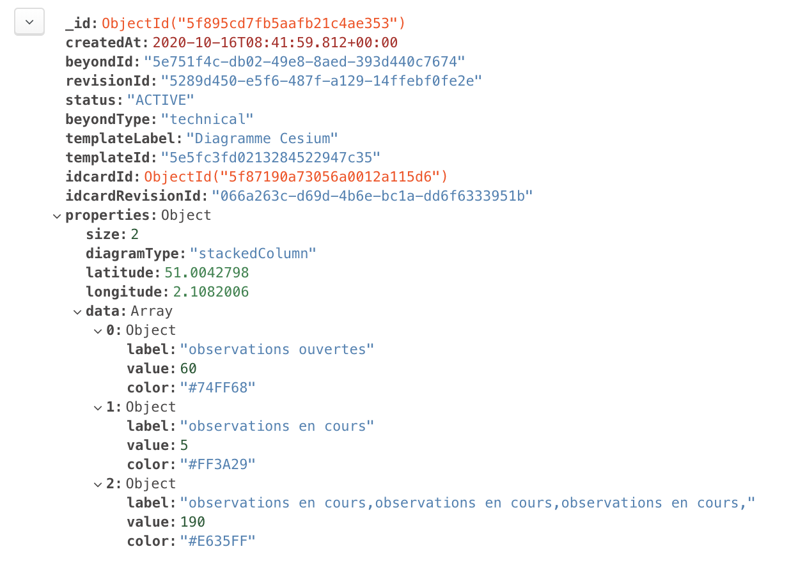
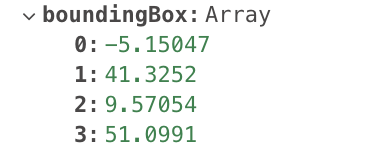

# Templates d'enrichissements #

## Liste des enrichissements ##

 - `MODELGRAPHIC` : Cet enrichissement sert à donner les infos concernant le bon affichage des modèles graphiques.
 - `Diagramme Cesium` : Cet enrichissement sert à donner les infos concernant le bon affichage des diagrammes cesium.
 - `ExternalData_RealWorld` : Cet enrichissement sert à ouvrir une donnée dans l'application RealWorld.
 - `ExternalData_DigitalSite` : Cet enrichissement sert à ouvrir une donnée dans l'application DigitalSite.
 - `ExternalData_Asset5` : Cet enrichissement sert à ouvrir une donnée dans l'application Asset5.
 - `ExternalData_Satellite` : Cet enrichissement sert à ouvrir une donnée dans l'application Satellite.
 - `ExternalData_ProcessManager` : Cet enrichissement sert à ouvrir une donnée dans l'application ProcessManager.
 - `ExternalData_Geoscope` : Cet enrichissement sert à ouvrir une donnée dans l'application Geoscope.
 - `ExternalData_Monitoring` : Cet enrichissement sert à ouvrir une donnée dans l'application Monitoring.
 - `ExternalData_Asset` : Cet enrichissement sert à ouvrir une donnée dans l'application Asset.
 - `Reality_ContextData` : Cet enrichissement sert à ajouter des données de contexte (flux WMS/WMTS) dans Reality.
 - `Enrichissement Ged` : Cet enrichissement correspond aux champs requis pour récuperer
 les informations d'un document contenu dans une ged. Le label "Enrichissement ged" importe peu.
 Il est possible de créer autant d'enrichissements avec un beyond type `document` que l'on veut.

## Contenu de l'enrichissement MODELGRAPHIC ##

    {
      size: number; // Taille du modèle graphique.
      color: string; // Couleur du modèle graphique.
      outlineColor: string; // Couleur du contour du modèle graphique.
      outlineSize: number; // Taille du contour du modèle graphique.
      showDistance: number // Distance à laquelle le modèle graphique s'affiche.
      type: string; // Type de modèle graphique (Points, polygone, line, etc..).
      geometry: {            // Contient les coordonnées et le système de référencement du modèle graphique.
                    type: string, // Pour l'instant nous ne gérons que le type 'Point'.
                    coordinates: Array // Tableau contenant les coordonnées des points. 
                }
    }

## Contenu de l'enrichissement Diagramme Cesium ##

    {
      size: number; // Taille du diagramme cesium.
      diagramType: 'stackedColumn' | 'circle'; // type du diagramme cesium.
      data: {
             type: Array; // données du diagramme.
             items: {
                      type: Object;
                      properties: {
                                   label: string; // Titre de la donnée.
                                   value: number; // Valeur de la donnée.
                                   color: string; // Couleur associée à la donnée.
                                  }
                    }
            }
      longitude: number; // Longitude du diagramme cesium.
      latitude: number; // Latitude du diagramme cesium.
    }
    
Voici un exemple d'enrichissement diagramme : 
 

## Contenu de l'enrichissement ExternalData_RealWorld ##

    {
      URL: string; // Url de la donnée dans Realworld au format URI.
    }

## Contenu de l'enrichissement ExternalData_DigitalSite ##

    {
      URL: string; // Url de la donnée dans DigitalSite au format URI.
    }

## Contenu de l'enrichissement ExternalData_Asset5 ##

    {
      URL: string; // Url de la donnée dans Asset5 au format URI.
    }

## Contenu de l'enrichissement ExternalData_Satellite ##

    {
      URL: string; // Url de la donnée dans Satellite au format URI.
    }

## Contenu de l'enrichissement ExternalData_ProcessManager ##

    {
      URL: string; // Url de la donnée dans ProcessManager au format URI.
    }

## Contenu de l'enrichissement ExternalData_Geoscope ##

    {
      URL: string; // Url de la donnée dans Geoscope au format URI.
    }

## Contenu de l'enrichissement ExternalData_Monitoring ##

    {
      URL: string; // Url de la donnée dans Monitoring au format URI.
    }

## Contenu de l'enrichissement ExternalData_Asset ##

    {
      URL: string; // Url de la donnée dans Asset au format URI.
    }

## Contenu de l'enrichissement Reality_ContextData ##

    {
      provider?: string; // Propriétaire du flux.
      boundingBox?: Array; // Zone encadrant le flux complet sur la carte.
      url: string; // Url du flux.
      layer: string; // Nom de la couche.
      WS Type?: string; // Type du flux.
      style?: string; // Réservé uniquement au WMTS. Nom du style associé à la couche.
      tileMatrixSetID?: string // Réservé uniquement au WMTS. Matrice de la couche.
      version?: string; // Version du flux dans le géoserveur.
      description?: string; // Description de la couche.
      format?: string; // Format des tuiles de la couche (JPG, PNG, etc...).
      specificLegendURL?: string; // Url de la surcharge de la légende au format URI.
    }
    
La propriété `boundingBox` de cet enrichissement est un tableau de coordonnées, voici un exemple :
 

## Contenu de l'enrichissement possédant un beyondType `document` (Nuxeo) ##

    {
      uid: string; // Identifiant du document dans la ged.
      title: string; // Titre du document.
      connector: string; // Nom du connecteur de la ged.
    }

|001|Version Initiale|HENNAERT Lucas|DELBE Nicolas|KUIK Geoffrey|
