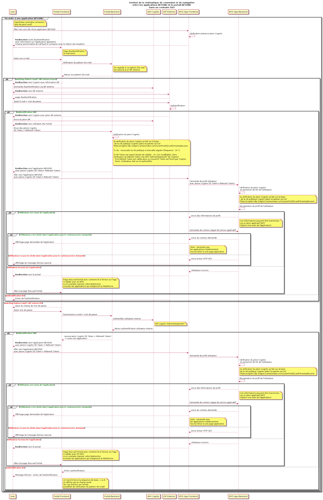
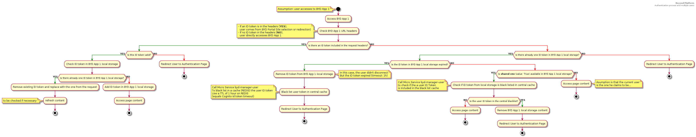
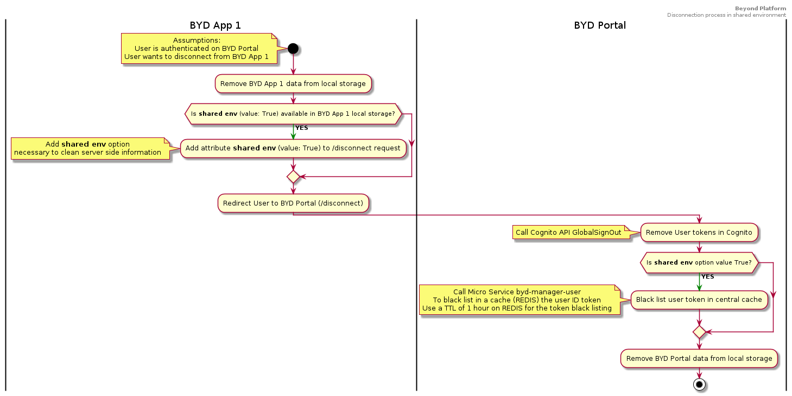

# Processus global d'authentification

L'objectif de cette page est de décrire le processus d'authentification au sein de la plateforme BEYOND et des applications qui la composent.

## Principes de l'authentification au sein de la plateforme BEYOND

La séquence d'authentification est décrite dans le diagramme de séquence ci-dessous :

Ce diagramme identifie les composants intervenant dans le processus d'authentification d'un utilisateur, que celui-ci ait un compte interne (géré dans le référentiel des utilisateurs de BEYOND - AWS Cognito) ou un compte externe, géré au sein d'un fournisseur d'identité (IdP) de son entreprise.

En synthèse, lorsqu'une utilisateur accède au portail ou bien directement à une des applications de BEYOND, si la requête utilisateur ne contient pas de jeton d'identification ("ID token"), l'utilisateur est redirigé vers la page d'identification gérée dans le portail.

### Gestion des autorisations dans chaque application BEYOND

Il est à noter que **la gestion des droits applicatifs se fait au sein de chaque application** :

- Au niveau du portail, on vérifie à quelles applications l'utilisateur a accès (modules d'exploitation et d'administration).
- Au niveau de chaque application, on vérifie les droits de l'utilisateur propres à celle-ci.

Ainsi, dans chaque application de BEYOND et dans le portail, il est nécessaire d'associer le compte de l'utilisateur avec un profil (lui-même rattaché à des permissions applicatives).

### Gestion de la connexion et de la déconnexion au sein des applications BEYOND et du portail

L'identification de l'utilisateur se fait sur chaque application en s'appuyant sur le jeton d'identification fourni par Cognito et partagé par le portail lors de la phase de connexion.

Il en va de même pour la déconnexion de l'utilsateur. Ainsi, lorsqu'un utilisateur se déconnecte d'une application A de BEYOND :

- Son jeton est invalidé au niveau de Cognito
- Son jeton est supprimé du LocalStorage de l'application A au sein du navigateur de l'utilisateur (le LocalStorage de l'application A est entièrement supprimé)
- L'utilisateur est redirigé sur le portail BEYOND (son jeton est alors supprimé du LocalStorage du portail).

Mais si l'utilisateur était également connecté à l'application B, le jeton reste valide (localement car présent dans le "LocalStorage" de l'application B), jusqu'à son expiration.
Dans la version actuelle de Cognito, la durée de validité du jeton est d'une heure (non modifiable).

#### Cas particulier des environnements partagés

Bien que non recommandé pour des raisons de sécurité globale (au-delà des cas d'usage de BEYOND), dans certains cas d'utilisation métier (utilisation d'applications BEYOND en mobilité par exemple), il est possible que le terminal soit utilisé par plusieurs personnes tout en restant connecté au sein de la même session utilisateur sur le terminal.

Afin de limiter les risques d'usurpation (involontaire) d'identité, la plateforme BEYOND propose d'identifier ce contexte d'utilisation des applications BEYOND au moyen d'un paramètre "environnement partagé" activé par l'utilisateur lors de sa connexion à BEYOND via le portail.

#### Cinématique de traitement de la connexion et de la déconnexion

Le premier diagramme d'activité suivant présente la gestion du jeton d'identification au niveau du portail en tenant compte de l'activation du paramètre précisant si on se trouve dans un cas d'environnement partagé ou non.

Dans le cas d'un environnement partagé, on stocke :

- Les informations permettant d'identifier le terminal sur lequel au moins un utilisateur est connecté -> côté serveur
- Le paralètre d'environnement partagé -> dans le LocalStorage de chaque application accédée par l'utilisateur (+ le portail)

Le second diagramme d'activité suivant présente la gestion du jeton d'identification au niveau d'une application BEYOND, en tenant compte de l'activation du paramètre précisant si on se trouve dans un cas d'environnement partagé ou non.

Le troisième diagramme d'activité suivant présente la gestion de la déconnexion au niveau d'une application BEYOND et du portail, en tenant à nouveau compte de l'activation du paramètre précisant si on se trouve dans un cas d'environnement partagé ou non.

Dossier de spécification - BEYOND PLATFORM - Juillet 2020
