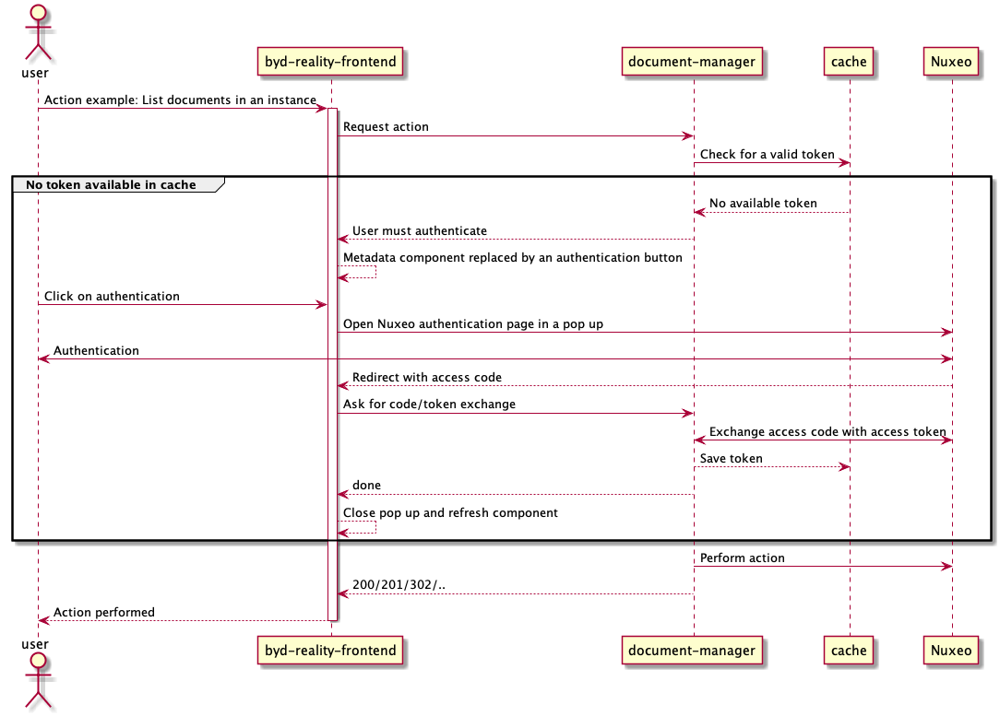

# Gestion électronique des documents

**1- Contexte:**

Le terme GED (ou EDMS pour Electronic Document Management System) désigne la gestion informatisée de contenus documentaires. Beyond, comme toute plateforme de gestion et suivi de chantiers, s'appuie entre autre sur des documents informatisés pour décrire les travaux et leur avancement.

Plusieurs fournisseurs de GED existent sur le marché (Nuxéo, Sharepoint... etc). Beyond a pour but de s'adapter à toute instance de ces GED et de pouvoir en rajouter au besoin des projets avec un minimum d'administration pour ensuite permettre à l'utilisateur final d'en associer un ou plusieurs document à un idcard.

**2 - Connexion aux GEDs**

Les instances des GEDs étant les propriétés des clients finaux, Beyond en tant que plateforme ne peut pas y accèder librement pour en lister, afficher ou renommer des documents. La connexion avec ces GEDs passe donc par l'identité des clients finaux au travers d'un client-id de Beyond à priori déclaré sur l'instance en question.

Le protocole utilisé dans le cadre du projet Beyond est OAuth2 qui permet d'authoriser un site web ou application à utiliser l'API d'une autre application pour le compte d'un utilisateur. Ainsi l'utilisateur final peut déléguer son authorisation d'utiliser la GED à la plateforme Beyond.

Ce protocole étant pas mal répondu sur le marché, le plupart des GEDs aujourd'hui en sont compatible dont Nuxeo qui est le premier fournisseur de GED à intégrer Beyond.

**3 - Diagramme de séquence**

Afin de pouvoir gérer ces appels particuliers de Beyond vers les GEDs de manière sécurisée, l'utilisateur doit saisir ses identifiants propres à l'instance de la GED sur un formulaire dédié à celà sur l'instance de GED et configurée de telle sorte à rediriger vers notre plateforme avec le code d'authenfication. Ce code est ensuite échangé contre un token avec durée de validité et échangeable avec un refresh token à expiration. Ci-dessous le diagramme décrivant le séquencement des appels depuis l'utilisateur jusqu'à la GED:



**4 - Modèle de donnée**

***4.1 - Les documents***

Les documents sont des enrichissements ayant la particularité d'avoir un champs supplémentaire "beyondType" qui vaut "document". Ces enrichissements sont issues du template suivant:

```js
{
    uid: "string", //Identifiant unique du document dans l'instance de GED
    title: "string", //Titre du document propre à Beyond
    connector: "string" //Identifiant unique du connecteur (décrit en 4-2)
}
```

***4.1 - Les connecteurs***

Un connecteur est un ensemble de données qui permettent de se connecter à une instance de GED. Un connecteur represente donc une instance de GED et est donc référencé dans chaque document. Les connecteur sont stockés dans une table MongoDB et contiennent les champs suivants:

```js
{
    id: "string", //Identifiant unique de l'instance de GED
    product: "string", //Type de GED, nuxeo par exemple
    company: "string", //Compagnie de rattachement de la GED
    "client-id": "string", //Nom du client Beyond comme déclaré dans la GED
    baseUrl: "string", //L’URL de base de l’instance de GED, utilisée pour l’affichage des documents
    authorizationEndpoint: "string", //L’URL du serveur d’autorisation oauth2 de la GED
    tokenEndpoint: "string" //L’URL du serveur de génération des tokens de la GED
}
```
