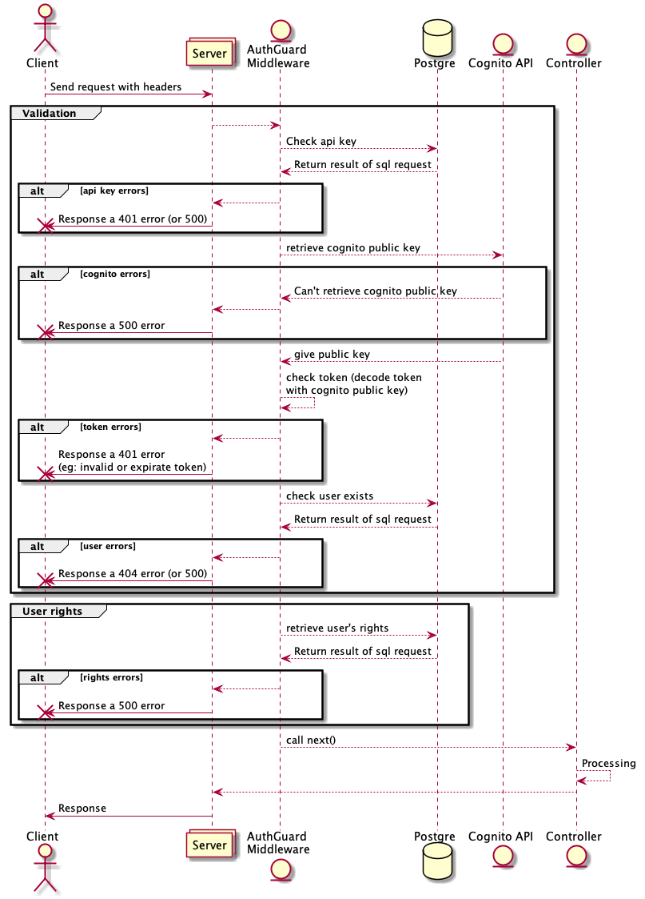

# Auth Guard
**Contexte :** L'auth guard est un middleware qui permet de vérifier que chaque personne sollicitant une API dispose bien d'une authentification valide

## Fonctionnement

Afin de vérifier si un utilisateur peut utiliser, ou non, une API, voici les différentes vérifications réalisées :

- **API Key** : Chaque microservice / entité de la plateforme dispose d'une API Key repertoriée dans notre base de données. Cette vérification sera réalisée grâce au header `[x-api-key]` <br/> Si ce dernier n'est pas renseigné, si la valeur est incorrecte, ou si l'api-key n'est pas acceptée pour solliciter un service en particulier, une erreur sera alors renvoyée indiquant à l'utilisateur qu'il lui est impossible de réaliser l'action demandée. Voici un exemple *(le message variera selon la situation, mais la structure de la réponse restera identique)* : 
 ``` 
{
     "errorCode": "Missing_apikey",
     "code": 401,
     "action": "API_VALIDATION_ERROR",
     "message": "No api key",
     "languageCode": "en-EN"
}
```
<br/>

- **Token** : Une fois l'api-key validée, le token de l'utilisateur sera alors vérifié.<br/>Pour réaliser cette vérification, nous devons dans un premier temps, récupérer la valeur du token qui se trouve dans le header `authorization`. Ensuite solliciter les services de *Cognito*. En effet, nous récupérons la clé publique de Cognito (si celle-ci n'est pas déjà stockée dans notre cache) pour demander le décodage du token. Si l'obtention de la clé publique de *Cognito* échoue, si le token a expiré ou si ce dernier n'est pas valide, une erreur sera alors renvoyée *(le message variera selon la situation, mais la structure de la réponse restera identique)* :

```
{
   "errorCode": "TOKEN_INVALID",
   "code": 401,
   "action": "TOKEN_VALIDATION_ERROR",
   "message": "expired token",
   "languageCode": "en-EN"
}
```

<br/>

- **Utilisateur** : Avec le décodage du token, nous avons pu récupérer le mail de l'utilisateur. Avec ce dernier, nous pouvons solliciter notre base de données pour vérifier que ce dernier est bien connu de la plateforme. Dans le cas contraire, une erreur sera retournée :

```
{
   "errorCode": "UNKNOWN_USER",
   "code": 403,
   "action": "ACCESS_API_ERROR",
   "message": "the user is not recognized from the platform",
   "languageCode": "en-EN"
}
```
<br/>

Si l'ensemble des étapes présentées ci-dessus sont validées, l'utilisateur pourra accéder à l'API et nous disposerons alors de l'ensemble de ses informations que nous stockerons dans le champ `user` de l'objet `request` pour pouvoir réaliser les différents traitements nécessaires sans avoir à solliciter à nouveau les mêmes informations. Voici un aperçu des champs disponibles : 

```
{
    "id": 324,
    "email": "john.doe@test.com",
    "firstname": "John",
    "lastname": "Doe",
    "providerUserId": "91d90c24-5341-4bde-c913-49313b92c48d",
    "companyName": "Company",
    "companyCode": "79a769ad-ee00-4c00-8760-7c719c286c39",
    "companyId": "1",
    "isAdminBeyond": true
    "rights": [
               {
                   "id": 1,
                   "code": "Company",
                   "roles": [
                       "DELEGATED_ADMIN",
                       "ADMIN_BEYOND"
                   ],
                   "permissions": [
                       "ADMIN_BEYOND_MANAGEMENT",
                       "COMPANY_CREATE",
                       "COMPANY_DELETE",
                       "COMPANY_READ",
                       "COMPANY_UPDATE",
                       "DELEGATED_ADMIN_MANAGEMENT",
                       "IDP_CREATE",
                       "IDP_DELETE",
                       "PRODUCT_CREATE",
                       "PRODUCT_DELETE",
                       "PRODUCT_READ",
                       "PRODUCT_UPDATE",
                       "USER_CREATE",
                       "USER_DELETE",
                       "USER_READ",
                       "USER_UPDATE"
                   ]
}
```

<br/>
Voici un diagramme permettant d'illustrer le fonctionnement :



## Cas particulier

En l'espèce, certaines situations nécessitent un accès à une information sans pour autant disposer de toutes les informations liées à l'utilisateur (*ex*: vérifier que le produit de la plateforme sollicité, lorsqu'un utilisateur se connecte, existe bien) 

Dans ce cas, en identifiant le service concerné, il est possible d'ajouter (côté code) dans le corps de la requête un champ supplémentaire appelé `securityOptions`

Ce dernier permet de préciser que seul un contrôle de `l'api-key` est nécessaire. Dès lors, le middleware prendra en compte cette spécificité pour valider l'accès à la ressource demandée.

Dans le cas contraire, l'ensemble des contrôles cités dans la section précédente sera réalisé.

|001|Version Initiale|ANTAL Steven|
