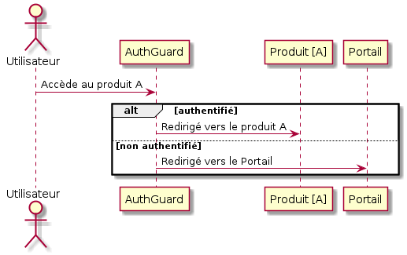

# AuthGuard

Le AuthGuard Angular est un service indiquant au routeur s’il doit autoriser ou non la navigation vers une route selon certain critères.

Si l’utilisateur est authentifié (Token en local storage), il est redirigé vers la page demandé.

Si l’utilisateur n’est pas authentifié (Token invalide ou inexistant en local storage), alors les données en local storage sont supprimés et il est redirigé vers la page de connexion du portail.

##Syntaxe

    CognitoConnectorModule.forRoot(environment, AuthService)

**Paramètres**

`environment` : variables d’environnement contenant les URLs des differents enviroments  
`AuthService` : Service d’authentification

##Exemple

- app.module.ts

    // ...
    import { CognitoConnectorModule } from 'cognito-connector';
    import { environment } from '../environments/environment';
    import { AuthService } from './shared/services/auth/auth.service';
    
    @NgModule({
      declarations: [
        // ...
      ],
      imports: [
        CognitoConnectorModule.forRoot(environment, AuthService),
      ],
      providers: [
        // ...
      ]
    })
    export class AppModule {}
    
    
- app-routing.module.ts
    
    
    // ...
    const routes: Routes = [
      {
        path: 'home',
        component: HomeComponent,
        canActivate: [AuthGuard]
      },
    ];
    
    @NgModule({
      imports: [RouterModule.forRoot(routes)],
      exports: [RouterModule],
    })
    export class AppRoutingModule {}

|001|Version Initiale|KUIK Geoffrey|
