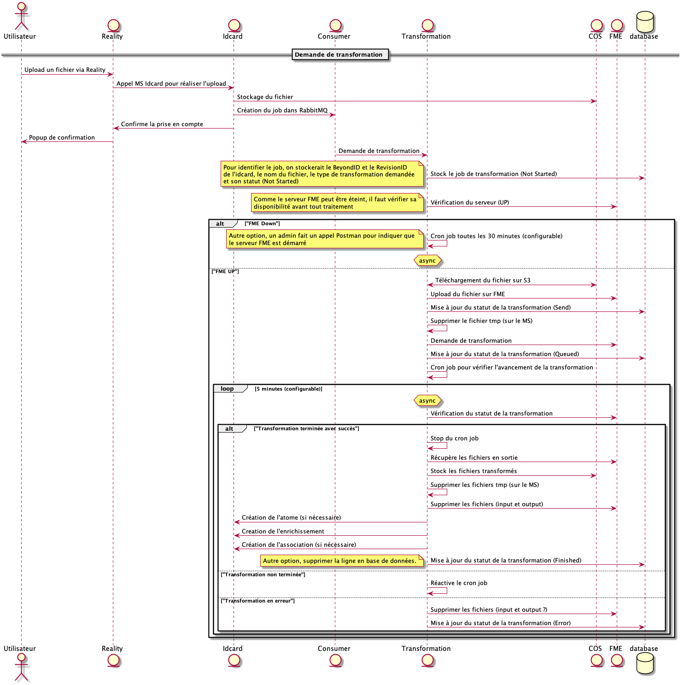

# Investigation FME

## Contexte

FME est un serveur distant (managé) permettant de paramétrer, gérer et proposer un catalogue de transformations.

Le but est de profiter de la puissance (déportée) de FME pour réaliser des transformations en dehors de notre infrastructure.

L'intérêt de solliciter FME est l'aspect asynchrone des transformations, contrairement à l'utilisation en interne des binaires de Cesium

## Diagramme de séquence

L'utilisation de FME oblige à revoir le fonctionnement actuel des transformations. En effet, l'aspect asynchrone des échanges entre le microservice et FME impose une approche différente.

Avant toute chose, il faudra vérifier que le service FME soit disponible. Pour se faire, la vérification se fera de manière régulière au travers d'un cron job.

Une fois actif, on pourra interagir avec ce dernier de la manière suivante:
- Envoi d'un fichier pour lequel une transformation est nécessaire
- Demande de transformation liée à ce fichier
- Récupération du résultat (statut, logs et/ou fichiers)
- Suppression des fichiers présents sur FME

Pour demander une transformation à FME, il sera nécessaire lors de l'appel API (méthode POST) de fournir les chemins d'entrée et de sortie qui seront regroupés dans le corps de la requête sous le champ `publishedParameters` comme suit :

```json
{
  "publishedParameters": [
    {
      "name": "SourceDataset_REVIT",
      "value": [
        "$(FME_SHAREDRESOURCE_DATA)/test/cesium/input/BATIMENT SOLIBRI.ifc"
      ]
    },
    {
      "name": "DestDataset_CESIUM3DTILES",
      "value": "$(FME_SHAREDRESOURCE_DATA)/test/cesium/output"
    }
  ]
}
```

Afin d'assurer la persistance du bon fonctionnement, un stockage en base de données des différents statuts de la transformation sera effectué (`Not Started`, `Send`, `Queued`, `Finished`). Ce suivi permettra aux cron job, chargés de l'asynchrone, de pouvoir vérifier l'ensemble des tâches non terminées et de les envoyer sur FME au besoin.

Ça nous permettra aussi, au redémarrage du microservice suite à une mise à jour ou à la mise à l'échelle, de récupérer les travaux en cours.

Pour illustrer le fonctionnement, voici un diagramme de séquence retraçant le parcours:



|Révision|Description|Auteurs|
|---:|---|---|
|001|Version Initiale|Antal Steven et Wyffels Ludovic|
