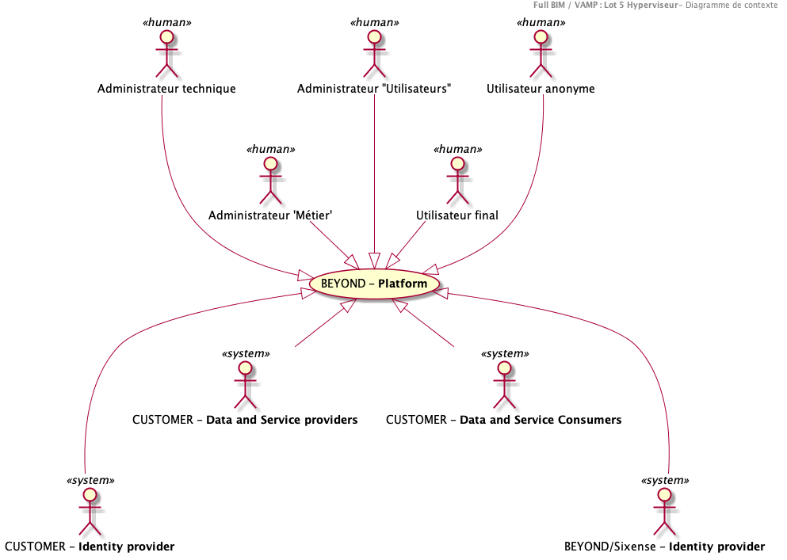

# Diagramme de contexte du système

## Introduction

La solution **FULLBIM - LOT #5 Hyperviseur** sera dénommée **SYSTEME** dans le reste du document.

Le diagramme de contexte du système est une représentation de l'architecture de la solution à son plus haut niveau.

Il permet de représenter

-   Les frontières du **SYSTEME**,
-   Son rôle et ses responsabilités
-   Les interactions auxquelles il est soumis
    -   Par les utilisateurs (Fonctions dans l'application)
    -   Par les systèmes externes.

>A ce stade, le diagramme de contexte du SYSTEME ne détaille pas la nature (technologique, fonctionnelle) de ces interactions qui seront décrites par les cas d'utilisation et la vision générale de l'architecture

## FULLBIM - LOT #5 Hyperviseur

### Rôles et responsabilités

Le **SYSTEME** est un composant de la plateforme **Full BIM** visant à :

- **LOCALISER** les équipements et le patrimoine du réseau
- **CONSULTER** les caractéristiques principales des objets
- **AFFICHER** les interventions en cours et à venir
- **SUIVRE** les activités

Aussi les responsabilités du SYSTEME sont de :

- Consolider les données de référence issues des composants de la plateforme Full BIM dans un **Référentiel de données central** (à savoir les outils de BIM, de gestion de patrimoine, de GMAO et de SIG)
- Fournir une visualisation agrégée de tout ou partie de ces données dans un contexte géolocalisé au travers d'une interface dédiée.
- Permettre la récupération du détail d'un objet dont le tronc commun est stocké dans le **SYSTEME** et notamment par le biais de l'URL de retour (callback URL) quand elle est retournée, de permettre à l'utilisateur d'être débranché dans l'application qui a généré cet objet.

### Frontières

Le **SYSTEME** n'a pas vocation à se substituer/recopier des processus existants dans les autres lots de la plateforme Full BIM, en conservant la vision strategie d'élaborer un produit (Fourniture d'un visualisateur cartographique).

En revanche, le **SYSTEME** visera à enrichir l'écosystème existant par de nouvelles capacités permettant une amélioration des processus inter-métiers

Afin de garantir l'intégrité des données :

- Il consolidera certaines données issues des autres lots de la plateforme
- Il ne modifiera pas/ne renverra pas les objets vers les composants externes. En revanche, il les enrichira d'un identifiant unique (idenfitiant universel) et pourra les relier logiquement au moyen d'une notion d'association.
- Il pourra générer des données qui lui sont propres
- Il permettra une interrogation des données de son référentiel (objets "Métier" consolidés) aux composants autorisés.

De manière schématique, le SYSTEME présente différentes frontières :

-   **Frontière #1:** Accès des utilisateurs de la plateforme aux différents "univers" (Cartographie, Tableau de bord)
-   **Frontière #2:** Enrichissement des données contenues dans le SYSTEME auprès de leurs propriétaires en temps réel (Récupération du détail d'un objet, affichage des hiérarchies d'organisation de l'objet, accès aux documents de la GED)
-   **Frontière #3:** 	Exposition de nouveaux services "métier" vers des tiers externes (Nouvelles API).
-   **Frontière #4:** Intégration des données issues des systèmes externes afin d'alimenter le SYSTEME avec les données nécessaires et suffisantes.

### Interactions

Le **SYSTEME** interagit avec les utilisateurs suivants :

**Fonction d'administration** :

- **Administrateur technique** : en charge du paramétrage technique de la solution. Il est en charge de suivre les éléments de journalisation et notamment les alertes afin d'y remédier.

- **Administrateur 'Métier'** : en charge du suivi des métriques "métier" remontées par le SYSTEME. Il est en charge de suivre les éléments de journalisation "Métier" et notamment les alertes afin d'y remédier. Il est aussi en charge du paramétrage permettant de contextualiser le fonctionnement de la plateforme. Par exemple, il définit les profils de permissions pouvant être associés aux utilisateurs de la plateforme

- **Administrateur "Utilisateurs"** : en charge de la gestion des autorisations (Identités) sur la plateforme (Niveau Utilisateurs/Groupes)

**Utilisateurs finaux** :
3 populations sont documentées. Il faut noter que le modèle de sécurité de l'hypeviseur permet de créer des profils d'utilisateurs (dans ce cas 3 profils "type" d'utilisateurs) par composition des permissions disponibles. Une permission permet d'ajouter une fonction élementaire. Ce mécanisme permettrait donc de décliner d'autres populations d'utilisateurs (dans le respect des permissions disponibles dans la solution)

- **Technicien** : Il utilise le **SYSTEME** afin de bénéficier d'une interface consolidant son activité par journée au travers d'une carte (Interventions, alerte). Il dispose d'une vision enrichie (Éléments de patrimoines, évènements/activités historisées...)
- **Superviseur** : Il permet d'avoir une vision consolidée des activités pour les techniciens qu'il supervise
- **Direction (régionale)** : Il dispose d'une interface de consolidation de l'ensemble des activités de la plateforme. Il peut notamment consulter des tableaux de bord de gestion présentant des indicateurs de performance (KPI)

Le **SYSTEME** interagit avec les systèmes suivants

- **FULLBIM - LOT #2 Gestion du patrimoine (GP)**
- **FULLBIM - LOT #3 Gestion de la maintenance (GMAO)**
- **FULLBIM - LOT #4 Système d'information géographique (SIG)**
- **FULLBIM - LOT #5 Gestion Electronique de Documents (GED)**
- **VINCI Autoroutes - Référentiel des identités**
- **VINCI Autoroutes - Analyse des données** (v2)
