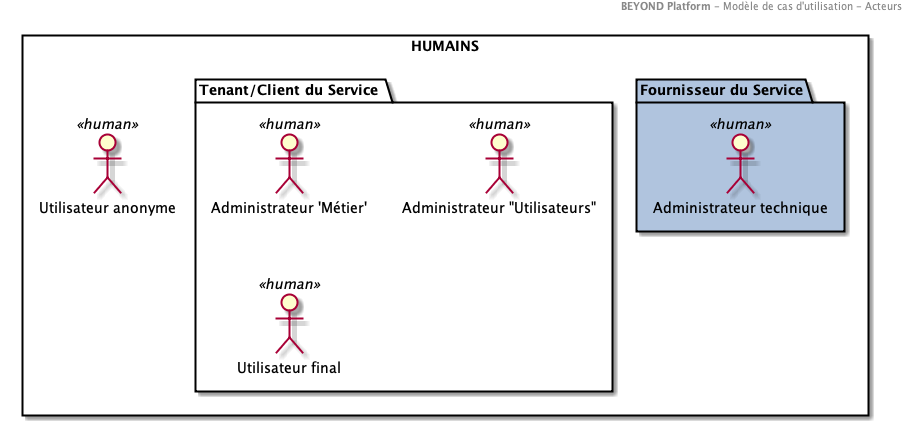
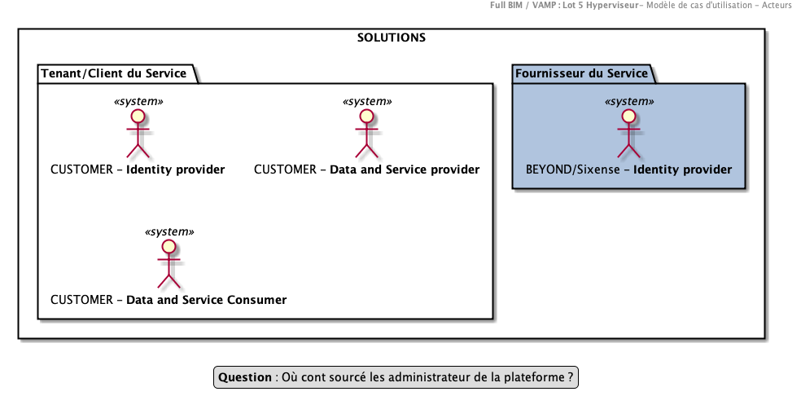

# Diagrammes de cas d'utilisation

> Les cas d'utilisation de la solution sont présentés ici.
> Ce document doit être aligné (ou remplacé) par les éléments des équipes fonctionnelles (EPIC/Stories JIRA).
> Son ambition est de pouvoir permettre d'assurer la maîtrise de la couverture fonctionnelle de la plate-forme.
> Les éléments devant être décrits pour un cas d'utilisation :
>
> - ACTEURS
> - PRE-CONDITIONS
> - DECLENCHEUR
> - DESCRIPTION
> - POST-CONDITIONS
> - ALTERNATIVES

## Acteurs

Les différents acteurs peuvent être répartis selon 2 catégories :

-   **Acteurs "solutions" :** services, systèmes ou applications
-   **Acteurs humains :** utilisateurs finaux de la plateforme

Les acteurs "humains" sont catégorisés en différentes populations, chacune avec des rôles et des droits spécifiques sur la plateforme.

>Remarque :
>La notion d'acteur permet de décrire l'intervenant "Métier" dans son utilisation  du **SYSTEME**. 
On parle de **profil** 'utilisateur' pouvant agréger un ensemble de **permissions** atomiques. Certaines permissions peuvent alors être partagées par différents profils.
>Voir [Sécurité](./0401.ComponentsModel.md)

### Acteurs Humains

### Acteurs "solutions"

| Acteurs                                                       | Type    |
| ------------------------------------------------------------- | ------- |
| Administrateur technique                                      | HUMAIN  |
| Administrateur 'Métier'                                       | HUMAIN  |
| Administrateur "Utilisateurs"                                 | HUMAIN  |
| Technicien                                                    | HUMAIN  |
| Superviseur                                                   | HUMAIN  |
| Direction (régionale)                                         | HUMAIN  |
| Utilisateur anonyme                                           | HUMAIN  |
| FULLBIM - LOT #2 **Gestion du Patrimoine (GP)**        | SOLUTION |
| FULLBIM - LOT #3 **Gestion de la maintenance (GMAO)**         | SOLUTION |
| FULLBIM - LOT #4 **Système d'information géographique (SIG)** | SOLUTION |
| FULLBIM - LOT #5 **Gestion Electronique de Documents (GED)** | SOLUTION |
| VINCI Autoroutes - **Identity provider**                      | SOLUTION |
| VINCI Autoroutes - **Analyse des données**                    | SOLUTION |

### Niveau "PRODUIT"

#### Administrateur technique (HUMAIN)

**Rôle** : Assure le paramétrage du SYSTEME pour les paramètres non accessibles des "Tenants". Par exemple, la configuration des premiers paramètres d'un compte  (administrateur, Définition du tenant). Il assure le paramétrage et le suivi technique du système
**Responsabilités** :

- **Active/Désactive** le "Tenant"
- **Configure** les Administrateurs "Utilisateurs" du "tenant"
-   **Consulte** les journaux techniques de la plateforme

>Remarque : La description du rôle et des responsabilités des acteurs du produit (les entités clientes ou "Tenant") devra être reprise de/consultée depuis  la description des "Users stories" dans JIRA

### Niveau "TENANT"

### Administrateur 'Métier' (HUMAIN)

**Rôle** : voir User Stories

**Responsabilités** : voir User Stories

### Administrateur "Utilisateurs" (HUMAIN)

**Rôle** : voir User Stories

**Responsabilités** : voir User Stories

### Technicien (HUMAIN)

**Rôle** : voir User Stories

**Responsabilités** : voir User Stories

### Superviseur (HUMAIN)

**Rôle** : voir User Stories

**Responsabilités** : voir User Stories

### Direction (régionale) (HUMAIN)

**Rôle** : voir User Stories

**Responsabilités** : voir User Stories

### Utilisateur anonyme (HUMAIN)

**Rôle** : voir User Stories

**Responsabilités** : voir User Stories

### FULLBIM - LOT #2 **Gestion du Patrimoine**  (SOLUTION)

**Rôle** : voir User Stories

**Responsabilités** : voir User Stories

### FULLBIM - LOT #3 **Gestion de la maintenance (GMAO)** (SOLUTION)

**Rôle** : voir User Stories

**Responsabilités** : voir User Stories

### FULLBIM - LOT #4 **Système d'information géographique (SIG)** (SOLUTION)

**Rôle** : voir User Stories

**Responsabilités** : voir User Stories

### VINCI Autoroutes - **Identity provider** (SOLUTION)

**Rôle** : voir User Stories

**Responsabilités** : voir User Stories

### VINCI Autoroutes - **Analyse des données** (SOLUTION)

**Rôle** : voir User Stories

**Responsabilités** : voir User Stories
