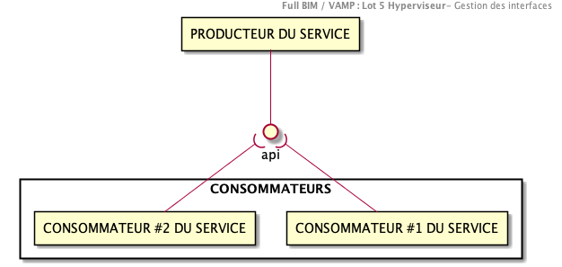
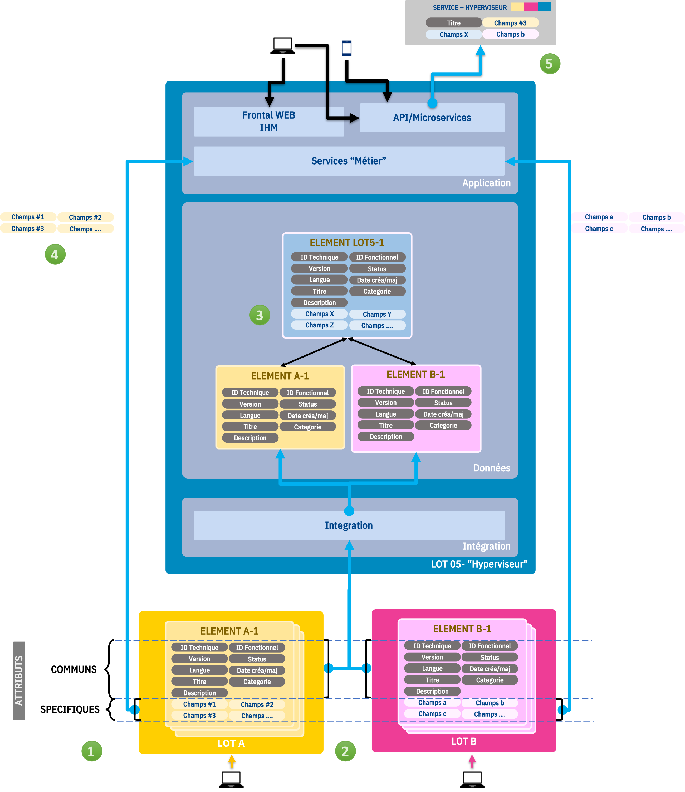
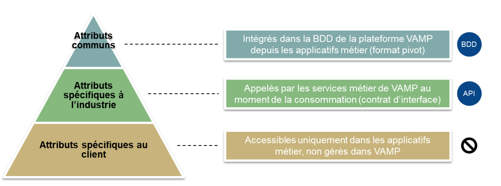

# Exigences sur l'intégration

## Introduction

Les exigences autour de l'intégration des systèmes visent à décrire le mode opératoire (fonctionnel et technique) d'accostage des tiers externes en interaction avec le **SYSTEME**

Pour chacun des intervenants, elles définissent pour chaque fonction :

-   Le mode d'accostage physique (Synchrone/Asynchrone/"Bulk Transfer" qui correspond à un transport de type sFTP par exemple)
-   La technologie d'accostage sous-jacente
-   La description du flux de données vue du **SYSTEME** (émetteur/récepteur)
-   La donnée échangée
-   La fréquence de requête
-   La volumétrie échangée
-   Les éléments de sécurité
-   Le lien vers le contrat d'interface qui détaille les exigences fonctionnelles (cas passants, exceptions), le contrat technique (wsdl/json).
-   Le lien vers les éléments de test
    -   Bouchons applicatifs
    -   Données représentatives

## Définition

Une interface est un mécanisme d'accostage entre 2 tiers, faisant la promotion d'un couplage faible en formalisant la stratégie d'intégration au travers d'un contrat. Ainsi, la façon dont est produite la donnée exposée est masquée à ceux qui l'utilisent et vice versa.

Pour éviter les ambiguïtés, les définitions suivantes sont proposées

-   Le **PRODUCTEUR** est le système qui expose le service aux tiers externes
-   Les **CONSOMMATEURS** sont les systèmes consommant la donnée exposée

Une interface entre deux acteurs doit permettre la gestion :

-   Du **cas nominal** : Le résultat attendu quand l'interface fonctionne
-   Des **cas d'exceptions** : L'ensemble des combinaisons de sortie pour des cas d'erreurs (fonctionnelles et/ou techniques)

Le principe fondateur d'une interface est de mettre en œuvre un système déterministe empêchant toute interprétation (de la requête ou de la réponse). Cela passe par une maitrise complète de cet accostage notamment en le décrivant au travers d'un **contrat d'interface** qui décrit en détail l'accostage technologique entre les tiers, ainsi que la donnée échangée.

Celui-ci peut prendre différents formats en fonction de la technologie en jeu :

-   Swagger pour des API Rest (La préconisation pour les échanges avec le **SYSTEME**)
-   Wsdl pour des webservices XML on SOAP
-   Fichier "doc" pour des accostages type sFTP ou autres.

## Matrice de responsabilité

|                                                                                            |       Responsible       |  Accountable  |       Consulted       |       Informed       |
| ------------------------------------------------------------------------------------------ | :-----------: | :-: | :-----------: | :-----------: |
| Formalisation du **besoin d'interface**                                                    | Consommateurs |     |               |   Producteur  |
| Formalisation du **contrat d'interface** (Document/swagger/wsdl) : Cas nominal, Exceptions |   Producteur  |     | Consommateurs |               |
| Fourniture des **bouchons applicatifs** avec des données représentatives                   |   Producteur  |     |               | Consommateurs |
| Implémentation de la **demi-interface : Exposition du service**                            |   Producteur  |     |               | Consommateurs |
| Implémentation de la **demi-interface : Consommation du service**                          | Consommateurs |     |               |   Producteur  |
| Test d'intégration de l'interface                                                          | Consommateurs |     |   Producteur  |               |

>Remarque: Afin de permettre les implémentations, le **SYSTEME** définira les contrats d'interface dont il est consommateur si ceux ci ne sont pas disponibles (getDetails, getAscendant, getDescedants, getPK, getSiblings)

## Stratégie d'interfaçage

Les enjeux de l'interfaçage du **SYSTEME** (Lot5 - Hyperviseur) avec des tiers externes sont de

-   Lui permettre de disposer d'un jeu de données suffisant, contenant les attributs permettant un affichage de l'ensemble des informations informations nécessaires et suffisantes dans  les écrans de « synthèse ».
-   Lui permettre de récupérer à la volée les données supplémentaires auprès du PRODUCTEUR de la donnée permettant détailler le contexte de l'objet affiché dans les écrans de « détail ».
-   Lui permettre de rediriger l'utilisateur du **SYSTEME** vers le PRODUCTEUR de la donnée afin qu'il puisse la modifier, sous reserve que les permissions d'accès en modification lui aient été fournies dans le PRODUCTEUR.
-   Conserver la cohérence globale des données qu'il contient, sachant que le **SYSTEME** peut lui aussi être un producteur de données.

La stratégie d'interfaçage est la suivante :

**[1]**: Chacun des lots peut contenir des éléments ( par exemple un actif) qu’il souhaite partager et/ou voir afficher dans le **SYSTEME**. Pour cela il doit être compatible avec les exigences du SYSTÈME, à savoir, chacun des éléments doit être décrit par

-   Un jeu d’attributs ("communs"en marron sur le schéma) (Titre, Identifiants, Catégories, Version, emplacement géographique…. – La liste reste à définir à l’aune des conclusions du chantier sur le dictionnaire de données).
-   Un jeu d’attributs propres aux fonctions de chaque lot/tiers externe (" spécifiques ", en rose et jaune pales)

Ces attributs sont nécessaires afin

-   De garantir un affichage performant et robuste des informations 'nécessaires et suffisantes' dans le SYSTÈME.
-   De permettre de récupérer dynamiquement les informations détaillant l’élément auprès du PRODUCTEUR de la donnée
-   De permettre le débranchement vers le PRODUCTEUR de la donnée afin de pouvoir la modifier, si les droits de l'utilisateur configurés dans le PRODUCTEUR le permettent.

**[2]**: Un déclencheur permet d’envoyer l’élément et son jeu d’attributs communs vers le SYSTÈME (Batch, passage de workflow pour l’élément à l’état « PUBLIC », action utilisateurs…)

**[3]**: L’ensemble des éléments (y compris ceux produits par le **SYSTEME** lui-même) est stocké. A ce stade, le SYSTÈME peut afficher la donnée "nécessaire et suffisante" (autonomie vis à vis des tiers externes)

Différentes options sont possibles pour « lier » les données dans le **SYSTEME**.

- Liens **fournis** : les lots externes renseignent la dépendance
- Liens **déduits** : la structuration des objets permet de les relier (découlant entre autre du dictionnaire des données, du référencement linéaire, du SIG)
- Liens **explicites** : Le **SYSTEME** fournit une interface permettant de lier les objets explicitement

**[4]**: Lors de l’affichage d’un élément dans le SYSTÈME, le détail de celui-ci peut être récupéré dynamiquement auprès du producteur (API REST)

**[5]**: De nouveaux services inédits pourront être générés par le SYSTÈME afin d’exposer de nouveaux objets ‘composites’ reflétant l’accostage des différents lots avec le SYSTÈME.

Remarque : Il est pris en hypothèse que le **SYSTEME** doit tendre à reposer sur/exposer des données **fraiches**, c'est à dire exposant la version la plus 'à jour' aux yeux de son propriétaire

### Segmentation des données

### Intérêts de cette approche

**Stratégie “Produit”** : permet de définir un produit générique ou lié à une industrie selon la répartition des attributs Communs/Spécifiques

**Ouverture/Polyvalence** : Permet d’intégrer de nouveaux lots facilement (Respect de la stratégie d’attributs Communs/Spécifiques)

**Couplage Faible** : L’évolution des tiers externes n’impacte pas la structuration du **SYSTEME**

**Performance** : Seules les données essentielles au fonctionnement du **SYSTEME** sont rapatriées.

**Pertinence/fraicheur des données** : Le détail des attributs spécifiques est requeté à la demande

**Innovation** : De nouveaux services inédits sont exposés par le **SYSTEME** (Composition, Consolidation de données enrichies).

### Impacts

Les impacts en termes d'interfaces sont les suivants :

**Impact #1 -** Cette approche favorise le couplage faible des systèmes, les tiers externes pouvant faire évoluer leur structuration interne (attributs spécifiques) en limitant l'impact sur l'architecture du **SYSTEME**.

**Impact #2 -** Les tiers externes doivent avoir la capacité d'être requêtés afin de fournir le détail d'un élément à afficher dans le **SYSTEME**

**Impact #3 -** La recherche détaillée sur les éléments du lot 5 ne pourra se faire que sur la base des données stockées dans le **SYSTEME**. L'évolution du **SYSTEME** dans le futur pourra chercher à étendre la recherche à des éléments résidents dans les lots externes, une capacité de recherche devra être alors déployée, celle-ci ayant la responsabilité de créer et maintenir un index de recherche transverse interrogeable depuis le **SYSTEME**.

### Compléments

 Un chantier **Dictionnaire de données** est initié dans le programme FullBIM afin de gouverner l'ensemble des enjeux autour de la donnée :

-   Définition des objets métiers, et de leurs interdépendances
-   Cycle de vie des objets métiers
-   Emplacement de la donnée (Propriétaire de la donnée)

## Les données du **SYSTEME**

Plusieurs familles d'objets doivent être reçues par le **SYSTEME**

-   Les **"assets"** (les actifs)
-   Les **"tasks"** (les tâches)
-   Les **"resources"** (les personnes et les équipes)
-   Les **"organisations"**

>Remarque : Il est fait l'hypothèse que les fichiers stockés en GED sont accédés au travers d'un objet auquel ils sont rattachés. Ils ne sont pas directement intégrés dans le **SYSTEME**

### Les **"assets"** (les actifs)

#### Émetteur :
- **FULLBIM - LOT #2 Gestion du patrimoine (GP)**
- **FULLBIM - LOT #3 Gestion de la maintenance (GMAO)**

#### Type d'objets pouvant être remontés dans le **SYSTEME** :

-   Équipement
-   Patrimoine
-   Foncier

#### Données remontées dans le SYSTEME

>Remarque : Les élements d'accostage sont décrits ci-dessous à titre d'illustration. Ils sont suceptibles d'évoluer en phase de spécifications techniques. La référence documentaire sur le sujet à consulter est le fichier technique de description de l'interface : (Fichier "Swagger")

|**Nom**|Type|Obligatoire|Description|Categorie|Exemple|
|---|---|:---:|---|:---:|---|
|**entryInServiceDate**|Date|OUI||_asset_|2002-12-30T06:40:00Z|
|**function**|Chaine de caractère|NON||_asset_||
|**indice**|Booléen|NON||_asset_||
|**notation**|Numérique|NON|Pour certains objets, une évaluation est fournie|_asset_||
|**serialNumber**|Chaine de caractère|NON||_asset_||
|**station**|Chaine de caractère|NON|GARE : Traduction a revoir|_asset_||
|**thumbnailurl**|Chaine de caractère|NON|Une image permettant d'illustrer l'élément|_asset_||
|**type**|Chaine de caractère|NON||_asset_||
|**originUId**|Chaine de caractère|OUI|Identifiant unique de l'élément dans le système d’origine|_core_||
|**originparentUId**|Chaine de caractère|OUI||_core_||
|**originFunctionalId**|Chaine de caractère|NON|Identifiant logique (fonctionnel) de l'objet. Il pourrait remonter plusieurs instances du même objet (par exemple différentes versions)|_core_||
|**origin**|Chaine de caractère|OUI|Système d'origine/Émetteur  de la donnée|_core_|SCANPRINT|
|**originlastupdated**|Timestamp|OUI||_core_|2002-12-30T06:40:00Z|
|**entity**|Chaine de caractère|OUI|un identifiant de l'entité d'origine|_core_|Cofiroute; ASF; Escota |
|**universalUId**|Chaine de caractère|NON|Identifiant universel de l'objet. Il identifie l'objet dans tous les systèmes (par exemple une référence universellement partagée pour un objet, un fichier de hachage pour un document)|_core_||
|**title**|Chaine de caractère|OUI|Le titre de l'élément, aligné sur la langue |_core_||
|**description**|Chaine de caractère|OUI|La description courte de l'élément|_core_||
|**status**|Chaine de caractère|OUI|Le statut (codification) de l'élément dans le système d'origine|_core_||
|**version**|Chaine de caractère|NON|La version de l'élément dans le système d'origine|_core_||
|**category**|Chaine de caractère|OUI|Un élément de catégorisation de l'élément (par exemple les "types d'asset"|_core_||
|**language**|Chaine de caractère|OUI|La langue de référencement de l'élément|_core_|fr|
|**way**|chaine de caractère|NON||_core/location_||
|**direction**|Chaine de caractère|NON||_core\location_||
|**firstLandmark**|Chaine de caractère|NON||_core\location_||
|**geoObject**|Objet JSON|OUI|Un objet permettant de définir un objet géographique associé. Au format geoJSON, il permet de définir un point, une poly-ligne, ou un polygone. |_core\location_||
|**highwayName**|chaine de caractère|NON||_core\location_||
|**landmark**|chaine de caractère|NON||_core\location_||
|**lastLandmark**|chaine de caractère|NON||_core\location_||
|**territoire**|Chaine de caractère|NON||_core\location_||
|**town**|chaine de caractère|NON||_core\location_||

### Les **"tasks"** (les tâches)

-   Visite
-   Constat
-   Intervention

#### Émetteur :

- **FULLBIM - LOT #2 Gestion du patrimoine (GP)**
- **FULLBIM - LOT #3 Gestion de la maintenance (GMAO)**

#### Données remontées dans le SYSTEME

>Remarque : Les élements d'accostage sont décrits ci-dessous à titre d'illustration. Ils sont suceptibles d'évoluer en phase de spécifications techniques. La référence documentaire sur le sujet à consulter est le fichier technique de description de l'interface : (Fichier "Swagger")

|**Nom**|Type|Obligatoire|Description|Categorie|Exemple|
|---|---|:---:|---|:---:|---|
|**originUId**|Chaine de caractère|OUI|Identifiant unique de l'élément dans le système d’origine|_core_||
|**originparentUId**|Chaine de caractère|OUI||_core_||
|**originFunctionalId**|Chaine de caractère|NON|Identifiant logique (fonctionnel) de l'objet. Il pourrait remonter plusieurs instances du même objet (par exemple différentes versions)|_core_||
|**origin**|Chaine de caractère|OUI|Système d'origine/Émetteur  de la donnée|_core_|SCANPRINT|
|**originlastupdated**|Timestamp|OUI||_core_||
|**entity**|Chaine de caractère|OUI|un identifiant de l'entité d'origine|_core_|Cofiroute; ASF; Escota |
|**universalUId**|Chaine de caractère|NON|Identifiant universel de l'objet. Il identifie l'objet dans tous les systèmes (par exemple une référence universellement partagée pour un objet, un fichier de hachage pour un document)|_core_||
|**title**|Chaine de caractère|OUI|Le titre de l'élément, aligné sur la langue |_core_||
|**description**|Chaine de caractère|OUI|La description courte de l'élément|_core_||
|**status**|Chaine de caractère|OUI|Le statut (codification) de l'élément dans le système d'origine|_core_||
|**version**|Chaine de caractère|NON|La version de l'élément dans le système d'origine|_core_||
|**category**|Chaine de caractère|OUI|Un élément de catégorisation de l'élément (par exemple les "types d'asset"|_core_||
|**language**|Chaine de caractère|OUI|La langue de référencement de l'élément|_core_|fr|
|**assignedTeam**|Chaine de caractère|NON|L'équipe en charge de réaliser la tâche|_task_|Tem001|
|**assignedUser**|Chaine de caractère|NON|L'utilisateur en charge de la tâche|_task_|john_doe@mycompany.fr|
|**duedate**|timestamp|NON|Date d'échance|_task_|2002-12-30T06:40:00Z|
|**priority**|Chaine de caractère|NON|Priorité de la tache  à effectuer|_task_|1, 2, 3|

## Services externes requis dans les tiers d'origine pour requêtage par le **SYSTEME**

Dans une stratégie de formaliser un écosystème où le détail des données stockées dans le SYSTÈME est rapatrié à la volée afin d’assurer une fraicheur optimale à la donnée, différents services doivent être exposés par les systèmes externes (les noms des services sont fournis à titre d'exemple pour simplifier la compréhension)

-   _getAscendants (**me**):_ Cette fonction permet de récupérer l'ascendance (le père avec/sans ses ancêtres) de l'objet en question.
-   _getDescendants(**me**):_ Cette fonction permet de récupérer la descendance (la filiation directe et/ou totale) de l'objet en question.
-   _getSiblings(**me**):_ Cette fonction permet de récupérer la fratrie de l’objet
-   _getDetail(**me**):_ permet de récupérer le descriptif de l’objet (dont le point de débranchement)
- _getDocuments(**me**):_ permet de récupérer la liste des documents (avec url) de l’objet
- _getPK(**highwayID,StartPK, EndPK**)_: permet de récupérer la description du linéaire entre 2 points kilométriques. Ce service sert notamment à l'établissement de la vision synoptique.

> Remarque:
> **_me_** : Correspond à l'identification de l’objet stocké dans le **SYSTEME**.
>Cela peut être :
>
> -   un identifiant **unique propre au système externe** (la clé primaire dans ce système). Il identifie 1 élément dans 1 système externe. (originUId)
> -   un identifiant **logique** (fonctionnel) au système externe. Il identifie plusieurs versions de l'élément dans le système externe (par exemple pour suivre son évolution). (originFunctionalId)
> -   un identifiant **universel**. Il identifie l'élément dans tous les systèmes. (universalUId).

## Les services exposés par le **SYSTEME**

|ID|CONSOMMATEUR (Emetteur  de la requête)|PRODUCTEUR (Producteur du service)|Type|Technologie|Nom du service|Description|Nombre de sollicitations par heure|Taille de la requête en ko|Taille de la reponse en ko|
|:---:|---|---|---|---|---|---|:---:|:---:|:---:|
|2|FULLBIM - LOT #2 Gestion du Patrimoine (GP)|SYSTÈME|Synchrone|REST API|_objectFeeder#2_|Envoi des éléments nécéssaires et suffisants vers le SYSTÈME. L'hypothèse est que cette alimentation se fait au fil de l'eau (pas de batch)|10|500|1|
|3|FULLBIM - LOT #3 Gestion de la maintenance (GMAO)|SYSTÈME|Synchrone|REST API|_objectFeeder#3_|Envoi des éléments nécéssaires et suffisants vers le SYSTÈME. L'hypothèse est que cette alimentation se fait au fil de l'eau (pas de batch)|10|500|1|

Voir le SWAGGER du services d'ingestion (Export pdf)
<https://bitbucket.org/sxdva/lot5-hyperviseur/src/master/ArchitectureDossier/tools/07.Interfaces/LOT5-ArchitectureDossier-INTERFACES.pdf>

## Les composants (systèmes externes) à interfacer

- **FULLBIM - LOT #2 Gestion du patrimoine (GP)**
- **FULLBIM - LOT #3 Gestion de la maintenance (GMAO)**
- **FULLBIM - LOT #4 Système d'information géographique (SIG)**
- **FULLBIM - LOT #5 Gestion Electronique de Documents (GED)**
- VINCI Autoroutes - **Identity provider**
- VINCI Autoroutes- **Analyse des données**

### FULLBIM - LOT #2 **Gestion du Patrimoine (GP)**

|ID|CONSOMMATEUR (Emetteur  de la requête)|PRODUCTEUR (Producteur du service)|Type|Technologie|Nom du service|Description|Nombre de sollicitations par heure|Taille de la requête en ko|Taille de la reponse en ko|
|:---:|---|---|---|---|---|---|:---:|:---:|:---:|
|4|SYSTÈME|FULLBIM - LOT #2 Gestion du Patrimoine (GP)|Synchrone|REST API|_getDetail_|Pour un utilisateur : Nombre d'objets en **détail** à afficher|30|1|10|
|5|SYSTÈME|FULLBIM - LOT #2 Gestion du Patrimoine (GP)|Synchrone|REST API|_getAscendants_|Pour un utilisateur : Nombre **d'ascendance** d'objets à afficher|30|1|5|
|6|SYSTÈME|FULLBIM - LOT #2 Gestion du Patrimoine (GP)|Synchrone|REST API|_getSiblings_|Pour un utilisateur : Nombre de **fratries d'objets** à afficher|7,5|1|5|
|7|SYSTÈME|FULLBIM - LOT #2 Gestion du Patrimoine (GP)|Synchrone|REST API|_getDescendants_|Pour un utilisateur : Nombre de **descendance** d'objets à afficher|7,5|1|5|
|24|SYSTÈME|FULLBIM - LOT #2 Gestion du Patrimoine (GP)|Synchrone|SSO |_getPK_|Affichage du synoptique|30|1|10|

### FULLBIM - LOT #3 **Gestion de la maintenance (GMAO)**

|ID|CONSOMMATEUR (Emetteur  de la requête)|PRODUCTEUR (Producteur du service)|Type|Technologie|Nom du service|Description|Nombre de sollicitations par heure|Taille de la requête en ko|Taille de la reponse en ko|
|:---:|---|---|---|---|---|---|:---:|:---:|:---:|
|13|SYSTÈME|FULLBIM - LOT #3 Gestion de la maintenance (GMAO)|Synchrone|REST API|_getDetail_|Pour un utilisateur : Nombre d'objets en **détail** à afficher|30|1|10|
|14|SYSTÈME|FULLBIM - LOT #3 Gestion de la maintenance (GMAO)|Synchrone|REST API|_getAscendants_|Pour un utilisateur : Nombre **d'ascendance** d'objets à afficher|30|1|5|
|15|SYSTÈME|FULLBIM - LOT #3 Gestion de la maintenance (GMAO)|Synchrone|REST API|_getSiblings_|Pour un utilisateur : Nombre de **fratrie d'objets** à afficher|7,5|1|5|
|16|SYSTÈME|FULLBIM - LOT #3 Gestion de la maintenance (GMAO)|Synchrone|REST API|_getDescendants_|Pour un utilisateur : Nombre de **descendance** d'objets à afficher|7,5|1|5|

### FULLBIM - LOT #4 **Système d'information géographique (SIG)**

|ID|CONSOMMATEUR (Emetteur  de la requête)|PRODUCTEUR (Producteur du service)|Type|Technologie|Nom du service|Description|Nombre de sollicitations par heure|Taille de la requête en ko|Taille de la reponse en ko|
|:---:|---|---|---|---|---|---|:---:|:---:|:---:|
|12|SYSTÈME|FULLBIM - LOT #4 Système d'information géographique (SIG)|Synchrone|REST API|_MAPS_|Pour un utilisateur : Nombre d'objets en **détail** à afficher|30|1|100|

### FULLBIM - LOT #5 **Gestion Electronique des Documents**

|ID|CONSOMMATEUR (Emetteur  de la requête)|PRODUCTEUR (Producteur du service)|Type|Technologie|Nom du service|Description|Nombre de sollicitations par heure|Taille de la requête en ko|Taille de la reponse en ko|
|:---:|---|---|---|---|---|---|:---:|:---:|:---:|
|21|SYSTÈME|FULLBIM - LOT #5 Gestion Electronique de Documents|Synchrone|REST API|_getDocuments_|Pour un utilisateur : Nombre de documents associés à un objet à afficher (URL retourné par le LOT 6, ouverture du document depuis le poste de l'utilisateur)|3|5|1|

### VINCI Autoroutes - **Identity provider**

|ID|CONSOMMATEUR (Emetteur  de la requête)|PRODUCTEUR (Producteur du service)|Type|Technologie|Nom du service|Description|Nombre de sollicitations par heure|Taille de la requête en ko|Taille de la reponse en ko|
|:---:|---|---|---|---|---|---|:---:|:---:|:---:|
|22|SYSTÈME|VINCI Autoroutes - Identity provider|Synchrone|SSO|_authenticate_|Nombre de demande d'authentification des utilisateurs VINCI Autoroutes. Hypothèse: correspond aux utilisateurs courant de la plateforme|206|1|5|

### VINCI Autoroutes- **Analyse des données**

A définir

## Cartographie des Flux
### Hypothèses

Sur la base des exigences non fonctionnelles en termes de capacité, le diagramme de flux suivant peut etre défini:

[Accéder au fichier de calcul de la volumétrie](./tools/03.Requirements/LOT5-ArchitectureDossier-VOLUMETRY01.01.xlsx)
