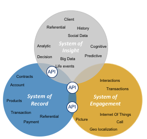

# Architecture générale

## Définition

Cette vue d'ensemble a pour objectif de synthétiser les grands thèmes d'architecture de l'Hyperviseur.

## Approche architecturale

Afin d'assurer la pérennité une approche architecturale déclinant la plateforme en

 - Un sous-système capturant la donnée, agissant comme un référentiel. On parle de système référentiel ou **"System Of Record"**
 - Un système permettant d'interagir avec les utilisateurs. On parle alors de système d'engagement des utilisateurs ou **"System Of Engagement"**
 - Un système permettant de manipuler les données collectées afin d'en tirer une valeur ajoutée. On parle alors de **"System of Insight"**

Il sera fait la promotion d'un couplage faible entre les différents systèmes par l'implémentation d’une approche **micro services** reposant sur des API

La force de cette stratégie est de permettre
  - une atomicité permettant une évolutivité plus simple (pas d'effets silo)
  - des cycles de vie des solutions adaptés à la typologie du système à implémenter (Agilité, vélocité des SoE, Pérennité, Stabilité des SoR )

Dans le cadre du Lot 5,
- La partie de « Collecte des données » (dans un format "pivot" métier de référence) aura un rôle de SoR,, alimenté par une couche d’intégration avec le monde extérieur permettant d’assurer la médiation avec les systèmes externes au moyen de format pivot générique.
-La partie au contact de l'utilisateur ("L'hyperviseur") aura un rôle de SoR
- il n'y a pas de « System of Insight ». Néanmoins la BI externe à alimenter répond a cette description.

## Description

L'**Hyperviseur** est une plate-forme visant à :

- Contenir les données de références utiles à l’ensemble des composants de la plateforme Full BIM dans un **Référentiel de données central** et offrir l'accès à ces données
- Fournir une visualisation agrégée de tout ou partie de ces données dans un contexte géo localisé au travers d'un client dédié

##  Parcours
Les utilisateurs de la plateforme FULLBIM qu'ils soient des utilisateurs finaux ou des administrateurs, peuvent accéder la plateforme au travers de leur navigateurs WEB.

Lors des accès par **navigateurs WEB**,
  - des pages HTML seront construites coté serveur et fournies au client.
  - Ces interfaces pourront mettre en œuvre des mécanismes asynchrones afin de récupérer de l'information supplémentaire. Ces requêtes se feront sous la forme d'appels d'API REST

Ces points d’entrée implémenteront des services « métiers » (notamment autour de l’authentification et l’identification de l’utilisateur).

Ils feront appel à des micro services permettant d’interagir avec la **zone de données**

-	De récupérer des données (cartographique, géo-spatiales, « métier » ou autres)
-	De stocker des données (en étant aligné sur une approche ‘micro services’)

Enfin, une **zone d’échange** (couche d’intégration) permettra à la plateforme :

-	De s’enrichir de données collectées depuis des systèmes externes
-	De fournir des extractions de données à des systèmes externes
-	D’exposer des micro services alignés sur des objets « métier »de la plateforme (pouvant eux-mêmes se reposer sur des micro services pour récupérer du détail)
