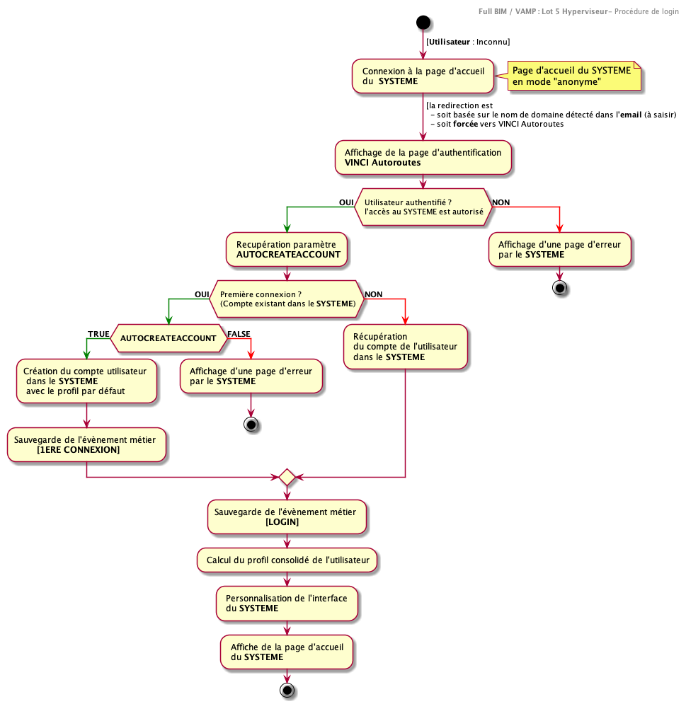

# Composant : Sécurité  (Rôles, Univers, Profils et Permissions)

La sécurisation du **SYSTEME** reposera sur les principes suivants :

-   Des **rôles** pré-câblés dans le **SYSTEME**
-   des **univers** qui correspondent à des zones fonctionnelles du **SYSTEME**.
-   des **permissions** sont associées à des fonctions élémentaires de la plateforme. Celles-ci sont atomiques et indépendantes (Une permission ne dépend pas d'une autre permission).
-   Des **profils**, correspondant à des compositions de permissions seront créés. Ils seront associés à des populations d'utilisateurs. Ils permettront d'attribuer des ensembles des fonctions à des utilisateurs du **SYSTEME**

> Remarque :
> Les permissions donnent accès à des fonctionnalités. Elles ne se substituent pas aux droits d'accès positionnés sur la donnée

## Rôles

Le fonctionnement du **SYSTEME** repose sur les rôles suivants :

-   **Administrateur technique** : Il est en charge

    -   De la supervision des journaux techniques de la plateforme (Log)
    -   De la création de l'**administrateur des utilisateurs**
    -   De la configuration initiale de la plateforme

-   **Administrateur des utilisateurs** : Il est en charge

    -   De la création des utilisateurs
    - De la création de l’**administrateur "Métier"**
    -   De l'association des profils aux utilisateurs
    - de la dés/activation d'un compte

-   **Administrateur "Métier"** : Il est en charge
    -   De la création des profils pour les utilisateurs
    -   De l'association des profils aux permissions du **SYSTÈME**

Les autres acteurs de la plateforme sont les utilisateurs, ils ne correspondent pas à un rôle pré-câblé dans le **SYSTEME**

## Univers

| **Univers**         | Description                                                            |
| ------------------- | ---------------------------------------------------------------------- |
| **Tableau de bord** | Cet univers permet d'accéder à l'hyperviseur 'Statistique'             |
| **Carte**           | Cet univers permet d'accéder à l'hyperviseur 'cartographique'          |
| **Recherche**       |                                                                        |
| **Administration**  | Cet univers permet d'accéder à la zone d'administration du **SYSTEME** |

La visibilité, l'accès à chacun des univers sont assujettis à une **permission** de haut niveau.

Des fonctionnalités supplémentaires à l'intérieur d'un univers sont activables en ajoutant des permissions supplémentaires.

## Permissions

Les permissions sont une liste finie d'habilitations alignées sur des fonctions du SYSTEME.

Une permission présente les qualités suivantes :

-   Elle active une fonctionnalité. Elle ne permet jamais de limiter/supprimer des fonctions à un utilisateur (Pas de permission de type "SUPPRIMER_FONCTIONNALITE"=Vraie/active)

-   Au-delà de l'accès aux univers (qui représente une permission de « haut niveau »), elles n'ont aucune dépendance entre elles.

Liste de permissions (non exhaustive) du **SYSTEME**

| Permission                       |     Univers     | Description                                                                                         |
| -------------------------------- | :-------------: | --------------------------------------------------------------------------------------------------- |
| **Access_Administation**         |  Administration | Accède à l'univers Administration                                                                   |
| **Access_BusinessEventsLogs**    |  Administration | Accède à l'interface de l'ensemble des journaux "Métiers" de la plateforme                          |
| **Access_TechnicalLogs**         |  Administration | Accède à l'interface de l'ensemble des journaux techniques de la plateforme                         |
| **Configure_Product**            |  Administration | Configure les paramètres **globaux** de la plateforme                                               |
| **Configure_Tenant**             |  Administration | Contextualise (Configure) les paramètres accessibles pour un tenant                                 |
| **Create Profile**               |  Administration | Crée un profil                                                                                      |
| **Create User**                  |  Administration | Crée un compte "utilisateur"                                                                        |
| **Manage_Profiles**              |  Administration | Associe des profils à des permissions                                                               |
| **Manage_Tenants**               |  Administration | Administre les différents clients de la plateforme (CRUD) (mise en place de la table Company/Entity) |
| **Manage_Users**                 |  Administration | Association des profils à des utilisateurs                                                          |
| **Access_Map**                   |      Carte      | Accède à l'univers cartographique                                                                   |
| **Create_Favorites**             |      Carte      | Création de favoris                                                                                 |
| **Create_Geofilter**             |      Carte      | Création de filtre géographique                                                                     |
| **View_Assets**                  |      Carte      | Affiche les assets sur une cartes                                                                   |
| **View_BusinessApplicationLink** |      Carte      | Affiche les liens vers les applications externes (Gestion des droits indépendantes)                |
| **View_Documentation**           |      Carte      | Affiche les documentations associées                                                                |
| **View_Notification**            |      Carte      | Affiche les notifications                                                                           |
| **View_Search**                  |      Carte      | Affiche la barre de recherche                                                                       |
| **View_Search_Advanced**         |      Carte      | Accède au moteur de recherche multicritère                                                          |
| **View_Task**                    |      Carte      | Affiche les tâches                                                                                  |
| **Access_DashBoard**             | Tableau de bord | Accède à l'univers de visualisation statistiques                                                    |
| **Export_Report**                | Tableau de bord | Exporte un rapport statistique                                                                      |

## Profils

Les profils sont des assemblages faits par l'**administrateur Métier** en vue de définir un ensemble d'habilitations pour un utilisateur.

C'est l'**administrateur des utilisateurs** qui associera les profils aux utilisateurs.

Un profil peut être marqué "Par défaut". Ce profil est alors automatiquement ajouté au compte de l’utilisateur lors de sa première connexion.

Par la suite, l'**administrateur des utilisateurs** pourra enrichir le compte de l'utilisateur de nouveaux profils.

Un **administrateur des utilisateurs** peut aussi anticiper la création d'un compte utilisateurs.

### Exemples d’utilisation:

1 - Création d'un profil "intervenant" par l'**administrateur Métier**

**INTERVENANT**:

-   Access_Map
-   Create_Favorites
-   Create_Geofilter
-   View_Assets
-   View_BusinessApplicationLink
-   View_Documentation
-   View_Notification
-   View_Search
-   View_Search_Advanced
-   View_Task

2 - Création d'un profil "intervenant" avec un ensemble des permissions limitées qui sera associé automatiquement au compte d'un utilisateur lors de sa première connexion

**INTERVENANT DEFAUT**:

-   Access_Map
-   View_Assets
    Association du marqueur "Par défaut"

> Remarque :
> Le profil du **superutilisateur**: Disposer sur une plateforme d'un utilisateur omnipotent/omniscient peut être assimilé à une mauvaise pratique par les dérives que cela peut engendrer (accès à des données non autorisée, par exemple). Toutefois, ce type de profil peut être créé en associant à un profil "SuperUtilisateur” l’ensemble des permissions accessibles.

## Séquence de connexion des utilisateurs

La séquence de connexion d'un utilisateur

## Stratégie d'implémentation

Les fonctions de gestion des profils, des permissions, des comptes utilisateurs seront exposées au travers d'API Rest:

- profile/add
- profile/associate/Account
- profile/associate/Permission
- account/add
- Account/toggleactivation
- ...

Celles-ci seront requétées au travers d'une interface Web
