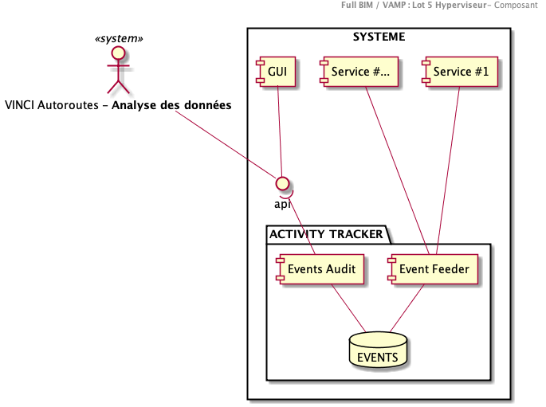

# Composant : Audit et Traçabilité

## Objectifs

Parce qu'il est central, le SYSTEME sera sollicité par des utilisateurs et des systèmes.
Il est alors de sa responsabilité d'assurer une traçabilité, et l’audibilité de l'activité des acteurs de la plateforme.

-   **Traçabilité** : Des mécanismes permettent de stocker les évènements arrivant sur la plateforme (Sollicitation d'utilisation, de stockage des données par des acteurs)
-   **Auditabilité** : Des mécanismes de requête des évènements collectés et d'affichage des résultats des interfaces permettent de comprendre l'activité (passée) sur la plateforme

Au-delà de ces objectifs 'métier', plusieurs enjeux peuvent être remontés :

-   L'architecture de ce composant devra permettre de stocker des évènements dont la structure (la richesse de la description d’un évènement) n'est pas forcément connue actuellement.
-   Cette capacité de traçabilité/auditabilité doit pouvoir être offerte à l'ensemble des services du SYSTEME, ceux-ci lui déléguant alors cette fonctionnalité afin d'éviter la redondance de code.

### Log vs. Evenements
L'ambition de ce composant est de remonter des activités "métier". En cela, il n'a pas vocation à être ni à remplacer les fonctions de journalisation classiques d'un système d'informations (Gestion des Logs)

## Principe

Le paquet/module **"Activity Tracker"** est constitué de 2 composants lui permettant de mettre en œuvre les fonctions de **traçabilité** et d'**auditabilité**.

Le principe de fonctionnement du module repose sur

-   Un composant qui permet l'ingestion d'évènements atomiques arrivant sur la plateforme à un des acteurs : **Event Feeder**
-   Un composant qui permet d'auditer la base des événements collectés, afin d'en tirer des analyses statistiques (Statistiques descriptives dans un premier temps, ouverture vers des analyses de tendance…), de suivre des parcours utilisateurs, de mieux comprendre le contexte d'utilisation de la plateforme (Détection d'incohérences, Qualification d'anomalies par exemple) : **Events Audit** .

Le fonctionnement de ce module repose sur

-   Une communication avec les tiers externes au moyen de micro services (REST API) pour exposer chacun des composants
-   Un stockage des données dans une base de données permettant de s'adapter aux différents évènements. Une approche de type "no-sql" est envisagé
-   Une syntaxe de codification permettant d'identifier des évènements de plateforme

> Remarque :  Le module **Activity Tracker** n'a pas la responsabilité de fournir la visualisation des statistiques (Bar/Pie chart) qui reste une prérogative de l'interface utilisateur (Par exemple : l'univers "Tableau de bord")

## Collecte des événements : Event Feeder

Ce composant permet d'ingérer les évènements de la plateforme.

Il est sollicité au travers d'une API d'exposition

### Évènement

La structure d'un évènement permet de collecter les notions suivantes

-   **QUI** : L'acteur qui a réalisé l'évènement.

-   **COMMENT** : Vecteur de sollicitation (Application Web, Mobile, configuration du poste…)
-   **QUOI** : La qualification de l'évènement
-   **QUAND** : l'horodatage de l'évènement

|**Nom**|Type|Obligatoire|Description|Arborescence|Exemple|
|---|---|:---:|---|---|---|
|**sourceID**|Chaine de caractère|OUI|Identifiant unique de l'utilisateur ou du système appelant|Source|F079139, ou utilisateur@companie.fr|
|**tenant**|Chaine de caractère|OUI|L'identifiant du'tenant'|Source|VINCI Autoroutes|
|**entity**|Chaine de caractère|OUI|un identifiant de l'entité d'origine|Source|Cofiroute; ASF; Escota |
|**device**|Chaine de caractère|NON||Source/Device|WEB, MOBILE|
|**screenResolution**|Chaine de caractère|NON|la resolution de l'ecran d'appel|Source/Device|1024x800|
|**language**|Chaine de caractère|NON|La langue de l'utilisateur|Source/Profile|fr_FR|
|**permissions**|Chaine de caractère|NON|La liste des permissions de l'utilisateur|Source/Profile||
|**timestamp**|Date|OUI|La date de l'evenement. C'est une date coté 'Serveur' (pour eviter les incohérences), exprimé au format ISO et sur la timezone UTC-Z. Voir les exigences non fonctionnelles|Event||
|**eventID**|Chaine de caractère|OUI|Identifiant de l'évènement|Event|VAMP_LOG ou VAMP_MAPUNIVERSEACCESS, ou VAMP_DASHBOARDACCESS, ou …|
|**context**|Objet JSON|NON|Contexte d'occurrence de l'évènement |Event|Champs additionnels|
|**severity**|Chaine de caractère|OUI|L'importance de l'évènement|Event|DEBUG,INFO,WARN,ERROR,FATAL|

>Remarque : Liste non exhaustive, à completer.

### Verbosité

Afin de permettre un suivi fin des activités sur la plateforme, différents niveaux de verbosité seront implémentés par les appelants :

-   **DEBUG**
-   **INFO**
-   **WARN**
-   **ERROR**
-   **FATAL**

Ces niveaux pourront être associés à des évènements particuliers afin de pouvoir les différencier facilement lors des analyses.
Cela pourra aussi influer sur les données remontées pour les évènements (par exemple le détail du poste de l'utilisateur...)

### Robustesse

Par sa criticité, des mécanismes particuliers doivent être mis en place afin de garantir de ne pas perdre des évènements lors de la collecte, tout en assurant de ne pas bloquer les appelant en cas de problème sur le composant.

A ce titre des mécanismes de queueing des appels au composant **Event Feeder**, ou prise en charge par l API Gateway seront à mettre en place.

### Label, Texte, Internationalisation

Afin d'optimiser la maintenance et l'utilisation de ce composant, aucun label 'intelligible' ne devrait être remonté dans la base de stockage.
Des identifiants devront être privilégiés. Ce sont les systèmes d'analyse qui auditent les évenements qui devront associer un label (dans la langue souhaité) à un évènement donné.

>Rappel : La langue de journalisation est l'anglais (voir exigences non fonctionnelles)

## Récupération des événements : Event Audit

Un service de récupération des évènements collectés sera mis en place. Les évènements pourront être récupérés :
  - Par date, en indiquant une fenêtre de récupération
  - Par utilisateur
  - Par type d'évènement
  - Par niveau de sévérité
  - par composition des éléments ci-dessus

Remarque : Le composant **Event Audit** n'a pas vocation à réaliser des statistiques sur les données. Ceci étant de la responsabilité de l'appelant (BI, Dashboard). Cette orientation se justifie par la volonté de limiter les effets de bords qui pourraient être engendrés par les calculs

### Performance
Un mécanisme de rupture sera configurable dans la plateforme afin de limiter le nombre de résultat retournes. Un indicateur sera alors positionné dans la réponse fait à l’appelant afin de lui indiquer cet état. Aucun mécanisme de pagination ne sera mis en place (approche « Stateless » du service).
