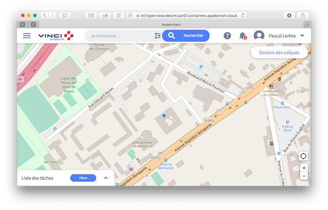
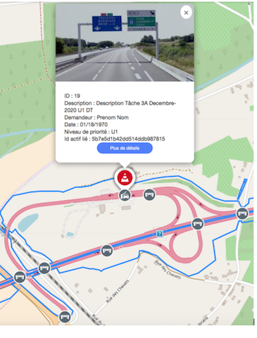
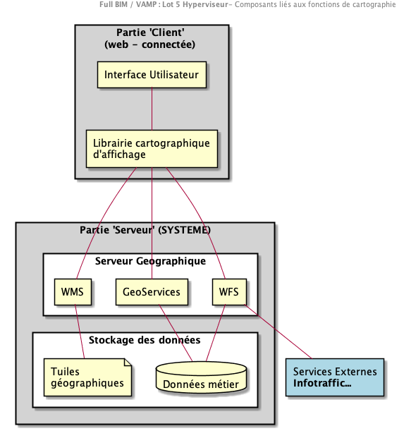
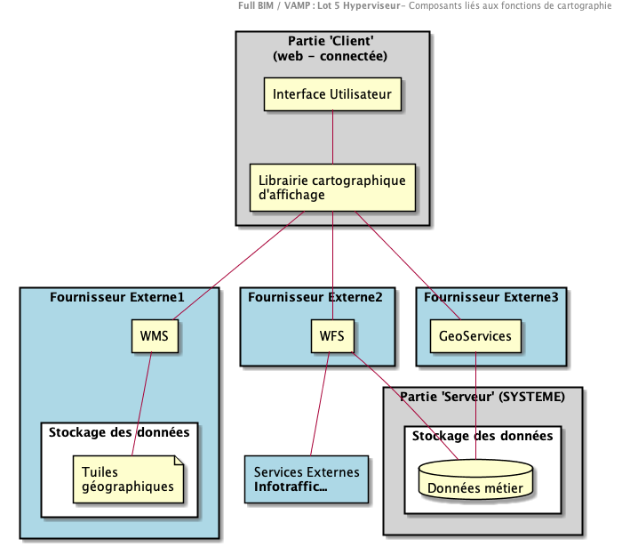
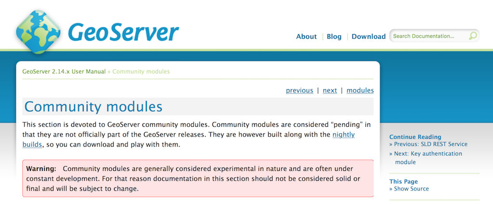
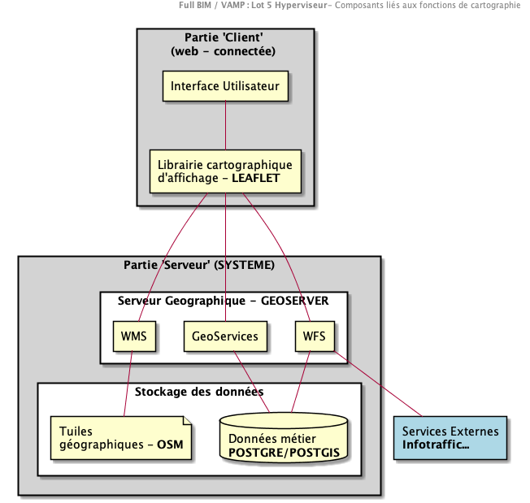
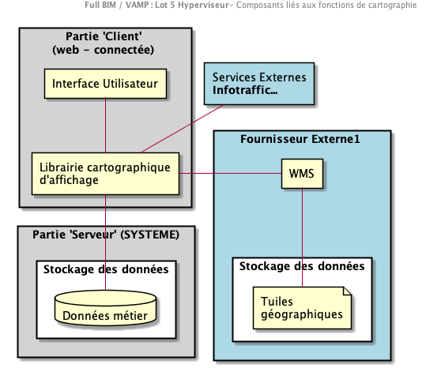

## AD-006 : Manipulation de contenus géographiques

### Documents de référence

|                           Document                          | Description                             |
| :---------------------------------------------------------: | --------------------------------------- |
| 20180824 FULL BIM Lot 4 Fiche de Convergence Métier v000.05 | Fiche de convergence Métier LOT 4 – SIG |

### Définitions

**Configuration** : Capacité à modifier le comportement de la plateforme par des actions d'Administration centralisées

**Personnalisation** : Capacité à modifier le comportement de la plateforme par la modification du profil de l'utilisateur

### Contexte

La conception de la plateforme LOT05-Hyperviseur (le "**SYSTEME**") porte l'ambition d'implémenter un "produit" (1) permettant

-   de **consolider** de l'information issue de tiers externes (Récupération d'un tronc commun de données dans le SYSTEME, accès au détail de l'information par requête du propriétaire de la donnée)
-   De déployer différents "univers"(2)  aux différents profils de la plateforme (Hyperviseur 'cartographique', Tableau de bord...)
-   De proposer des services enrichis au travers d'API à des tiers externes (API "composites")

(1) (2) cf. Dossier d'architecture

### Enjeux

Pour atteindre ces objectifs, une capacité de visualisation d'objet cartographique est requise dans le **SYSTEME**

Dans cette perspective, différents enjeux peuvent être formalisés :

-   "**Indépendance technologique**" : Parce qu'il est un produit, le SYSTEME doit pouvoir être déployé et opérationnel indépendamment du contexte client (présence de SIG) et des autres lots (LOT 04 en particulier)
-   **Affichage cartographique 2D**: Possibilité d'afficher des cartes 2D directement dans les univers de l'hyperviseur

> Remarque : Le périmètre de visualisation est mondial

-   Les éléments de cartographie peuvent être **configurés**
    -   Les **fonds de carte** doivent pouvoir être configurés par l'administrateur pour chaque "client" (ou "tenant")
    -   La **symbologie** doit pouvoir être configurée par l'administrateur pour chaque "client"

-   Vecteur de pérennité, le SYSTEME visera à reposer sur des **standards éprouvés** (Open Geospatial Consortium (OGC): Web Feature Service ou WFS, Web Map Service ou WMS ...)
-   Le SYSTEME visera à reposer sur une **solution libre** (Open source) vivante

-   Le SYSTEME sera un fournisseur de services cartographiques à destination de tiers externes.

    -   **Web Feature Service** ou WFS,
    -   **Web Map Service** ou WMS
    -   **geoService**

-   Le SYSTEME devra présenter des caractéristiques de performance et de robustesse :
-   Nombre d'éléments à afficher : TBD
-   Nombre d'utilisateurs : cf. NFR du dossier d’architecture

-   Le SYSTEME permettra l'affichage de ces éléments au travers d'un **canal WEB connecté**

-   **Le LOT 02 permettra l'affichage de ces éléments au travers d'un canal mobile/Mode déconnecté.**
> Question :
> Quel lot doit être le fournisseur de service cartographique pour le LOT 02 ?
>(Doit-on traiter cette exigence comme une capacité du LOT 05 et/ou une spécificité du lot 02)

### Hypothèses

#### Exclusions

-   Les fonctionnalités de type **"Street View"** ne sont pas étudiées dans le cadre de ce document
-   Les labels des cartes seront **mono-lingues**
-   La **production des fonds de cartes** n'est une fonction à mettre en œuvre dans le cadre de la capacité cartographique du SYSTEME.

#### Applicabilité à VINCI Autoroutes.

-   Le périmètre des cartes a afficher est **FR**
-   L'expérience utilisateur sur la cartographie devra viser à être **"sans couture"** entre les différents lots (LOT5/LOT2/LOT4)
    - Les fonds de cartes, la symbologie issus du lot 04 devront être configurés dans le SYSTEME

### Architecture de référence
#### Vision integrée (Plateforme géographique)

#### Vision "multi-source"

Externalisation des differents services (avec l'ensemble des compositions possibles)

### Alternatives

#### Alternative 01 - Architecture de référence

Mise en œuvre d'un serveur géographique exposant les fonds de cartes, les services métier et les fonction géographiques.

Serveurs géographiques étudiés (Voir document en référence)

-   Geoserver
-   QGIS server
-   MapServer

Solution retenue : **Geoserver**

**Avantages** :

-   Approche produit (Extensibilité, Performance)
-   Standardisation
-   Performance (Calcul fait sur serveur)

**Inconvénients** :

-   Mise en place de composants intermédiaires (SLA, Architecture, Implications dérivées...)
    > Remarque : C'est une contrainte plus qu'un inconvénient

| Critère                      | Niveau atteint |
| ---------------------------- | :------------: |
| Vision Produit               |    **HAUT**    |
| Standardisation              |    **HAUT**    |
| Performance                  |    **HAUT**    |
| Périmètre fonctionnel        |    **HAUT**    |
| Complexité de l'architecture |    **COMPLEXE**    |

##### Analyse d’impacts : Le modèle de données

**geoServer** intègre nativement les bases de données **POSTGRE/POSTGIS**

**geoServer** intègre à une base de données **mongoDB** au travers de modules communautaires. Ceux-ci sont identifiés comme "expérimentaux" A ce titre, ils ne seront pas retenus comme un composant de notre architecture

**Impact sur les données à stocker du SYSTEME**

L'architecture du SYSTEME vise à standardiser les données stockées afin de lui permettre de s'interfacer avec de nombreux systèmes externes. Ces données appelées le 'tronc commun' ont vocation à être enrichies par des données requêtées à la demande auprès du propriétaire de l'objet (le détail). A ce titre, l'ambition est de ne pas 'importer' la complexité des tiers externes à l'intérieur du SYSTEME. Cette approche rend l'utilisation d'une base relationnelle envisageable à l'intérieur du SYSTEME

>Remarque: Cela ne présume pas du mode de stockage des données 'non géo graphiques' à l'intérieur du SYSTEME - approche Hybride (SQL/noSQL)

**Les actifs stockés dans le SYSTEME (Vision Septembre 2018)**

|**Nom**|Type|Obligatoire|Description|Categorie|Exemple|
|---|---|:---:|---|:---:|---|
|**origin**|Chaine de caractère|OUI|Système d'origine/Émetteur  de la donnée|_core_|SCANPRINT|
|**originFunctionalId**|Chaine de caractère|NON|Identifiant logique (fonctionnel) de l'objet. Il pourrait remonter plusieurs instances du même objet (par exemple différentes versions)|_core_||
|**originlastupdated**|Timestamp|OUI||_core_||
|**originparentUId**|Chaine de caractère|OUI||_core_||
|**originUId**|Chaine de caractère|OUI|Identifiant unique de l'élément dans le système d’origine|_core_||
|**universalUId**|Chaine de caractère|NON|Identifiant universel de l'objet. Il identifie l'objet dans tous les systèmes (par exemple une référence universellement partagée pour un objet, un fichier de hachage pour un document)|_core_||
|**title**|Chaine de caractère|OUI|Le titre de l'élément, aligné sur la langue |_core_||
|**status**|Chaine de caractère|OUI|Le statut (codification) de l'élément dans le système d'origine|_core_||
|**version**|Chaine de caractère|NON|La version de l'élément dans le système d'origine|_core_||
|**language**|Chaine de caractère|OUI|La langue de référencement de l'élément|_core_|fr_FR|
|**entity**|Chaine de caractère|OUI|un identifiant de l'entité d'origine|_core_|Cofiroute; ASF; Escota |
|**description**|Chaine de caractère|OUI|La description courte de l'élément|_core_||
|**category**|Chaine de caractère|OUI|Un élément de catégorisation de l'élément (par exemple les "types d'asset"|_core_||
|**direction**|Chaine de caractère|NON||_core\location_||
|**firstLandmark**|Chaine de caractère|NON||_core\location_||
|**geoObject**|Objet JSON|OUI|Un objet permettant de définir un objet géographique associé. Au format geoJSON, il permet de définir un point, une poly-ligne, ou un polygone. |_core\location_||
|**highwayName**|chaine de caractère|NON||_core\location_||
|**landmark**|chaine de caractère|NON||_core\location_||
|**lastLandmark**|chaine de caractère|NON||_core\location_||
|**territoire**|Chaine de caractère|NON||_core\location_||
|**town**|chaine de caractère|NON||_core\location_||
|**entryInServiceDate**|Date|OUI||_asset_||
|**function**|Chaine de caractère|NON||_asset_||
|**indice**|Booléen|NON||_asset_||
|**notation**|Numérique|NON|Pour certains objets, une évaluation est fournie|_asset_||
|**serialNumber**|Chaine de caractère|NON||_asset_||
|**station**|Chaine de caractère|NON|GARE : Traduction a revoir|_asset_||
|**thumbnailurl**|Chaine de caractère|NON|Une image permettant d'illustrer l'élément|_asset_||
|**type**|Chaine de caractère|NON||_asset_||

>Remarque :
> La symbologie devra être alignée à cette structuration des données. Par exemple, on pourrait associer un symbole à un actif ‘pylône', en revanche, la hauteur n'étant pas un élément remonté dans le SYSTEME, on ne saurait pas afficher des symboles associés à différentes hauteur de pylône, sans dégrader fortement les performances du système.

#### Alternative 02 - Connexion directe de l'application sur la source de données

Connection directe du client sur la source de données. Le Client effectue les calcul de rendu de la carte.

**Avantages** :

-   Simplicité
-   Approche produit (??)

**Inconvénients** :

-   Evolutivité
-   Performance
-  Complexité du développement (requêtes geographiques coté 'client')
-   Approche produit (??)

  | Critère                      | Niveau atteint |
  | ---------------------------- | :------------: |
  | Vision Produit               |    **FAIBLE**    |
  | Standardisation              |    **FAIBLE**    |
  | Performance                  |    **MOYEN**    |
  | Périmètre fonctionnel        |    **HAUT**    |
  | Complexité de l'architecture |    **SIMPLE**    |

### Recommandation

Alternative 01 - Architecture de référence

### Justification

- Vision produit
- Adequation besoin

### Implications

Définition d'un systeme de stockage de la donnée : POSTGRE/POSTGIS pour les données spatialisées.

### Décisions d'architecture liées

| **Identifiant** | **Decision d'architecture** |
| --------------- | --------------------------- |
| **N/A**         | N/A                         |
