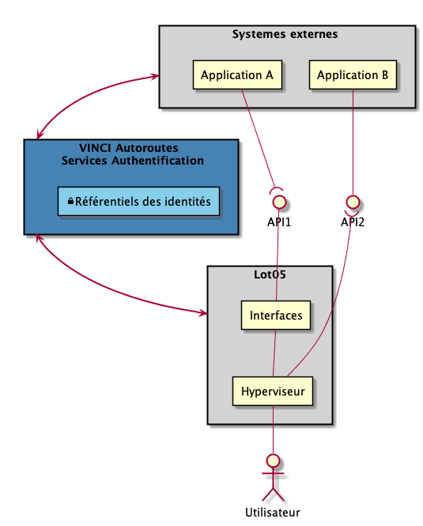

## AD-007 : Sécurisation des communications de la plateforme

### Contexte

Le **SYSTEME** est un écosystème qui s'interface avec des systèmes externes afin de proposer une vision "métier" consolidée des données et des processus.

Une interface est un vecteur de communication entre 2 systèmes sur un mode Producteur/Consommateur d'un service.  

-   Le **PRODUCTEUR** est le système qui expose le service aux tiers externes
-   Les **CONSOMMATEURS** sont les systèmes consommant la donnée exposée

Fonctionnellement, 2 types de flux peuvent exister entre le **SYSTEME**

-   **Flux de données** : Des données doivent pouvoir transiter entre un système A et un Système B
-   ** Actionneur** : Un système A actionne un déclencheur pour initier un processus dans un système B

L’interfaçage entre les systèmes peut s’opérer sous 2 modes

-   **Synchrone** : Les deux systèmes doivent être présents et opérationnels pour communiquer. 
-   **Asynchrone** : La communication entre les 2 systèmes passe par un composant intermédiaire afin de pouvoir gérer l’absence du tiers récepteur. 

Une interface peut être de deux types 

-   Utilisateur à Machine, Machine à Utilisateur 
-   Machine à Machine 

### Enjeux

Il convient d’assurer la sécurisation et la confidentialité des échanges non seulement sur la partie de transport (https) mais surtout entre les systèmes afin d’assurer que les interlocuteurs sont clairement authentifiés et identifié.

### Hypothèses

1-   La stratégie d'interfaçage (Novembre 2018) entre les systèmes reposent sur des API Rest
2-   Les droits ‘fins’ des utilisateurs (fonctionnalités internes à une application) sont gérées par l’applications (pas de centralisation)
3-   Les interfaces entre les systèmes reposent sur un mode de communication synchrone
4-   Les communications peuvent être de type 
     - Machine à Machine
     - Utilisateur à Machine 
5-   L’ensemble des applications à interfacer repose sur les mêmes mécanismes d’authentification (SSO- single sign on)

#### Exclusions

#### Applicabilité à VINCI Autoroutes.
-   Un référentiel des utilisateurs est disponible et mis à disposition par VINCI Autoroutes pour authentifier les utilisateurs du **SYSTEME** et des applications à interfacer, ainsi que leurs droits de ‘haut niveau’ (accès à l’application). Il permet la mise en œuvre de mécanismes de type « Single-Sign-On » sous une spécification OpenIdConnect

### Architecture de référence

La sécurisation d’une API doit permettre au producteur :

1 - D’authentifier d’une manière globale les acteurs le sollicitant. Par exemple, ne pas autoriser les sollicitations anonymes, sans définir une gestion de droits fins. 

Cette stratégie repose sur la mise en place d’un identifiant (clé), ou d’un couple de valeur identifiant une application cliente (Client ID) et un secret (Client secret) qui est généré par le producteur et fourni aux consommateurs. 
  - Plusieurs consommateurs peuvent partager la même clé
  - Le producteur peut révoquer unilatéralement la clé partagée.

2 - D’authentifier l’acteur le sollicitant au travers du système consommateur (un utilisateur par exemple).  Plusieurs approches permettent d’identifier un utilisateur (user/pwd, jetons d’authentification). 
Lorsqu’il s’agit d’accès des utilisateurs des mécanismes de « Single Sign On » existent afin de déporter l’authentification/autorisation d’un utilisateur et sa propagation aux différentes applications traversées 
Ce principe de propagation des autorisations est généralisable au API par le biais des jeton Oauth

**Communication Machine à Machine**
-	 Reposer sur une API Key  (ou client ID/Client Secret) . 

**Communication Humain(machine) à Machine**
-	 Mise en œuvre du transfert de jeton oauth récupéré par les mécanismes SSO 

