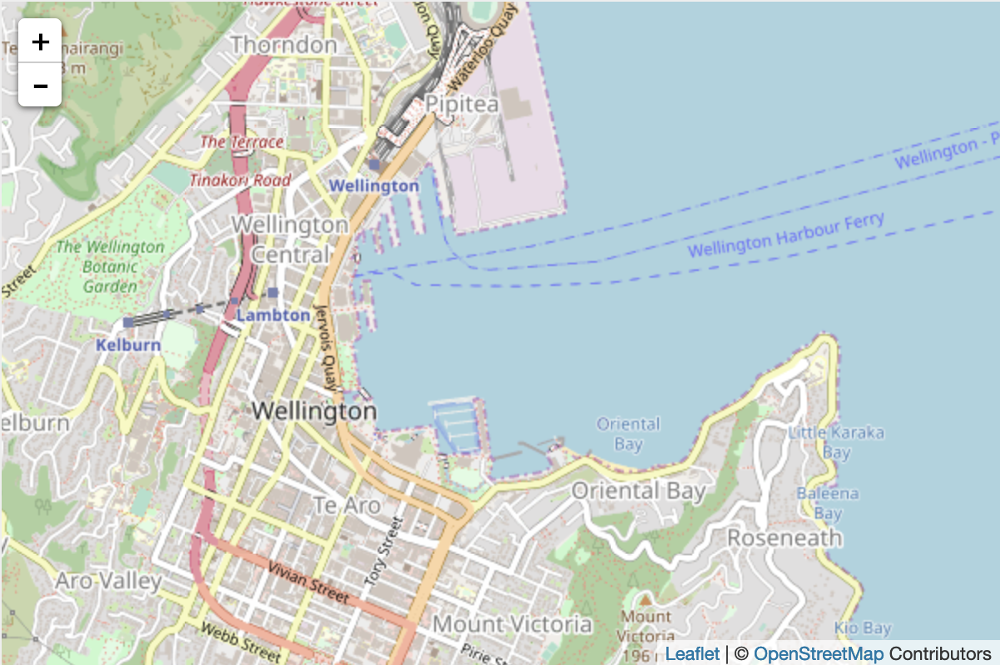
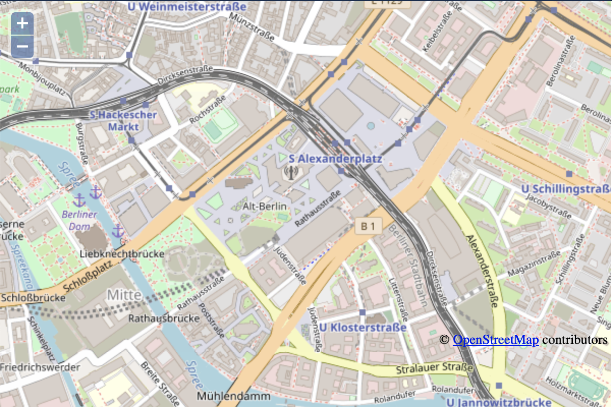

## AD-052 : Choix du visualisateur cartographique

### Décision d'architecture

| Identifiant | Décision d'architecture                                                      | Domaine        | Date | Comité |
| ----------- | ---------------------------------------------------------------------------- | -------------- | ---- | ------ |
| **AD-052**  | Visualiseur cartographique : Leaflet | Front web | **2018-11-09** | Local

### Enjeux

Le lot 5 a besoin dès à présent de pouvoir manipuler les cartes et objets géographique à l'aide d'un visualiseur cartographique et d'outils d'aide aux requêtages géographique.

### Hypothèses

Le lot 5 n'a pas de besoin très avancé en terme d'outillage cartographique. Ces derniers sont :

- Affichage de fonds cartographiques au format WMS / WMTS / Tiles
- Affichage d'éléments au format WMS
- Affichage d'éléments au format geojson
- Interaction limité avec la carte
  - Récupération d'éléments sous le clique souris
  - Délimitation d'une zone de requêtage

### Alternatives

#### Alternative 01 - Leaflet

Cette bibliothèque regroupe l'affichage de cartes et de nombreux outils d'aide à la manipulation géographique : [Site officiel Leaflet](https://leafletjs.com/)

Exemple :

```html
<!DOCTYPE html>
<html>
<head>
    <title>Simple Leaflet Map</title>
    <meta charset="utf-8" />
    <link rel="stylesheet" href="http://cdn.leafletjs.com/leaflet-0.7/leaflet.css"
    />
</head>
<body>
    <div id="map" style="width: 600px; height: 400px"></div>
    <script src="http://cdn.leafletjs.com/leaflet-0.7/leaflet.js"></script>
    <script>
        // centre la carte et zoom
        var map = L.map('map').setView([-41.2858, 174.78682], 14);
        // ajout du fond de plan OpenStreetMap
        L.tileLayer(
            'http://{s}.tile.openstreetmap.org/{z}/{x}/{y}.png', {
            attribution: '&copy; <a href="http://openstreetmap.org">OpenStreetMap</a> Contributors',
            maxZoom: 18,
            }).addTo(map);
    </script>
</body>
</html>
  ```



**Avantages** :

- Gratuit et opensource;
- Librairie très légère : ~150 ko et ~55 classes;
- Approche simple (peu d'imbrication et utilisation mesurée du nombre de classe), bien documenté et nombreux tutoriaux;
- Large communauté;
- Extensible via de nombreux [plugins officiels](https://leafletjs.com/plugins.html) ou non;
- Optimisé pour le mobile (viewport, geolocalisation,...);
- Basé sur les éléments DOM donc facile à utiliser et à personnaliser (CSS);
- Taux d'utilisation en constante augmentation sur les sites Web.

**Inconvénients** :

- L'utilisation massive des plugins peut ralentir le visualiseur;
- Certaines fonctions avancées ne sont pas gérées ou pas de manière optimale :
  - mode édition avancé;
  - snipping (ex : rattachement automatique à une ligne);
  - reprojection;
- Plugins pas toujours optimaux par rapport au noyau de Leaflet;
- Limitation à une utilisation WGS 84 (Leaflet peut gérer les autres formats mais au prix de transformation géographique qui peuvent vite être pénalisante en terme de performance);
- Basé sur les éléments DOM donc une assez forte empreinte mémoire;
- Ne gère pas la 3D;
- Librairie assez jeune.

#### Alternative 02 - Openlayers

Cette bibliothèque regroupe l'affichage et la projection de cartes et un outillage avancé d'aide à la manipulation géographique : [Site officiel Openlayers](https://openlayers.org/)

Exemple :

```html
<!DOCTYPE HTML>
<html>
  <head>
    <title>Simple OpenLayers Map</title>
    <style type="text/css">
      html, body, #basicMap {
          width: 600px;
          height: 400px;
          margin: 0;
      }
    </style>
    <script src="http://www.openlayers.org/api/OpenLayers.js"></script>
    <script>
      function init() {
        // ajout du fond de plan OpenStreetMap
        map = new OpenLayers.Map("basicMap");
        var mapnik = new OpenLayers.Layer.OSM();
        map.addLayer(mapnik);
        // Centre la carte (via reprojection) et zoom
        map.setCenter(new OpenLayers.LonLat(13.41,52.52)
          .transform(
            // transformation de WGS 1984
            new OpenLayers.Projection("EPSG:4326"),
            // en projection Mercator sphérique
            new OpenLayers.Projection("EPSG:900913")
          ), 15
        );
      }
    </script>
  </head>
  <body onload="init();">
    <div id="basicMap"></div>
  </body>
</html>
  ```



**Avantages :**

- Gratuit et opensource;
- Outils très complet en standard :
  - Tous les formats de projection;
  - Beaucoup de formats de fond de plan (ESRI ArcGis, Bing, CartoDB, WMS, WMTS, Here, KML,...);
  - Le clustering;
  - Outils de dessin avancée (snipping, forme, libre, );
  - Drag & drop;
  - Export de carte;
  - Flight mode;
  - Z-Layer;
  - Map overview;
  - Map rotation;
- Basé sur HTML canvas donc très rapide, flexible et gérant de nombreux éléments à l'écran (Adapter à une utilisation massive de geojson);
- S'adresse à des spécialistes;
- Librairie très mature.

**Inconvénients** :

- Assez complexe à utiliser (Nombreux niveau d'imbrication et beaucoup de classes à manipuler) et documentation perfectible;
- S'adresse à des spécialistes;
- Massive : ~700 ko et ~160 classes;
- basé sur HTML canvas donc complexe à utiliser;
- Ne gère pas la 3D en standard mais avec Cesium;
- Taux d'utilisation en constante diminution sur les sites Web;

### Recommandation

 Alternative 01 – Leaflet

### Justification

Les besoin en **fonctionnalités cartographiques avancées sont très limités voire inexistants** :

- L'affiche d'information cartographique est limité à des flux WMS/WMTS / tiles;
- Les interactions limitées à
  - des click souris simple;
  - au détourage en formes simples (rectangle);
  - à l'affichage d'une quantité contenue d'éléments graphiques (Geojson d'une centaine d'élément).

Le lot 5 s'appuie donc majoritairement sur les **fonctions standard** de Leaflet et le nombre de **plugins** nécessitant l'accès à quelques fonctionnalités un peu plus avancées (WMTS, Title simplifié, ClusterMarker et calculateur de reprojection) est **peu important** et reconnu par la communauté.
**
La **simplicité d'utilisation** de leaflet est également un élément de justification.

### Implications

- **Limité à des aux fonctions standard de Leaflet**, si le besoin évolue vers un outil plus avancé, l'utilisation de leaflet pourrait devenir problématique. Les fonctions seraient disponibles via de multiples plugins mais qui pourrait surcharger le visualiseur et entraîner une baisse de performance significatif.

### Décisions d'architecture liées

| **Identifiant** | **Decision d'architecture** |
| --------------- | --------------------------- |
| **N/A**         | N/A                         |
