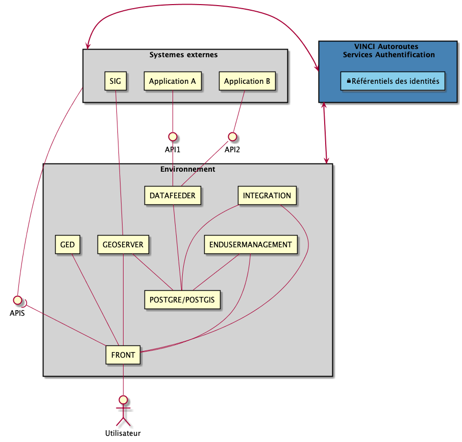

# Modèle de déploiement
## Liste des URLs
|Environnement|Serveur|Sixense Digital|IBM Cloud|
|:---:|:---:|---|---|---|---|---|
|DEV|Hyperviseur|dev-hyperviseur.sixense-digitalsite.com|hyperviseur.lot05-dev.eu-de.containers.appdomain.cloud|
|DEV|GeoServeur|dev-geoserver-hyperviseur.sixense-digitalsite.com|geoserver.lot05-dev.eu-de.containers.appdomain.cloud|
|DEV|Box|dev-box-hyperviseur.sixense-digitalsite.com|sxdvinci.app.box.com|
|DEV|Data Feeder (API)|dev-api-hyperviseur.sixense-digitalsite.com|api.lot05-dev.eu-de.containers.appdomain.cloud|
|DEV|integration||integration.lot05-dev.eu-de.containers.appdomain.cloud|
|DEV|EndUserManagement||endusermanagement.lot05-dev.eu-de.containers.appdomain.cloud|
|DEV|Ged (API)||ged.lot05-dev.eu-de.containers.appdomain.cloud|
|INT|Hyperviseur|int-hyperviseur.sixense-digitalsite.com|hyperviseur.lot05-int.eu-de.containers.appdomain.cloud|
|INT|GeoServeur|int-geoserver-hyperviseur.sixense-digitalsite.com|geoserver.lot05-int.eu-de.containers.appdomain.cloud|
|INT|Box|int-box-hyperviseur.sixense-digitalsite.com|sxdvinci.app.box.com|
|INT|Data Feeder (API)|int-api-hyperviseur.sixense-digitalsite.com|api.lot05-int.eu-de.containers.appdomain.cloud|
|INT|Integration (API)||integration.lot05-int.eu-de.containers.appdomain.cloud|
|INT|EndUserManagement||endusermanagement.lot05-int.eu-de.containers.appdomain.cloud|
|INT|Ged (API)||ged.lot05-int.eu-de.containers.appdomain.cloud|
|UAT|Hyperviseur|uat-hyperviseur.sixense-digitalsite.com|hyperviseur.lot05-uat.eu-de.containers.appdomain.cloud|
|UAT|GeoServeur|uat-geoserver-hyperviseur.sixense-digitalsite.com|geoserver.lot05-uat.eu-de.containers.appdomain.cloud|
|UAT|Box|uat-box-hyperviseur.sixense-digitalsite.com|sxdvinci.app.box.com|
|UAT|Data Feeder (API)|uat-api-hyperviseur.sixense-digitalsite.com|api.lot05-uat.eu-de.containers.appdomain.cloud|
|UAT|Integration (API)||integration.lot05-uat.eu-de.containers.appdomain.cloud|

## Technologies
Les composants suivants de la solution seront délivrés sous forme de conteneurs Docker orchestrés par Kubernetes.

### Clusters

Un cluster Kubernetes sera déployé par environnement

- **SANDBOX** : Test /prototypage interne à l'equipe
- **DEV** : Environnement de développement
- **INT** : Environnement d'intégration/test de bout en bout
- **UAT** : Environnement de recette utilisateurs: accédé par les equipes VINCI Autoroutes

Ces clusters seront hébergés en mode 'monozone' sur la région "Europe" (Décembre 2018 - Frankfurt) 

### Composants

Les composants suivants seront déployé sous la forme de conteneurs dockers

 - **FRONT** : Application Web 
 - **GED**: Service de connexion aux services documentaires (box.com)
 - **DATAFEEDER**: Service d'ingestion des données (Actifs/Taches)
 - **ENDUSERMANAGEMENT**: Service de gestion des comptes "utilisateur"
 - **INTEGRATION** Service de manipulation des données métiers
 - **GEOSERVER**: Serveur geopgraphique
 - **POSTGRE/POSTGIS**: base de données

**Remarque importante:** La capacité de base de données est déployée sous forme de conteneurs. Toutefois afin d'optimiser la sécurisation de ce sous système, une approche de DBaaS sera mise en œuvre pour l'hébergement dans IBM Cloud sur les environnements critiques. Le conteneur POSTGRE sera déployé et testable sous l'environnement SANDBOX.

### Dépots de code

L'ensemble des codes seront déployés dans un dépôt de code Sixense Digital - Bitbucket

Sur la base de ces codes source, des "pipelines" permettront de construire la solution executable par la mise en oeuvre de processus d'intégration continue et de déploiement continu.

