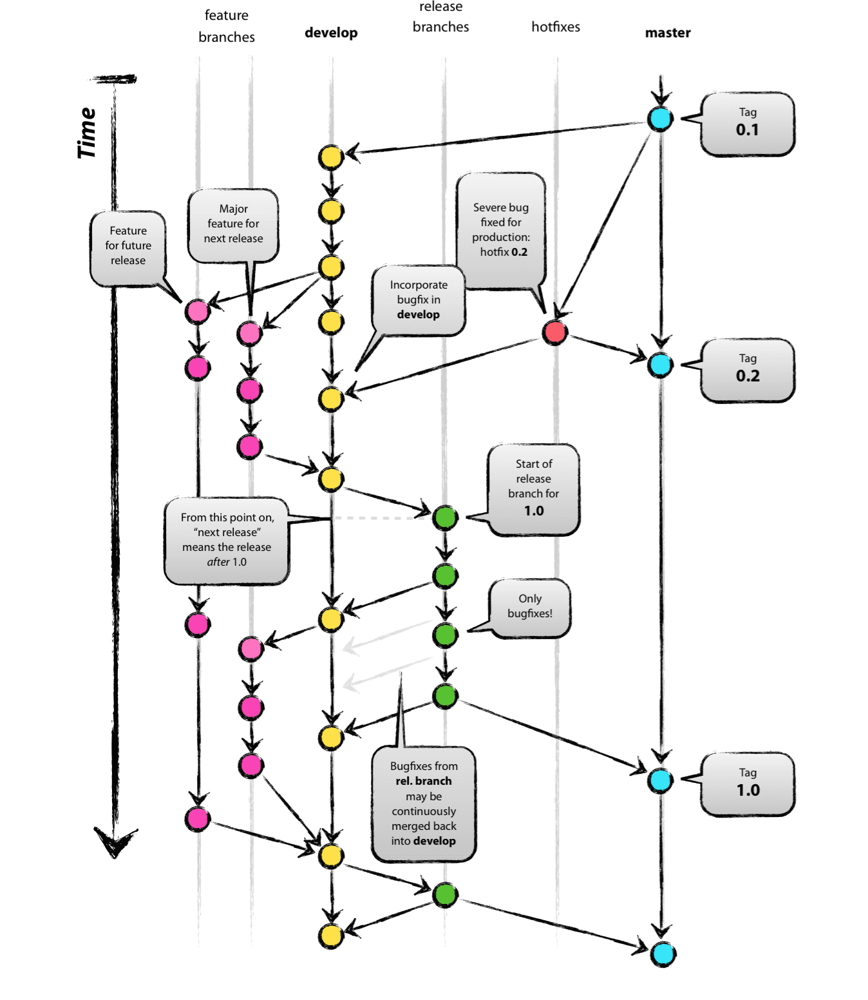

# Versioning - Branching Strategy

In order to handle the code versioning and deployment in our project we use branching as follow:

List of branches:

* Master: the final stage, contains releases (tags to releases)

* Hotfix branches: these branches are drived only from the **master** once a bug is fixed, merged with **master** also merged with **develop** branch.

* Develop branch: this branch is like beta software branch. When working on a new feature we create a new branch starting from the **develop** branch and delete your feature branch just like **hotfix** branches these are only temporary branches. The **develop** branch is like **master**, a never ending branch, never remove this branch.

* Release branch: at some point you need to wrap up the next release. To prepare an incoming release, you have to branch from **develop** giving it a name composed of the release prefix and the number of the release, Example: release/1.0
No more new features are allowed at this stage. You cannot merge develop onto the release branch. The purpose is to give the software to beta testers.
We keep this branch throughout the project until we decide that the software is both mature and tested enough to go in production at this point we merge with the **master** branch. We can delete this branch afterwards.

* Feature branches: when implementing a new feature a new feature branch should be created. Feature branches start with "feature" prefix (example: feature/authentication). This type of branches is volatile so it can be removed once the feature merged.

## Release notes

Actual release should be done only in the **release/latest** branch and then merged to master. Before you release make sure that all commits have landed on develop branch (all features are developed and are ready to be released).

For release management standard-version package is being used which automates the process.

**standard-version does the following:**

1. bumps the version in package.json (based on your commit history)
2. uses conventional-changelog to update CHANGELOG.md
3. commits package.json (et al.) and CHANGELOG.md
4. tags a new release

Steps for making a new release:

1. Get latest develop stuff: `git checkout develop; git pull origin develop`
2. Switch to release/latest: `git checkout release/latest; git pull origin release/latest`
3. Merge develop branch to release/latest: `git merge develop`
4. run `npm run release` (in case of initail release e.g. v1.0.0, you should run this command: `npm run release -- --first-release`)
5. `git push --follow-tags origin release/latest`

*Note: "npm run release" does not publish code to the remote repo or npm registry. It is a custom script defined in package.json to initiate standard-version script which in turn makes changes only in current (local) repo.*
