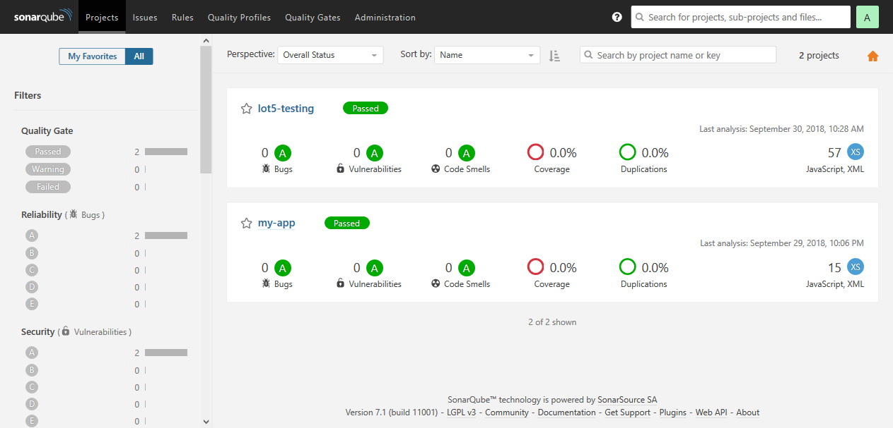
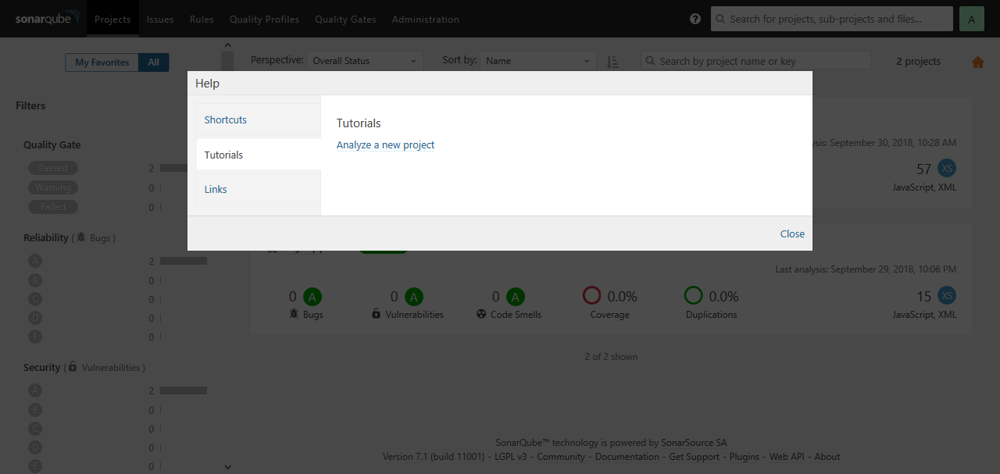
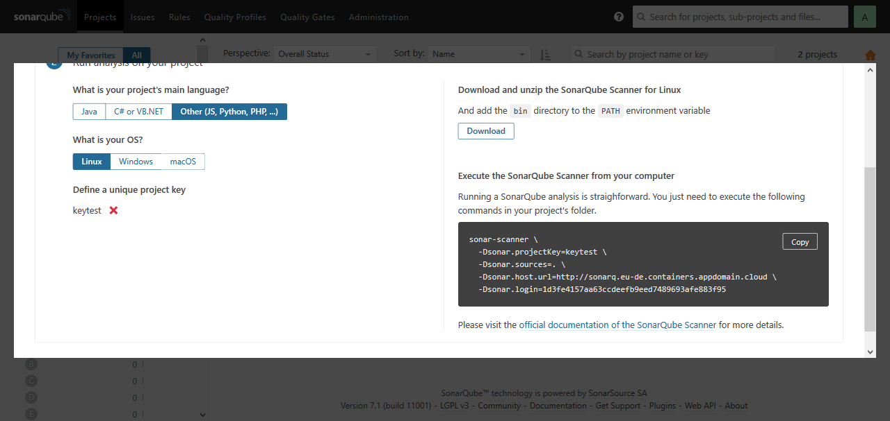
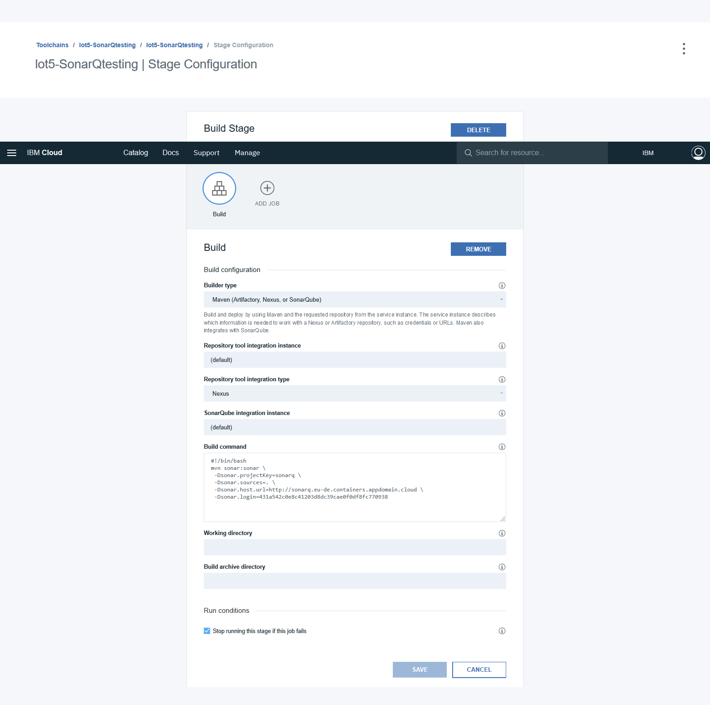

# Installation CLI

#### Initialisation
    ibmcloud login --sso

    ibmcloud target -r eu-de

    ibmcloud ks init

    ibmcloud target --cf

    ibmcloud ks workers sonarQ

    ibmcloud cr login

#### Import de l'image dans le répertoire privé
    docker pull sonarqube

    docker tag sonarqube registry.eu-de.bluemix.net/sonarq-namespace/sonarqube:1

    docker push registry.eu-de.bluemix.net/sonarq-namespace/sonarqube:1

    ibmcloud cr image-list

#### Configuration du cluster

    ibmcloud cs region-set eu-central

    ibmcloud cs cluster-config sonarQ

    export KUBECONFIG=/C/Users/SongchirajouSengchan/.bluemix/plugins/container-service/clusters/sonarQ/kube-config-fra02-sonarQ.yml

    kubectl get nodes

    kubectl create -f sonarq-secret.yaml
    kubectl create -f sonarq-configmap.yaml
    kubectl create -f sonarq-deployment.yaml
    kubectl create -f sonarq-service.yaml
    kubectl create -f sonarq-ingress.yaml

    ibmcloud ks workers sonarQ

    kubectl get services

#### Configuration de sonarQ dans la pipeline
1. Pour analyser un projet, cliquer sur le bouton help en haut à gauche de la barre de recherche :

2. Onglet Tutorials

3. Rentrer un token et une clé, des paramètres en ligne de commande seront générées :

4. Dans votre pipeline, créer un build de type Maven et entrer le script suivant :
    mvn sonar:sonar [paramètres]

5. Dans votre répot Bitbucket, placer un fichier pom.xml.
