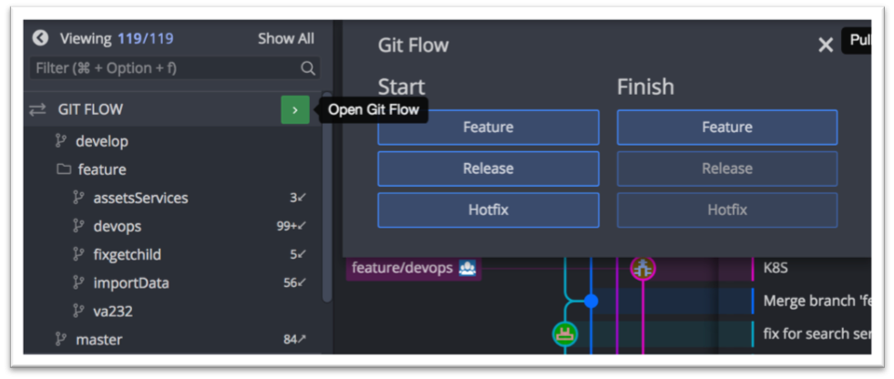
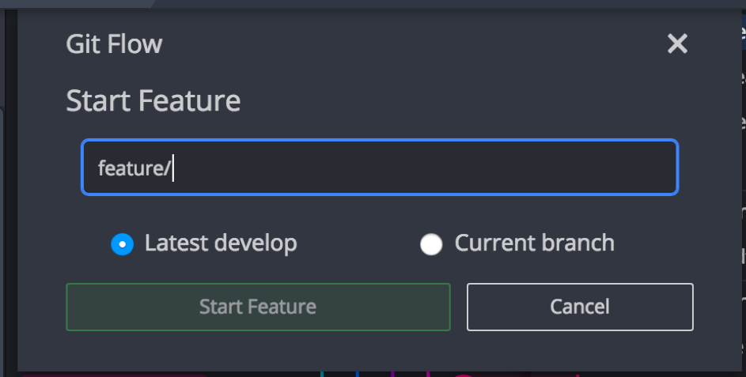
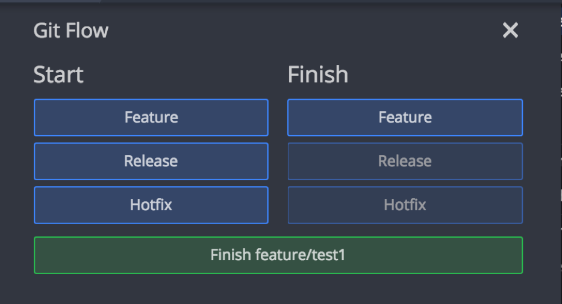
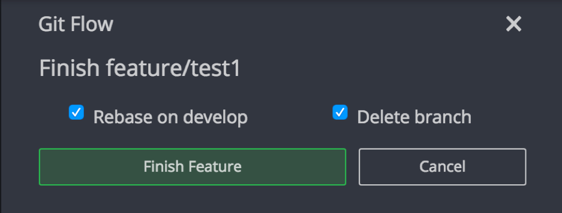

# GitFlow (GitKraken)

GitFlow sépare sur des branches isolées le code en cours de développement et le code validé et testé. Pour cela, il s’appuie sur la création de plusieurs branches dont le cycle de vie est bien défini.

## Mise en place
-	Sur GitKraken : 
	-	Cliquer sur Préférences
	-	Cliquer sur GitFLow
	-	Cliquer sur Initialize Gitflow

=>	Vous pouvez laisser tous les paramètres par défaut

## Création d’une branche locale

Une fois les préférences fermées vous aurez un menu « GitFlow »

-	Pull develop (qui deviens la branche de dev commune)
-	Créer une nouvelle branche :
	-	Cliquer sur la flèche verte (voir screen ci-dessous)
	-	Start -> feature

Cela va créer une branche locale qui viendra s’ajouter au dossier « feature » 
Vous pourrez donc travailler et faire vos développement en local.

**Il faut avoir à jour la branche develop pour éviter tout soucis.**

Veuillez nommer votre branche comme suis :
Si c’est une story :  lot5-task-[numero de VA]
Si c’est un bug : lot5-fix-[numero de VA]

**Il est important d’avoir un nommage normé pour la lisibilité du Git.**

Il faut sélectionner "lastest develop" pour partir de la branche la commune (develop).

## Rebase de votre branche sur develop

Une fois vos développements terminés vous pouvez soit : 

1. Cliquer sur le bouton vert pour clore la branche courante sur laquelle vous êtes.
2. Cliquer sur Finish -> Feature et sélectionner la branche désirée.

Une fois le bouton cliqué vous pouvez :
-	"Rebase on develop" : qui comme son nom l’indique, fera un rebase de votre branche sur develop.
-	Delete branch : ce qui supprimera la branche courante après le rebase.

=> Concernant la suppression de la branche c’est à vous de voir. Si vous pensez devoir retourner dessus un jour ou si c’est une tâche transverse, il peut être préférable de ne pas la supprimer. Cependant le fait de supprimer la branche permettra d’avoir un Remote plus lisible.

Déroulement du flow sur le lot5 hyperviseur

En début de sprint :

1. Nous repartons tous de la branche develop pour créer nos branches locales
2. Nous effectuons des rebase sur develop une fois les devs terminés
3. Lors de la livraison en QA du milieu de sprint nous créons une nouvelle Release avec un tag pour le versionning.

En fin de sprint : 

4. Livraison finale en QA  en fin de sprint nous créons une nouvelle Release avec un tag pour le versionning

En cas de livraison en Proto

5. Rebase sur master avec un tag  pour le versionning.

