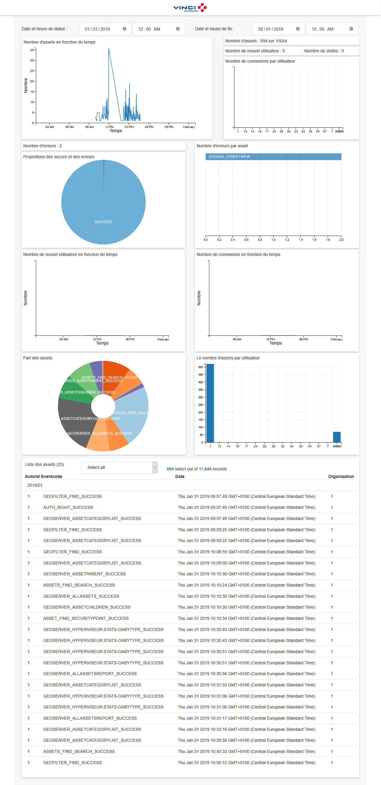

# Activity Tracker

#### Présentation
      # Outil destiné au business owner.
      # Outil de visualisation des données/événements provenant de l'hyperviseur.
      # Configuré sur l'environnement de dev

#### Librairies utilisées
      # Crossfilter = Crossfilter is a JavaScript library for exploring large multivariate datasets in the browser. Crossfilter supports extremely fast (<30ms) interaction with coordinated views, even with datasets containing a million or more records; we built it to power analytics for Square Register, allowing merchants to slice and dice their payment history fluidly.
      # Dc.js = dc.js is a javascript charting library with native crossfilter support, allowing highly efficient exploration on large multi-dimensional datasets (inspired by crossfilter's demo). It leverages d3 to render charts in CSS-friendly SVG format. Charts rendered using dc.js are data driven and reactive and therefore provide instant feedback to user interaction.
      # D3.js = D3.js is a JavaScript library for manipulating documents based on data. D3 helps you bring data to life using HTML, SVG, and CSS. D3’s emphasis on web standards gives you the full capabilities of modern browsers without tying yourself to a proprietary framework, combining powerful visualization components and a data-driven approach to DOM manipulation.
      # Jquery = jQuery is a fast, small, and feature-rich JavaScript library. It makes things like HTML document traversal and manipulation, event handling, animation, and Ajax much simpler with an easy-to-use API that works across a multitude of browsers.
      # Bootstrap = Bootstrap is an open source toolkit for developing with HTML, CSS, and JS. Quickly prototype your ideas or build your entire app with our Sass variables and mixins, responsive grid system, extensive prebuilt components, and powerful plugins built on jQuery.

#### Lien
    https://activitytracker.lot05-sandbox.par01.containers.appdomain.cloud/

#### Image

#### Description
    L'utilisateur ouvre l'application. Il arrive sur un tableau de bord. Par défaut, le formulaire est configuré sur la date du jour. Il peut très bien modifier la date et l'heure de début ainsi que la date et l'heure de fin. Il a ainsi plusieurs diagrammes de statistiques lui permettant de visualiser les différentes utilisations de l'hyperviseur. Le premier affiche le nombre d'assets reçus sur la plateforme en fonction du temps. Ainsi, il a une vue globale de l'activité du jour. Il a également le nombre d'asset crée puis le nombre total de données dans la table. Ensuite, le nombre de nouvel utilisateur (ACCOUNT_CREATE_SUCCESS) et le nombre de visites (AUTH_LOGIN_SUCCESS). Le graphe en dessous permet de voir pour chaque utilisateur, son nombre de connexion. Le nombre d'anomalies détectées (%ERROR%, plutot !SUCCESS) est également disponible. Un diagramme circulaire montre la part que cela représente. De même, un diagramme en baton détaille les assets en erreurs et leur nombre. Deux diagrammes de lignes temporelles suivent ensuit, reprénsentant respectivement le nombre de nouvel utilisateur et de le nombre de connexion en fonction du temps. Ensuite, on retrouve tous les assets avec les utlisateurs associés. Enfin, une liste des assets classés par ordre chronologique permet de retracer pour chaque utilisateur les différents assets qu'il a créer (par défaut les 25 premiers).
