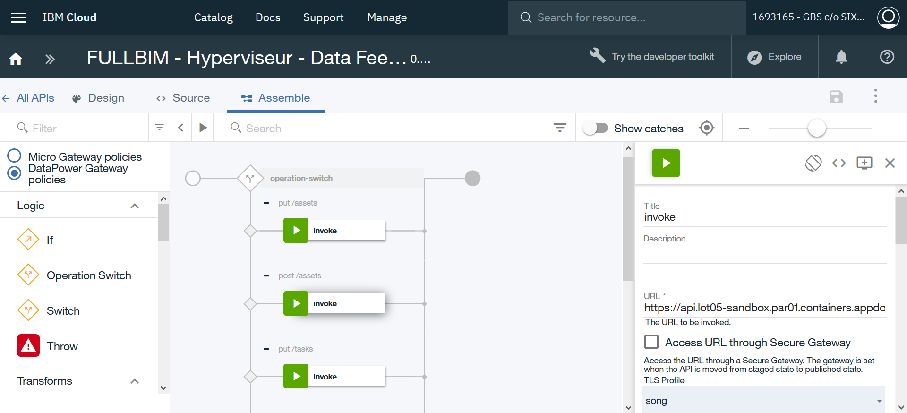
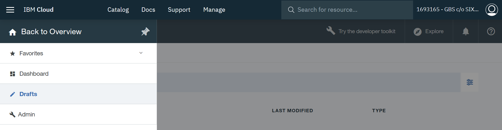
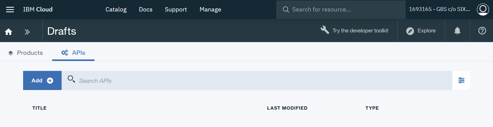
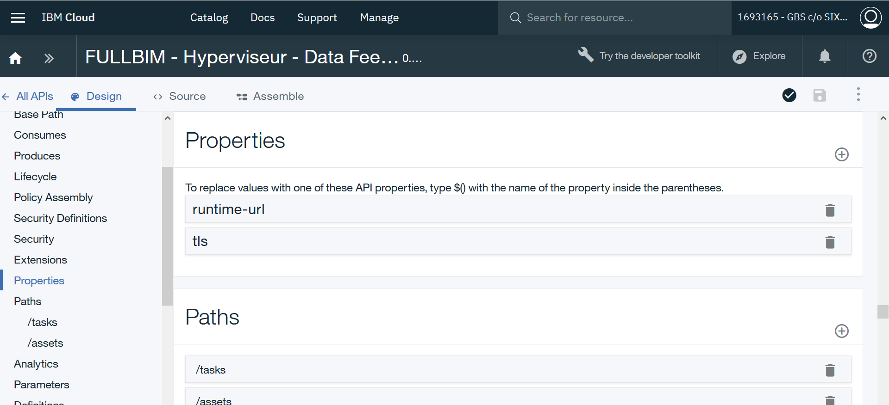
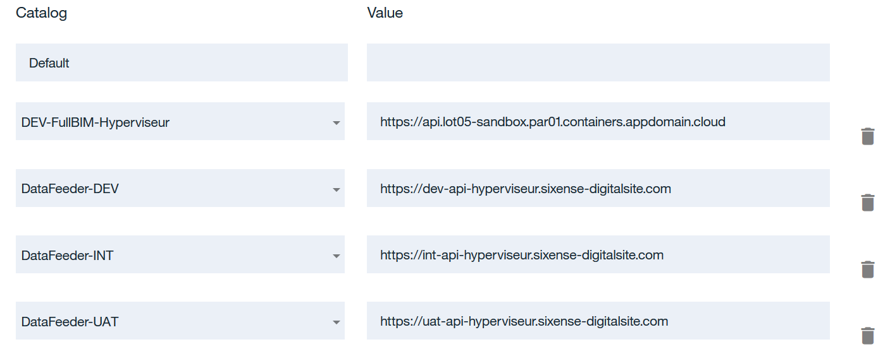
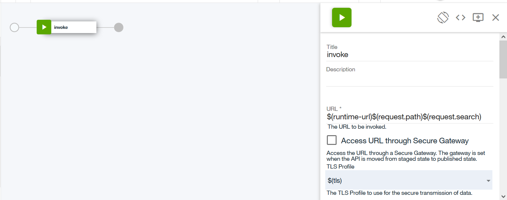
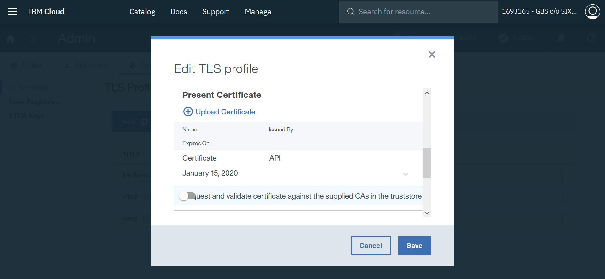
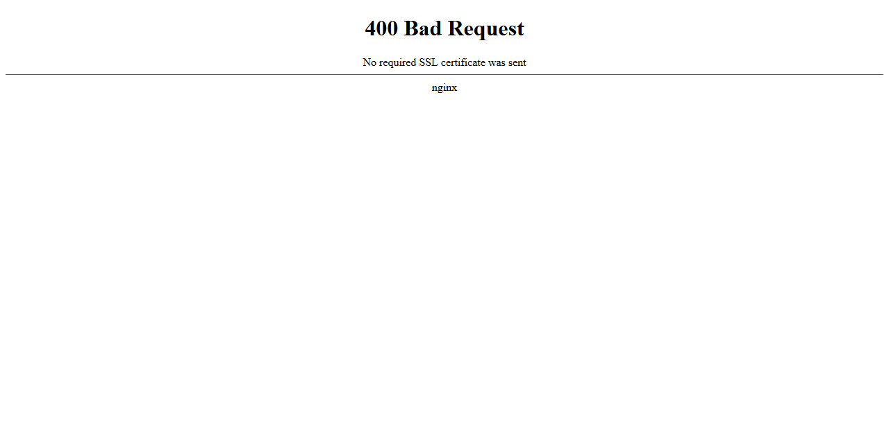
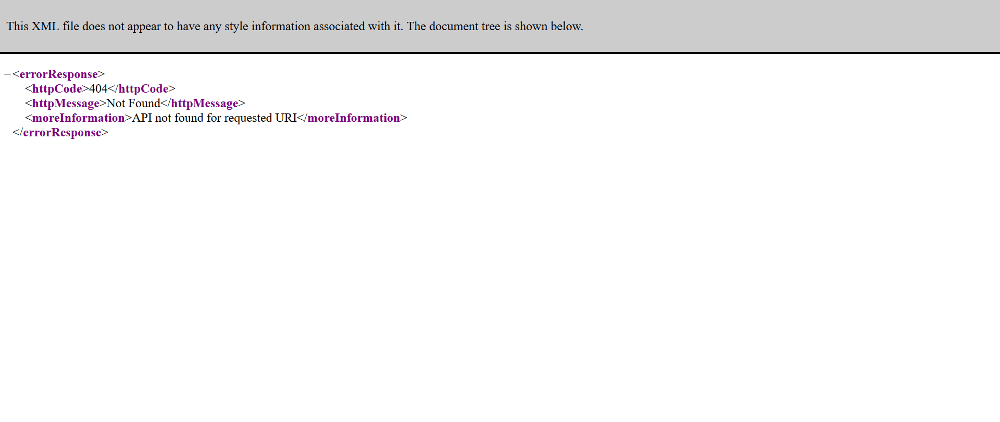
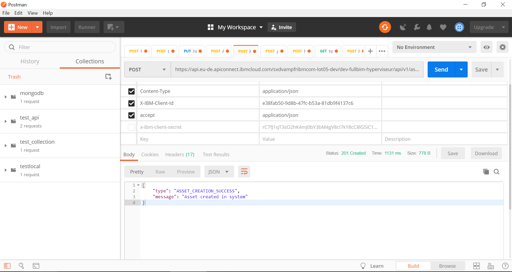

# Protection de l'API

#### Configurer API Connect
    # Création d'un portail API sur API Connect
    # Pour chaque requête, configurer les appels à l'API dans l'onglet "Assemble"
    # De cette manière, on peut passer par le portail API Connect généré pour réaliser des requêtes si on possède la clé API
    # exemple (sandbox)
    # URL ingress : https://api.lot05-sandbox.par01.containers.appdomain.cloud/
    # URL API Connect : https://api.eu-de.apiconnect.ibmcloud.com/sxdvampfribmcom-lot05-dev/dev-fullbim-hyperviseur/

#### Déclarer plusieurs target urls sur API Connect
    # Un catalogue correspond à une URL.
    # Exemple (catalogue datafeeder-dev) :
    https://api.eu-de.apiconnect.ibmcloud.com/sxdvampfribmcom-lot05-dev/datafeeder-dev/
    # On a : {api-url}/{account-info}/{catalog-name}

    # Créer donc un catalogue par API
    # Se rendre sur la configuration de l'API :

    # Se rendre dans la section Properties

    # Créer une variable (ici, runtime-url)

    # Se rendre dans l'onglet Assemble
    # invoke : $(runtime-url)$(request.path)$(request.search)
    # tls : $tls
    # HTTP method : Keep

#### Générer un certificat client
    # voir fichiers (clientPrivate.key et clientPublic.crt)
    openssl req -newkey rsa:2048 -nodes -keyout clientPrivate.key -x509 -days 365 -out clientPublic.crt -subj "/C=FR/O=Sixense/CN=API"

    # voir fichier (clientCert.p12)
    openssl pkcs12 -inkey clientPrivate.key -in clientPublic.crt -export -out clientCert.p12
    => password: password

    # Encoder ensuite le certificat du client (.crt) en base 64
    # https://www.base64encode.org/

#### Créer le secret dans le cluster
    # voir fichier (secret_model.yaml)
    apiVersion: v1
    kind: Secret
    metadata:
      name: ssl-cert
      namespace: fullbim-hyperviseur
    type: Opaque
    data:
      ca.crt: <certificat_base_64>

#### Rajouter l'annotation "mutual-auth" dans l'ingress
    # voir fichier (ingress_model.yaml)
    annotations:
      ingress.bluemix.net/mutual-auth: "secretName=ssl-cert port=443"

#### Ajouter le TLS profil du client
    # Onglet "Admin" > "Security" > "TLS Profiles"
    # Add puis Save
    # Aller dans "Edit TLS Profile"
    # Dans la section "Present Certificate", uploader le certificat du client généré précédemment (.p12) et rentrer le password

#### Spécifier le profil TLS lors des requêtes
    # Onglet "Draft" > "API" > "Assemble"
    # Spécifier le profile TLS pour chaque requête
    # Sauvegarder

#### Résultat
    # https://api.lot05-sandbox.par01.containers.appdomain.cloud/

    # https://api.eu-de.apiconnect.ibmcloud.com/sxdvampfribmcom-lot05-dev/dev-fullbim-hyperviseur/ (sans clé API)

    # Requête POST API Connect (avec clé API)

#### Configuration Postman
    # sandbox
    # https://api.eu-de.apiconnect.ibmcloud.com/sxdvampfribmcom-lot05-dev/dev-fullbim-hyperviseur/api/v1/assets
    # X-IBM-Client-Id : e38fab50-9d8b-47fc-b53a-81db9f4137c6

    # dev
    # https://api.eu-de.apiconnect.ibmcloud.com/sxdvampfribmcom-lot05-dev/datafeeder-dev/api/v1/assets
    # X-IBM-Client-Id : 38f5b87d-7b49-435b-b2a1-8d73793ed926

    # int
    # https://api.eu-de.apiconnect.ibmcloud.com/sxdvampfribmcom-lot05-dev/datafeeder-int/api/v1/assets
    # X-IBM-Client-Id : 8b6fa4e0-db25-4029-8d05-384dca2e2f99

    # uat
    # https://api.eu-de.apiconnect.ibmcloud.com/sxdvampfribmcom-lot05-dev/datafeeder-uat/api/v1/assets
    # X-IBM-Client-Id : 2e950c97-ce4c-4499-8806-d89bc042ff94
