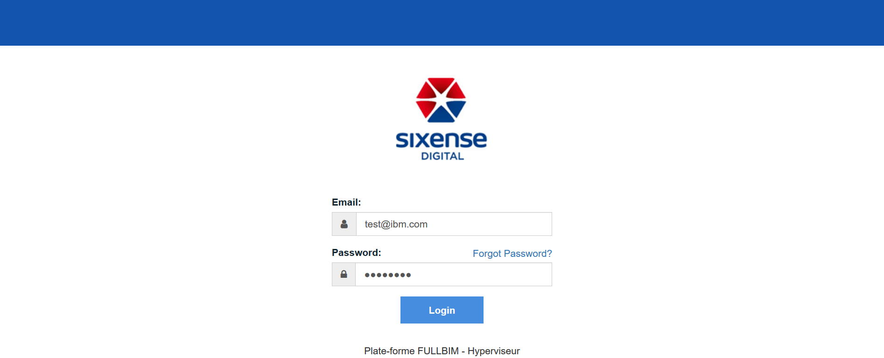
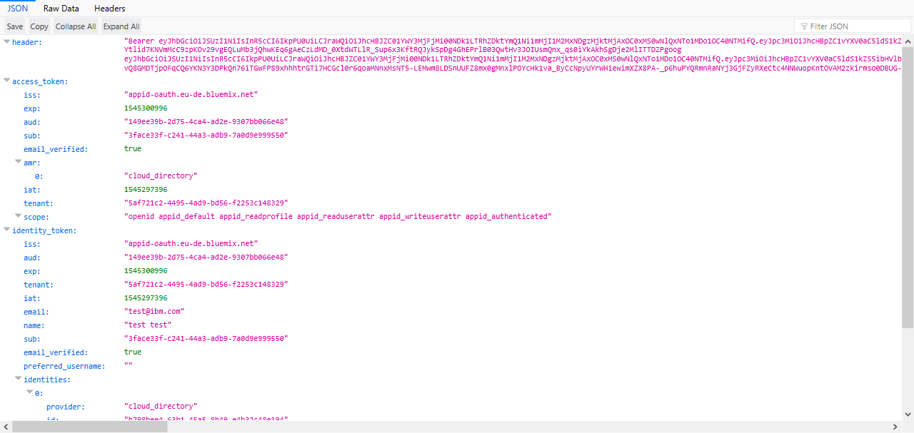

# Implémentation du SSO App Id

#### Initialisation
    ibmcloud login --sso

    ibmcloud target -r eu-de

    ibmcloud ks init

    ibmcloud target --cf

    ibmcloud cr login

    ibmcloud target -g fullbim-lot05

    ibmcloud ks workers lot05-sandbox

#### Binding du service AppID avec l'ingress
    # Récupérer le UUID du service AppID
    # Renvoit 5af721c2-4495-4ad9-bd56-f2253c148329
    ibmcloud resource service-instance lot05-appid

    # Lier le cluster au service
    # Créer un secret dans le cluster
    ibmcloud ks cluster-service-bind --cluster lot05-sandbox --namespace fullbim-hyperviseur --service 5af721c2-4495-4ad9-bd56-f2253c148329

#### Ajout de l'annotation dans l'ingress
    # Rajouter une ligne d'annotation dans le ingress.yaml
    # Accéder à l'application redirige vers une page d'authentification AppID
    # requestType=api (pour les api)
    annotations:
      ingress.bluemix.net/appid-auth: "bindSecret=binding-lot05-appid namespace=fullbim-hyperviseur requestType=web serviceName=lot05-endusermanagement-service"

#### Récupération de l'identity token
    # Examiner l'entete HTTP pour récupérer l'identité de l'utilisateur
      api.get('/token', (req, res, next) => {
        const auth = req.header('authorization') || process.env.TEST_AUTHORIZATION_HEADER;
        if (!auth) {
          res.status(403).send();
        } else {
          // authorization should be "Bearer <access_token> <identity_token>"
          const parts = auth.split(' ');
      	if (parts.length !== 3) {
            res.status(403).send({ message: 'Invalid Authorization header. Expecting "Bearer access_token identity_token".' })
            return;
          }
          if (parts[0].toLowerCase() !== 'bearer') {
            res.status(403).send({ message: 'Invalid Authorization header. Bearer not found.' });
            return;
          }
          const jwt = require('jsonwebtoken');
          const access_token = jwt.decode(parts[1]);
          if (!access_token) {
            res.status(403).send({ message: 'Invalid access token' });
            return;
          }
          const identity_token = jwt.decode(parts[2]);
          if (!identity_token) {
            res.status(403).send({ message: 'Invalid identity token' });
            return;
          }
          req.appIdAuthorizationContext = {
            header: auth,
            access_token,
            identity_token,
          };
      	res.send(req.appIdAuthorizationContext);
        }
      });

#### Accès à l'application
    # Accéder au lien : http://endusermanagement.lot05-sandbox.par01.containers.appdomain.cloud/token
    # Rajouter la web redirect URL : <APP_URL>/appid_callback
    # Redirection et authentification

    # Accès à l'application
    # L'URL /token donne toutes les infos liées au token

  
