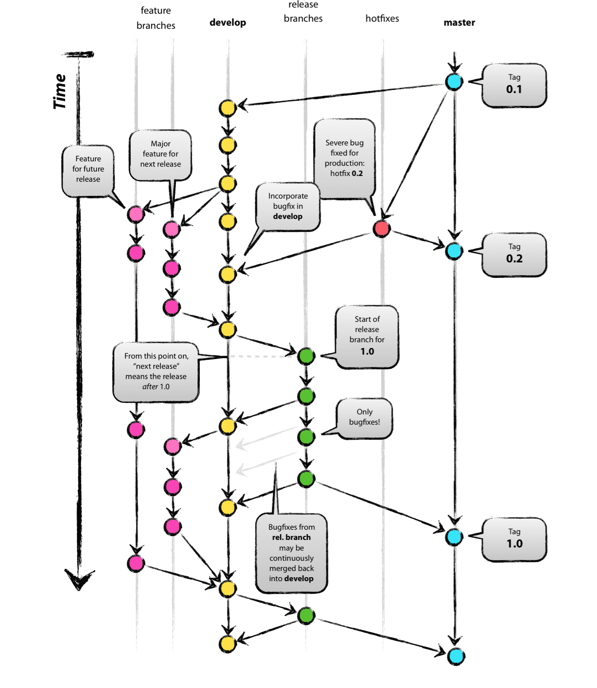
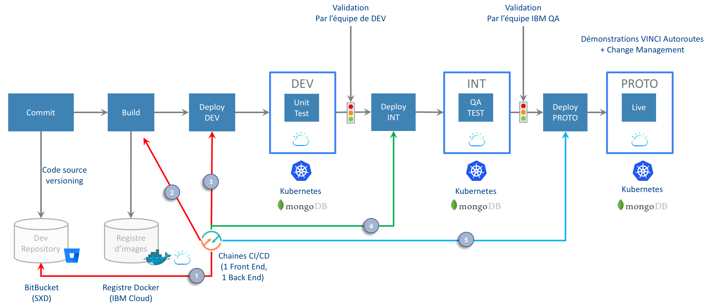

# Implémentation

L'implémentation du **SYSTEME**, même si elle est une fraction de l'effort total d'un projet est une phase des plus cruciales car elle correspond à la construction du code applicatif.

## Les enjeux

Les défis sont multiples. Le code source produit doit :

-   Adresser les différentes exigences attendues par les utilisateurs finaux du **SYSTÈME**
-   Correspondre aux exigences des acteurs opérant la solution (Hébergeur, Administrateurs)
-   Correctement interpréter l'architecture définit
-   Présenter des qualités de résilience, de robustesse et de performance.

Cela nécessite

-   D'utiliser un langage de programmation adapté
-   De promouvoir la capitalisation, la réutilisation des fonctions produites en définissant et respectant des motifs de code applicatifs partagés par l'ensemble de l'équipe de développement ("Design Patterns")
-   De se reposer sur des approches éprouvées : Approche par micro services permettant de promouvoir le couplage faibles, Découplage en 3-tiers.
-   D’implémenter des standards reconnus : Définition de contrats d’interfaces, REST API, wsdl,
-   De mettre en œuvre des structures de données normalisée : Normalisation des temps avec une zone de temps, des unités de valeurs, codification des pays…

## Gestion des configurations

L'ensemble des codes doit être géré de manière centralisée. Cette source de données est la référence du source code :

-   Pour l’ensemble des développeurs
-   Pour la mise à jour des environnements d’exécution du **SYSTÈME**

Parce qu'elle contient l'ensemble de toutes les versions des code produits, elle permet d'avoir une traçabilité complète des versions du **SYSTEME**.

Le **SYSTEME** reposera sur un stockage des codes source dans des "repositories" git.
Chaque "repository" contiendra l'ensemble des codes nécessaire à l'exécution des fonctions.
A titre d'exemple, un "repository" pourra être associé à un micro service, lui permettant ainsi d'avoir un cycle de vie totalement indépendant des autres composants de la plateforme portés par d’autres "repository". Cette isolation favorise la qualité en limitant l'impact d'une anomalie d'un code.

Par ailleurs, parce que ce cloisonnement s'accompagne d’une 'atomisation' des codes, une livraison plus fréquente des codes peut être envisagée, promouvant un déploiement en continu du code ainsi que son intégration avec les autres composants. On parle alors d'intégration continue et de déploiement continu (CI/CD)

Cet élément sera organisé comme suit :

-   Le "repository" est organisé en "branches" associées à des préoccupations spécifiques :

    -   **Branche maitresse** : Elle contient l’historique des versions du code en production. Chaque mouvement sur cette branche est déployé vers l'environnement correspondant (PRODUCTION). D’expérience, cette approche nécessite souvent une validation manuelle si les équipes d'industrialisation le requièrent.
    -   **Branche des "Versions"** : Elle contient la version à venir. On parle alors de versions candidates ou Release Candidates. Celle-ci est constituée au fur et à mesure des développements dès lors que le source code est stabilisé. Chaque mouvement sur cette branche est déployé vers l'environnement correspondant (INTEGRATION)
    -   **Branche de développement** : Cette branche contient la version en cours de développement, pas nécessairement stabilisée. Chaque mouvement sur cette branche est déployé vers l'environnement correspondant (DEV). Il est recommandé de déployer les codes de cette branche le plus régulièrement possible (approche de livraison quotidienne par exemple : 'Nightly release')

Des branchements secondaires peuvent être créés afin

-   De traiter des anomalies bloquantes arrivant en production. On parle alors de corrections à chaud ou "HotFix"
-   D'implémenter des fonctions spécifiques dans un mode d'incubation d'idées (Feature)
-   ...

Source : <https://datasift.github.io/gitflow/IntroducingGitFlow.html>

Pour travailler, chaque développeur :

-   Clone localement le "repository"
-   Y applique ses modifications au niveau de qualité attendu
-   Valide la portion de code à remonter ou 'Commit'
-   Remonte le code dans le « repository » centralisé ou 'Push'

  > Remarque : Des mécanismes de gestion de concurrence (Merge) peuvent être anticipés par chaque développeur afin de limiter les régressions engendrées par des codes source concurrents remontés par 2 développeurs.

## Déploiement continu, intégration continue

L'industrialisation de la production de code au sein d'une usine logicielle ('Digital Factory') nécessite d'avoir des processus d'automatisation de la transformation du code source en application accessible par les utilisateurs.
Cela nécessite de pourvoir automatiser la mise en œuvre en séquence de plusieurs traitements

-   La détection d'un changement de code dans le "repository"
-   Le test qualitatif du code produit : Mise en place de commentaire, respect des normes de développement… (1)
-   La mise en œuvre de mécanisme de compilation/construction du code
-   Le test d'intégration de la solution. Par exemple, s'assurer que les API remontent les mêmes réponses que celles prévues par le contrat d'interface
-   Le déploiement du code sur l'environnement cible.

Cet enchainement d'outil, appelé 'toolchain’ permet d'orchestrer la mise à disposition de nouveaux codes de manière automatique. Totalement extensible, il peut être enrichi de fonctionnalités additionnelles, telles qu'une notification automatique en cas de succès ou d'erreur afin de promouvoir l'efficacité opérationnelle dans le traitement (Par exemple : Remontée des anomalies dans un canal « Slack » des développeurs les au plus tôt).

Plusieurs approches sont possibles en termes d'orchestrateurs.
Parce que la solution est déployée dans le Cloud, des chaines d’automatisation sont fournies. Celles-ci seront privilégiées.

Alternativement, à titre informatif' ce composant d'orchestration pourrait être remplacé par le composant logiciel Jenkins.

(1) Cette évaluation est aussi réalisée par chaque développeur, et n'autorise la remontée du code qu'en cas de succès. Son exécution dans la chaine de production est donc une vérification de 'contrôle'.

## Standard de développements

Afin d'assurer un haut niveau de qualité du code, partagé par l'ensemble des développeurs un ensemble de règles et de standards sont établis issus

-   Des communautés technologiques
-   De l'expérience acquises sur les projets par l'équipe
-   Des expertises présentes dans l'équipe

Cela permettra d'établir des règles communes sur la syntaxe à employer, la mise en place de commentaires ( <http://usejsdoc.org>)...

Le détail de ces documents est présenté en annexes

## Tests unitaires

Pour limiter l'apparition d'effets de bord et de régression entre deux versions de code, un ensemble de tests unitaires sera implémenté permettant de valider l'invariance d'un résultat entre 2 versions.

## Peer review

Afin de promouvoir le partage des connaissances, et amener un regard critique sur les implémentations réalisées, des revues 'entre membres de l'équipe de développement seront menés.
Pour éviter l'inertie que pourrait amener cet exercice déroulé fréquemment, les retours seront formalisés par oral et ne mèneront pas forcément à la création d'un document.
