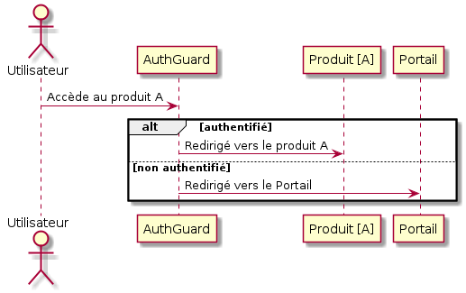

# AuthGuard

Le AuthGuard est un service indiquant au routeur si il doit autoriser la navigation.

Si l’utilisateur est authentifié, c’est-à-dire qu’un token est présent dans le local storage, la navigation est autorisée.
Dans le cas contraire l’utilisateur est redirigé sur la page de connexion.



## Implémentation

- app.module.ts
> Module principal de l'application

```typescript
    import { CognitoConnectorModule } from 'cognito-connector';
    import { environment } from '../environments/environment';
    import { AuthService } from './shared/services/auth/auth.service';

    @NgModule({
      declarations: [
        // ...
      ],
      imports: [
        CognitoConnectorModule.forRoot(environment),
      ],
      providers: [
        // ...
      ]
    })
    export class AppModule {}
```

##### Paramètres

`environment` : Ce paramètre doit obligatoirement contenir les URLs de Beyond portal et de l’application courante sous la forme suivante :

> Dans l'exemple ci-dessous, localhost devra être remplacé par les vraies URLs.
```json
{
  "sso_redirect": "?redirect_uri=http://localhost:4201/",
  "portal": "http://localhost:4200/"
}
```

- app-routing.module.ts
> Fichier de gestion des routes.

> Le AuthGuard doit être appliqué sur chaque route que l’on souhaite sécuriser.  
> Par exemple pour donner l'accès à une donnée sensible ou à une page qui requière une authentification.

```typescript
import { AuthGuard } from './shared/services/auth/auth.service';

const routes: Routes = [
      {
        path: 'home',
        component: HomeComponent,
        canActivate: [AuthGuard]
      },
    ];

    @NgModule({
      imports: [RouterModule.forRoot(routes)],
      exports: [RouterModule],
    })
    export class AppRoutingModule {}
```

| 001 | Version Initiale | SIXENSE |
