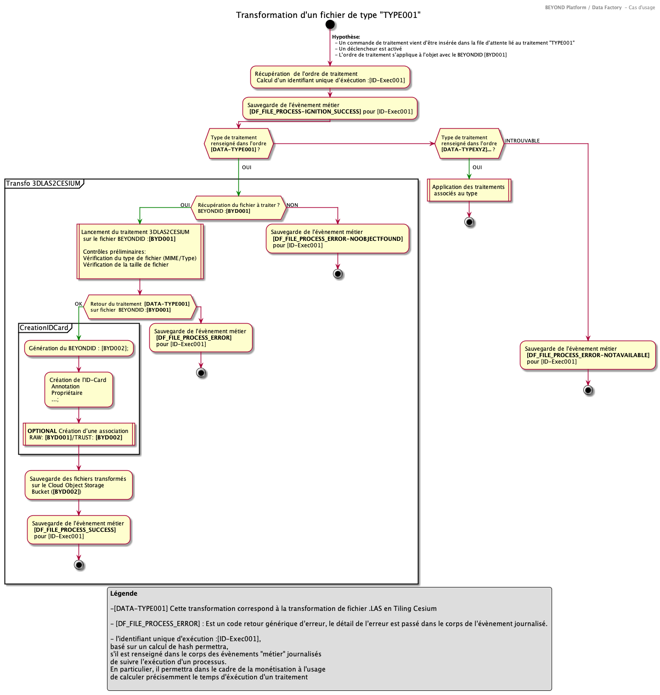

## Lancement d'un traitement sur un fichier brut reçu par le SYSTEME

### Introduction

Ce cas d'utilisation permet l'application d'un traitement dont l'ordre d'exécution vient d'être posté dans la file d'attente.

Le processus suivant est envisagé :

1. Chaque traitement dispose de sa propre file d'attente. (Un fichier devant subir 2 traitements, aura donc 2 ordres de traitement dans 2 files d'attente différentes et les traitements seront exécutés independemment et en fonction de son rang dans la file d'attente)
2. Récupération de la configuration du traitement à exécuter
3. Récupération du fichier à traiter au moyen de son BYDID renseigné dans l'ordre d'exécution
4. Application du traitement sur le fichier brut
5. En cas de succès, création d'un nouvel objet BEYOND (Nouvel BYDID2)
6. Le processus est suivi par une journalisation d’évènements métier qui agit comme un composant de 'Business Activity Monitoring'.

### Acteurs

Processus du **SYSTEME**

### Préconditions

1. Le fichier brut existe et porte le BYDID : **BYD001**
2. Le traitement des fichier Las-> CESIUM TIling est implémenté. Il est configuré dans le **SYSTEME** (depuis la console d'administration de la Data Factory Manager) pour être associé au l'identifiant de traitement **[DATA-TYPE001]**

### Déclencheur

Le processus est déclenché par l'arrivé d'un ordre d'exécution dans la file de traitement.

### Description

**Remarque** Le lancement d'un traitement imposera l'exécution des contrôles sur le type de fichiers et la taille. Si cela peut paraitre redondant (car déjà fait lors de la phase d'UPLOAD), cela permettra de garantir la cohérence du processus pour les fichiers en file d'attente dont le paramétrage du traitement aurait changé depuis le chargement (approche par couplage faible).

### Alternatives

N/A
